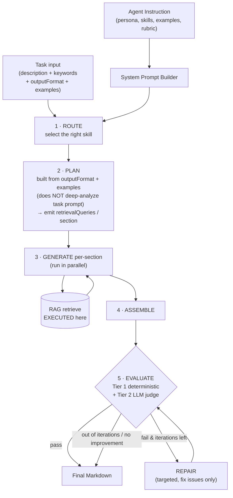

# Agent Orchestration Architecture — Node.js / TypeScript (build from scratch)

Multi-skill agent + Plan → Retrieve → Generate → **Self-Correction loop**. Substrate: **Vercel AI SDK v6** (`ai` + `@ai-sdk/*`) + `zod` + `p-retry` + `remark`/`unified`. No framework (Mastra/LangGraph) — just ~300–400 lines you fully own.

---

## 1. Core principle: separate the two layers (requirement #5)

This is the single most important architectural decision. Separate clearly:

| Layer | Defined by | Contains |
|---|---|---|
| **Configuration** (agent instruction) | **User** | persona, skills, examples, output conventions, rubric, safety |
| **Infrastructure** (orchestrator) | **System** | route, plan, retrieve, generate, evaluate, repair |

`plan` and `retrieve` **are system mechanisms — they do NOT live in the agent instruction**. Reason: if users write "how to plan" / "how to retrieve" into the instruction, quality becomes inconsistent and very hard to control and measure. These steps use **dedicated internal prompts** owned by the system (planner prompt, generator prompt, critic prompt), kept entirely separate from the agent instruction the user writes.

Practical consequence: the user's agent instruction only answers **"WHO this agent is and WHAT it produces"** — it never touches **"HOW this agent plans/retrieves."**

---

## 2. Architecture diagram



**Components:** System Prompt Builder · Router (skill selector) · Planner · Retriever (wrapper around your existing RAG function) · Generator · Evaluator (deterministic + judge) · Repairer · Orchestrator.

---

## 3. Agent Instruction — what to define for the highest quality (requirements #2, #3, #7)

The template below is **agent-level** (stable). The per-task `outputFormat` + `examples` are injected dynamically at the plan/generate steps — they do **not** live in the base system prompt.

```markdown
# Role & Identity
You are {{name}}, {{role}}. {{voice}}.
Your job: produce high-quality Markdown that fulfills the user's task.

# Skills                            ← multi-task via skills (requirement #2)
<skills>
  <skill id="tech_doc">
    <name>Technical documentation</name>
    <when_to_use>API docs, architecture write-ups, how-to guides</when_to_use>
    <instructions>Prefer precise terminology; include code blocks and tables.</instructions>
  </skill>
  <skill id="blog">
    <name>Blog / article</name>
    <when_to_use>Persuasive or educational long-form for a general audience</when_to_use>
    <instructions>Hook in the intro; conversational but credible; cite sources.</instructions>
  </skill>
</skills>

# Capabilities & Constraints
- {{constraint_1}}
- {{constraint_2}}

# Output Format                     ← the RULES (skeleton, heading rules)
Return ONLY valid GitHub-Flavored Markdown.
- Start with exactly one `#` H1; `##` for primary sections, `###` for subsections.
- Code → ```fenced```; tabular data → Markdown table; cite inline `[title](id)`.
- Do NOT wrap the whole response in a code fence; no preamble like "Here is...".

# Examples                          ← SEPARATE header, right after Output Format (requirement #7)
<examples>
  <example>
    <input><task>...</task><keywords>...</keywords></input>
    <output># Title

## Section
Body with [Source A](src-a).
    </output>
  </example>
</examples>

# Quality Rubric                    ← used by Self-Correction (section 6)
- Completeness: every section in the plan is addressed.
- Grounding: every factual claim is cited or marked as inference.
- Structure: heading hierarchy matches the output format.
- Keywords: every input keyword appears >=1 time, naturally (no stuffing).

# Safety & Refusals
- Refuse content that violates the persona's constraints / policy.
```

**Why this ordering (per the GPT-4.1 / Anthropic guides):**

- **Role → Skills → Constraints** first: identity + behavior up front.
- **Output Format** then **Examples**: state the rules first, demonstrate after. Examples get their **own header** because they demonstrate the *whole task* (format + tone + citation + how to weave in keywords), not just format — and because **the planner reads `outputFormat` and `examples` as two separate signals** (see section 5).
- **No "Tools"/"Planning"/"Retrieval" section** in the agent instruction → consistent with the layer separation in section 1.
- 3 anti-patterns to avoid: (a) don't inline JSON tool-schemas into the prompt (OpenAI measured -2% on SWE-bench), (b) drop "CRITICAL!" / all-caps coercion (models over-trigger), (c) **don't rely on assistant-message prefill** — Claude 4.6+ returns HTTP 400.

---

## 4. Types & Schemas (Zod = runtime validator + type + JSON Schema for `generateObject`)

```ts
import { z } from "zod";

export const ExampleSchema = z.object({
  input: z.object({ task: z.string(), keywords: z.array(z.string()) }),
  output: z.string(),                       // full exemplar Markdown
});

export const SkillSchema = z.object({
  id: z.string(),
  name: z.string(),
  whenToUse: z.string(),                    // trigger description — used by ROUTE
  instructions: z.string(),
  defaultExamples: z.array(ExampleSchema).optional(),
});

export const AgentConfigSchema = z.object({          // ← CONFIG LAYER (user)
  id: z.string(),
  persona: z.object({
    name: z.string(), role: z.string(), voice: z.string(),
    constraints: z.array(z.string()),
  }),
  skills: z.array(SkillSchema).min(1),               // multi-task (#2)
  defaultOutputConventions: z.string().optional(),
  qualityRubric: z.array(z.string()),                // for self-correction (#4)
  safety: z.array(z.string()).optional(),
  models: z.object({
    router: z.string(), planner: z.string(),
    generator: z.string(), critic: z.string(),       // each step can use a different model
  }),
  limits: z.object({
    maxSelfCorrectIterations: z.number().int().default(2),
    minQualityScore: z.number().default(0.8),
  }),
});

export const TaskSchema = z.object({                 // ← input on every run
  id: z.string(),
  description: z.string(),
  keywords: z.array(z.string()).default([]),
  outputFormat: z.string(),                          // PRIMARY signal for the plan (#6)
  examples: z.array(ExampleSchema).default([]),      // PRIMARY signal for the plan (#6)
  skillHint: z.string().optional(),                  // if present → skip the router
});

export const PlanSchema = z.object({
  title: z.string(),
  sections: z.array(z.object({
    id: z.string(),
    heading: z.string(),
    intent: z.string(),
    keywordsAssigned: z.array(z.string()),
    needsRetrieval: z.boolean(),
    retrievalQueries: z.array(z.string()),  // EMITTED in plan, EXECUTED in generate (#6)
  })).min(1),
});

export const EvaluationSchema = z.object({
  pass: z.boolean(),
  score: z.number(),
  deterministic: z.object({
    structureOk: z.boolean(),
    keywordCoverage: z.number(),
    issues: z.array(z.string()),
  }),
  judge: z.object({ score: z.number(), feedback: z.array(z.string()) }).optional(),
  feedback: z.array(z.string()),
});

export type AgentConfig = z.infer<typeof AgentConfigSchema>;
export type Task = z.infer<typeof TaskSchema>;
export type Plan = z.infer<typeof PlanSchema>;
export type Evaluation = z.infer<typeof EvaluationSchema>;
```

---

## 5. Processing flow & the Retrieve decision (requirement #6)

**The plan is built from `outputFormat` + `examples`, NOT by deep-analyzing the task prompt.** The planner takes its *structure* from the output format/examples, then maps the task's keywords + intent onto that structure. The plan output is a list of sections, **each carrying its own `retrievalQueries`**.

**Retrieve: decided in Plan, executed in Generate.**

- *Decision* (`needsRetrieval` + `retrievalQueries`) → produced in **Plan**.
- *Execution* (the real RAG call) → in **Generate**, per section, **run in parallel**.

Because the plan's structure already comes from the output format, there is **no need for a seed-retrieval at plan time** to "discover" the structure → this avoids wasting one RAG call and avoids stuffing context with generic chunks. Per-section retrieval at generate time gives the highest precision.

```ts
import { generateText } from "ai";
import pRetry from "p-retry";
import { retrieve } from "../rag/retriever";   // wrapper around your existing RAG

async function generateSection(cfg: AgentConfig, task: Task, plan: Plan, section, system: string) {
  // ── RETRIEVE EXECUTES HERE (not in plan) ──
  const chunks = section.needsRetrieval
    ? (await Promise.all(
        section.retrievalQueries.map((q) =>
          pRetry(() => retrieve({ query: q, topK: 6 }), { retries: 2 })
        )
      )).flatMap((r) => r.chunks)
    : [];

  const { text } = await pRetry(() => generateText({
    model: cfg.models.generator,
    system,
    prompt: generatorPrompt(task, plan, section, chunks),  // inject intent + chunks + keywords
  }), { retries: 2 });

  return { sectionId: section.id, markdown: text };
}
```

Keywords flow through three places: (1) they become `retrievalQueries` in plan, (2) they become per-section `keywordsAssigned` constraints, (3) they become coverage criteria in evaluate. Target ~70–85% coverage (don't force 100% → keyword stuffing).

---

## 6. Autonomy / Self-Correction mechanism (requirement #4)

This is the **evaluator-optimizer** pattern with a bounded loop. The agent self-evaluates, decides what to fix, and stops on its own — within safety limits.

**Two-tier evaluation:**

- **Tier 1 — Deterministic** (fast, free, runs first): `remark`/`unified` parses the AST to check heading hierarchy / required sections / valid tables; regex checks keyword coverage + anti-stuffing. If a **hard structural rule fails → repair immediately, skip the judge** (saves cost).
- **Tier 2 — LLM judge** (subjective dimensions): scores against the `qualityRubric` (completeness, grounding, coherence) + structured feedback. Uses the `critic` model, low temperature.

**3 safety mechanisms so self-correction doesn't "break itself":**

1. **Bounded loop** — `maxSelfCorrectIterations` (default 2).
2. **No-improvement guard** — if the repaired score <= the previous score → stop (avoid thrashing).
3. **Keep-best** — always keep the highest-scoring version; only accept a repair if it's *better*.

**Repair is targeted, not a regenerate** — it only receives the feedback + the failing sections, with the instruction "fix only these, preserve the rest".

```ts
import { generateObject } from "ai";

async function evaluate(cfg: AgentConfig, task: Task, plan: Plan, draft: string): Promise<Evaluation> {
  // ── Tier 1: deterministic (remark AST + keyword regex) ──
  const det = validateDeterministic(draft, task, plan);   // { structureOk, keywordCoverage, issues }

  if (!det.structureOk) {                                  // hard error → skip the judge
    return { pass: false, score: det.keywordCoverage * 0.5, deterministic: det, feedback: det.issues };
  }

  // ── Tier 2: LLM-as-judge ──
  const { object: judge } = await generateObject({
    model: cfg.models.critic,
    schema: z.object({ score: z.number().min(0).max(1), feedback: z.array(z.string()) }),
    prompt: judgePrompt(task, cfg.qualityRubric, draft),
  });

  const score = 0.5 * det.keywordCoverage + 0.5 * judge.score;
  const pass = det.issues.length === 0 && judge.score >= cfg.limits.minQualityScore;
  return { pass, score, deterministic: det, judge, feedback: [...det.issues, ...judge.feedback] };
}
```

---

## 7. Orchestrator (~40 lines, ties it all together)

```ts
import pRetry from "p-retry";

export async function runAgent(cfg: AgentConfig, task: Task) {
  const system = buildSystemPrompt(cfg);                 // persona+skills+rubric+safety (section 3)

  // 1 · ROUTE — select the skill (skip if skillHint is provided)
  const skill = task.skillHint
    ? cfg.skills.find((s) => s.id === task.skillHint)!
    : await routeSkill(cfg, task);                       // generateObject → { selectedSkillId }

  // 2 · PLAN — from outputFormat + examples (NO retrieve, NO dissecting the task prompt)
  const plan = await pRetry(() => buildPlan(cfg, task, skill, system), { retries: 3 });

  // 3 · GENERATE — per-section, retrieve runs inside, parallel
  const parts = await Promise.all(
    plan.sections.map((s) => generateSection(cfg, task, plan, s, system))
  );

  // 4 · ASSEMBLE
  let draft = `# ${plan.title}\n\n` + parts.map((p) => p.markdown).join("\n\n");

  // 5 · SELF-CORRECT — bounded + keep-best + no-improvement guard
  let evaln = await evaluate(cfg, task, plan, draft);
  let best = { draft, score: evaln.score };
  for (let i = 0; i < cfg.limits.maxSelfCorrectIterations && !evaln.pass; i++) {
    const repaired = await repair(cfg, task, plan, best.draft, evaln.feedback, system);
    const reval = await evaluate(cfg, task, plan, repaired);
    if (reval.score <= best.score) break;                // no improvement → stop
    best = { draft: repaired, score: reval.score };
    evaln = reval;
  }

  return { markdown: best.draft, evaluation: evaln, plan, skillId: skill.id };
}
```

---

## 8. Project structure & production

```
src/
├── agent/
│   ├── orchestrator.ts        # runAgent()
│   ├── steps/{route,plan,generate,evaluate,repair}.ts
│   ├── prompts/{persona,planner,generator,judge}.ts   # INTERNAL prompts (!= agent instruction)
│   └── types.ts               # Zod schemas (section 4)
├── llm/provider.ts            # model registry (swap provider = change 1 string)
├── rag/retriever.ts           # wrapper around your existing RAG — orchestrator just calls it
├── obs/{tracer,logger}.ts     # OpenTelemetry GenAI + pino → Langfuse
└── schemas/                   # output validators (remark/unified)
```

**Guardrails:**

- **Retry**: wrap every LLM call in `p-retry` (`factor: 2`, `retries: 3`); don't retry `400`/`AbortError`; on `429` read `retry-after`. Cap total wall-clock with `AbortController` (~90s/run).
- **Observability**: wrap spans per OpenTelemetry **GenAI semantic conventions** (`gen_ai.usage.input_tokens`...); use OpenLLMetry to auto-instrument the SDK; export OTLP → **Langfuse** (trace replay + per-step cost). Key spans: `route`, `plan`, each `generate.section`, each `retrieve`, each `evaluate`.

**Extensibility:**

- **Add a skill** → push to `AgentConfig.skills`; the router picks it up. No orchestrator change.
- **Add another output format** (JSON, DOCX...) → add a discriminator to `TaskSchema.outputFormat` + a `formatters` registry (each formatter has `buildOutputFormatPrompt` + `validate`). The `runAgent` core stays format-agnostic.
- **Multiple agents** → `Map<string, AgentConfig>`, call `runAgent(configId, task)`.

---

## Summary of the 7 decisions

| # | Requirement | Solution |
|---|---|---|
| 1 | Node.js/TS from scratch | Vercel AI SDK v6 + Zod + remark, ~300–400 LOC, no framework |
| 2 | Multi-task via skills | `skills[]` in config + a ROUTE step that selects the skill |
| 3 | High-quality instruction | 8-part template (section 3); plan/retrieve excluded from the instruction |
| 4 | Autonomy / Self-Correction | Two-tier evaluator-optimizer + bounded loop + keep-best + no-improvement guard |
| 5 | Plan/retrieve are infra | Separate the config vs infrastructure layers (section 1) |
| 6 | Retrieve in plan or generate | Decided in **Plan** (emit queries), executed in **Generate** (parallel) |
| 7 | Examples as a separate header? | **Separate header**, right after Output Format; stored as a separate field |
