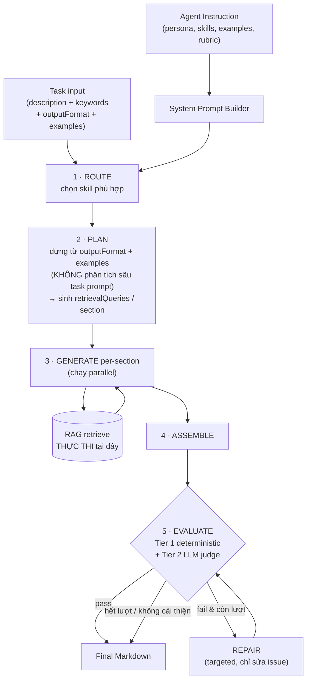

# Kiến trúc Agent Orchestration — Node.js / TypeScript (build from scratch)

Multi-skill agent + Plan → Retrieve → Generate → **Self-Correction loop**. Substrate: **Vercel AI SDK v6** (`ai` + `@ai-sdk/*`) + `zod` + `p-retry` + `remark`/`unified`. Không dùng framework (Mastra/LangGraph) — chỉ ~300–400 dòng bạn sở hữu hoàn toàn.

---

## 1. Nguyên tắc cốt lõi: tách 2 tầng (đáp ứng #5)

Đây là quyết định kiến trúc quan trọng nhất. Tách rõ:

| Tầng | Ai định nghĩa | Gồm gì |
|---|---|---|
| **Configuration** (agent instruction) | **User** | persona, skills, examples, output conventions, rubric, safety |
| **Infrastructure** (orchestrator) | **Hệ thống** | route, plan, retrieve, generate, evaluate, repair |

`plan` và `retrieve` **là cơ chế hệ thống, KHÔNG nằm trong agent instruction**. Lý do: nếu để user tự viết "cách plan" / "cách retrieve" trong instruction, chất lượng sẽ không nhất quán và rất khó kiểm soát/đo lường. Các bước này dùng **prompt nội bộ riêng** do hệ thống quản lý (planner prompt, generator prompt, critic prompt), tách hẳn khỏi agent instruction mà user viết.

Hệ quả thực tế: agent instruction của user chỉ trả lời **"agent này LÀ AI và TẠO RA cái gì"**, không bao giờ đụng tới **"agent này plan/retrieve NHƯ THẾ NÀO"**.

---

## 2. Sơ đồ kiến trúc



**Các component:** System Prompt Builder · Router (skill selector) · Planner · Retriever (wrapper quanh hàm RAG có sẵn) · Generator · Evaluator (deterministic + judge) · Repairer · Orchestrator.

---

## 3. Agent Instruction — định nghĩa gì để chất lượng cao nhất (đáp ứng #2, #3, #7)

Template dưới đây là **agent-level** (ổn định). Phần `outputFormat` + `examples` theo từng task được inject động ở bước plan/generate, **không** nằm trong system prompt nền.

```markdown
# Role & Identity
You are {{name}}, {{role}}. {{voice}}.
Your job: produce high-quality Markdown that fulfills the user's task.

# Skills                            ← multi-task qua skill (yêu cầu #2)
<skills>
  <skill id="tech_doc">
    <name>Technical documentation</name>
    <when_to_use>API docs, architecture write-ups, how-to guides</when_to_use>
    <instructions>Prefer precise terminology; include code blocks and tables.</instructions>
  </skill>
  <skill id="blog">
    <name>Blog / article</name>
    <when_to_use>Persuasive or educational long-form for a general audience</when_to_use>
    <instructions>Hook in the intro; conversational but credible; cite sources.</instructions>
  </skill>
</skills>

# Capabilities & Constraints
- {{constraint_1}}
- {{constraint_2}}

# Output Format                     ← LUẬT (skeleton, heading rules)
Return ONLY valid GitHub-Flavored Markdown.
- Bắt đầu bằng đúng 1 `#` H1; `##` cho section chính, `###` cho subsection.
- Code → ```fenced```; bảng → Markdown table; cite inline `[title](id)`.
- KHÔNG bọc cả response trong code fence; KHÔNG có preamble kiểu "Here is...".

# Examples                          ← header RIÊNG, ngay sau Output Format (yêu cầu #7)
<examples>
  <example>
    <input><task>...</task><keywords>...</keywords></input>
    <output># Title

## Section
Body with [Source A](src-a).
    </output>
  </example>
</examples>

# Quality Rubric                    ← dùng cho Self-Correction (mục 6)
- Completeness: mọi section trong plan được xử lý.
- Grounding: mọi factual claim có citation hoặc đánh dấu là inference.
- Structure: heading hierarchy đúng output format.
- Keywords: mọi keyword input xuất hiện >=1 lần, tự nhiên (không nhồi).

# Safety & Refusals
- Từ chối nội dung vi phạm constraint của persona / policy.
```

**Vì sao thứ tự này (theo guide GPT-4.1 / Anthropic):**

- **Role → Skills → Constraints** lên đầu: định danh + hành vi trước.
- **Output Format** rồi **Examples**: nêu luật trước, minh họa sau. Examples để **header riêng** vì nó minh họa *cả task* (format + tone + citation + cách lồng keyword), không chỉ format — và vì **planner đọc `outputFormat` và `examples` như 2 tín hiệu tách biệt** (xem mục 5).
- **KHÔNG có section "Tools"/"Planning"/"Retrieval"** trong agent instruction → đúng nguyên tắc tách tầng ở mục 1.
- 3 anti-pattern cần tránh: (a) đừng nhồi JSON tool-schema vào prompt (OpenAI đo -2% SWE-bench), (b) bỏ "CRITICAL!" / chữ in hoa ép buộc (model over-trigger), (c) **đừng dựa vào assistant-message prefill** — Claude 4.6+ trả HTTP 400.

---

## 4. Type & Schema (Zod = runtime validator + type + JSON Schema cho `generateObject`)

```ts
import { z } from "zod";

export const ExampleSchema = z.object({
  input: z.object({ task: z.string(), keywords: z.array(z.string()) }),
  output: z.string(),                       // exemplar Markdown đầy đủ
});

export const SkillSchema = z.object({
  id: z.string(),
  name: z.string(),
  whenToUse: z.string(),                    // mô tả trigger — dùng cho ROUTE
  instructions: z.string(),
  defaultExamples: z.array(ExampleSchema).optional(),
});

export const AgentConfigSchema = z.object({          // ← TẦNG CONFIG (user)
  id: z.string(),
  persona: z.object({
    name: z.string(), role: z.string(), voice: z.string(),
    constraints: z.array(z.string()),
  }),
  skills: z.array(SkillSchema).min(1),               // multi-task (#2)
  defaultOutputConventions: z.string().optional(),
  qualityRubric: z.array(z.string()),                // cho self-correction (#4)
  safety: z.array(z.string()).optional(),
  models: z.object({
    router: z.string(), planner: z.string(),
    generator: z.string(), critic: z.string(),       // mỗi step có thể dùng model khác nhau
  }),
  limits: z.object({
    maxSelfCorrectIterations: z.number().int().default(2),
    minQualityScore: z.number().default(0.8),
  }),
});

export const TaskSchema = z.object({                 // ← input mỗi lần chạy
  id: z.string(),
  description: z.string(),
  keywords: z.array(z.string()).default([]),
  outputFormat: z.string(),                          // TÍN HIỆU CHÍNH cho plan (#6)
  examples: z.array(ExampleSchema).default([]),      // TÍN HIỆU CHÍNH cho plan (#6)
  skillHint: z.string().optional(),                  // nếu có → bỏ qua router
});

export const PlanSchema = z.object({
  title: z.string(),
  sections: z.array(z.object({
    id: z.string(),
    heading: z.string(),
    intent: z.string(),
    keywordsAssigned: z.array(z.string()),
    needsRetrieval: z.boolean(),
    retrievalQueries: z.array(z.string()),  // SINH ở plan, CHẠY ở generate (#6)
  })).min(1),
});

export const EvaluationSchema = z.object({
  pass: z.boolean(),
  score: z.number(),
  deterministic: z.object({
    structureOk: z.boolean(),
    keywordCoverage: z.number(),
    issues: z.array(z.string()),
  }),
  judge: z.object({ score: z.number(), feedback: z.array(z.string()) }).optional(),
  feedback: z.array(z.string()),
});

export type AgentConfig = z.infer<typeof AgentConfigSchema>;
export type Task = z.infer<typeof TaskSchema>;
export type Plan = z.infer<typeof PlanSchema>;
export type Evaluation = z.infer<typeof EvaluationSchema>;
```

---

## 5. Luồng xử lý & quyết định Retrieve (đáp ứng #6)

**Plan được dựng từ `outputFormat` + `examples`, KHÔNG phân tích sâu task prompt.** Planner lấy *cấu trúc* từ output format/examples, rồi map keyword + intent của task lên cấu trúc đó. Đầu ra plan là danh sách section, **mỗi section kèm `retrievalQueries` riêng**.

**Retrieve: quyết định ở Plan, thực thi ở Generate.**

- *Quyết định* (`needsRetrieval` + `retrievalQueries`) → sinh trong **Plan**.
- *Thực thi* (gọi hàm RAG thật) → trong **Generate**, theo từng section, **chạy parallel**.

Vì cấu trúc plan đã đến từ output format nên **không cần seed-retrieval ở plan** để khám phá cấu trúc → tránh tốn 1 RAG call vô ích và tránh nhồi context chung chung. Per-section retrieve ở generate cho precision cao nhất.

```ts
import { generateText } from "ai";
import pRetry from "p-retry";
import { retrieve } from "../rag/retriever";   // wrapper quanh RAG có sẵn của bạn

async function generateSection(cfg: AgentConfig, task: Task, plan: Plan, section, system: string) {
  // ── RETRIEVE THỰC THI Ở ĐÂY (không phải ở plan) ──
  const chunks = section.needsRetrieval
    ? (await Promise.all(
        section.retrievalQueries.map((q) =>
          pRetry(() => retrieve({ query: q, topK: 6 }), { retries: 2 })
        )
      )).flatMap((r) => r.chunks)
    : [];

  const { text } = await pRetry(() => generateText({
    model: cfg.models.generator,
    system,
    prompt: generatorPrompt(task, plan, section, chunks),  // inject intent + chunks + keywords
  }), { retries: 2 });

  return { sectionId: section.id, markdown: text };
}
```

Keyword đi qua 3 chỗ: (1) thành `retrievalQueries` ở plan, (2) thành `keywordsAssigned` ràng buộc per-section, (3) thành tiêu chí coverage ở evaluate. Mục tiêu coverage ~70–85% (không ép 100% → nhồi keyword).

---

## 6. Cơ chế Autonomy / Self-Correction (đáp ứng #4)

Đây là pattern **evaluator-optimizer** với loop có chặn. Agent tự đánh giá, tự quyết định cần sửa gì, tự dừng — trong giới hạn an toàn.

**Evaluate 2 tầng:**

- **Tier 1 — Deterministic** (nhanh, miễn phí, chạy trước): `remark`/`unified` parse AST kiểm tra heading hierarchy / section bắt buộc / table hợp lệ; regex kiểm keyword coverage + chống nhồi. Nếu **sai cấu trúc cứng → repair luôn, khỏi gọi judge** (tiết kiệm cost).
- **Tier 2 — LLM judge** (chiều chủ quan): chấm điểm theo `qualityRubric` (completeness, grounding, coherence) + feedback có cấu trúc. Dùng model `critic`, temperature thấp.

**3 điểm an toàn để self-correction không "tự làm hỏng":**

1. **Bounded loop** — `maxSelfCorrectIterations` (mặc định 2).
2. **No-improvement guard** — nếu điểm bản sửa <= bản trước → dừng (tránh thrash).
3. **Keep-best** — luôn giữ bản điểm cao nhất; chỉ nhận repair nếu nó *tốt hơn*.

**Repair là targeted, không regenerate** — chỉ nhận feedback + các section lỗi, lệnh "fix only these, preserve the rest".

```ts
import { generateObject } from "ai";

async function evaluate(cfg: AgentConfig, task: Task, plan: Plan, draft: string): Promise<Evaluation> {
  // ── Tier 1: deterministic (remark AST + keyword regex) ──
  const det = validateDeterministic(draft, task, plan);   // { structureOk, keywordCoverage, issues }

  if (!det.structureOk) {                                  // lỗi cứng → khỏi gọi judge
    return { pass: false, score: det.keywordCoverage * 0.5, deterministic: det, feedback: det.issues };
  }

  // ── Tier 2: LLM-as-judge ──
  const { object: judge } = await generateObject({
    model: cfg.models.critic,
    schema: z.object({ score: z.number().min(0).max(1), feedback: z.array(z.string()) }),
    prompt: judgePrompt(task, cfg.qualityRubric, draft),
  });

  const score = 0.5 * det.keywordCoverage + 0.5 * judge.score;
  const pass = det.issues.length === 0 && judge.score >= cfg.limits.minQualityScore;
  return { pass, score, deterministic: det, judge, feedback: [...det.issues, ...judge.feedback] };
}
```

---

## 7. Orchestrator (≈40 dòng, ráp tất cả)

```ts
import pRetry from "p-retry";

export async function runAgent(cfg: AgentConfig, task: Task) {
  const system = buildSystemPrompt(cfg);                 // persona+skills+rubric+safety (mục 3)

  // 1 · ROUTE — chọn skill (bỏ qua nếu có skillHint)
  const skill = task.skillHint
    ? cfg.skills.find((s) => s.id === task.skillHint)!
    : await routeSkill(cfg, task);                       // generateObject → { selectedSkillId }

  // 2 · PLAN — từ outputFormat + examples (KHÔNG retrieve, KHÔNG mổ xẻ task prompt)
  const plan = await pRetry(() => buildPlan(cfg, task, skill, system), { retries: 3 });

  // 3 · GENERATE — per-section, retrieve chạy bên trong, parallel
  const parts = await Promise.all(
    plan.sections.map((s) => generateSection(cfg, task, plan, s, system))
  );

  // 4 · ASSEMBLE
  let draft = `# ${plan.title}\n\n` + parts.map((p) => p.markdown).join("\n\n");

  // 5 · SELF-CORRECT — bounded + keep-best + no-improvement guard
  let evaln = await evaluate(cfg, task, plan, draft);
  let best = { draft, score: evaln.score };
  for (let i = 0; i < cfg.limits.maxSelfCorrectIterations && !evaln.pass; i++) {
    const repaired = await repair(cfg, task, plan, best.draft, evaln.feedback, system);
    const reval = await evaluate(cfg, task, plan, repaired);
    if (reval.score <= best.score) break;                // không cải thiện → dừng
    best = { draft: repaired, score: reval.score };
    evaln = reval;
  }

  return { markdown: best.draft, evaluation: evaln, plan, skillId: skill.id };
}
```

---

## 8. Cấu trúc project & production

```
src/
├── agent/
│   ├── orchestrator.ts        # runAgent()
│   ├── steps/{route,plan,generate,evaluate,repair}.ts
│   ├── prompts/{persona,planner,generator,judge}.ts   # prompt NỘI BỘ (≠ agent instruction)
│   └── types.ts               # Zod schemas (mục 4)
├── llm/provider.ts            # model registry (đổi provider = đổi 1 string)
├── rag/retriever.ts           # wrapper quanh RAG có sẵn — orchestrator chỉ gọi
├── obs/{tracer,logger}.ts     # OpenTelemetry GenAI + pino → Langfuse
└── schemas/                   # output validators (remark/unified)
```

**Guardrails:**

- **Retry**: mọi LLM call bọc `p-retry` (`factor: 2`, `retries: 3`); `400`/`AbortError` không retry; `429` đọc `retry-after`. Chặn tổng thời gian bằng `AbortController` (~90s/run).
- **Observability**: bọc span theo OpenTelemetry **GenAI semantic conventions** (`gen_ai.usage.input_tokens`...); dùng OpenLLMetry tự instrument SDK; export OTLP → **Langfuse** (replay trace + cost per step). Span chính: `route`, `plan`, mỗi `generate.section`, mỗi `retrieve`, mỗi `evaluate`.

**Mở rộng:**

- **Thêm skill** → push vào `AgentConfig.skills`; router tự nhận. Không sửa orchestrator.
- **Thêm output format khác** (JSON, DOCX...) → thêm discriminator vào `TaskSchema.outputFormat` + một `formatters` registry (mỗi formatter có `buildOutputFormatPrompt` + `validate`). Core `runAgent` format-agnostic.
- **Nhiều agent** → `Map<string, AgentConfig>`, gọi `runAgent(configId, task)`.

---

## Tóm tắt 7 quyết định

| # | Yêu cầu | Giải pháp |
|---|---|---|
| 1 | Node.js/TS from scratch | Vercel AI SDK v6 + Zod + remark, ~300–400 LOC, no framework |
| 2 | Multi-task qua skill | `skills[]` trong config + ROUTE step chọn skill |
| 3 | Instruction chất lượng cao | Template 8 phần (mục 3); loại bỏ plan/retrieve khỏi instruction |
| 4 | Autonomy / Self-Correction | Evaluator-optimizer 2 tầng + bounded loop + keep-best + no-improvement guard |
| 5 | Plan/retrieve là infra | Tách 2 tầng config vs infrastructure (mục 1) |
| 6 | Retrieve ở plan hay generate | Quyết định ở **Plan** (sinh queries), thực thi ở **Generate** (parallel) |
| 7 | Examples header riêng? | **Header riêng**, ngay sau Output Format; lưu field tách biệt |
