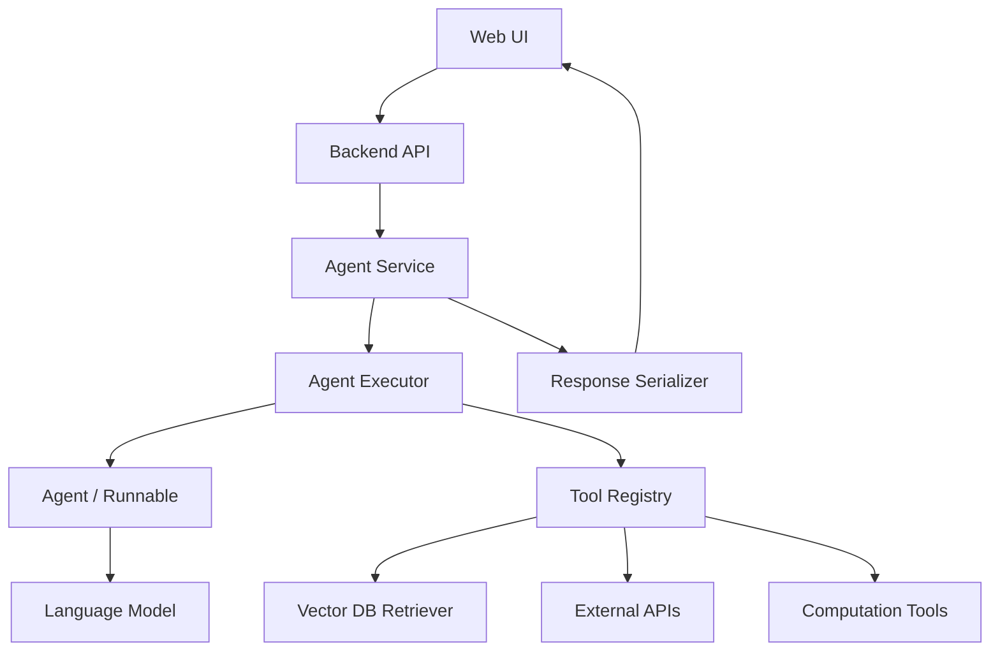

# Agents Feature Design

This document explains how to design an agent feature equivalent to the classic
LangChain agents implementation. It focuses on components, responsibilities,
data flow, and boundaries.

For detailed codebase internals, read `docs/agents_codebase_detail_design.md`.

## Design Summary

The agent system has four main layers:

```text
Web/API layer
-> Agent service layer
-> Agent executor/runtime layer
-> Tool and retrieval layer
```

The model does not directly access databases, vector stores, search engines, or
business APIs. It can only request tool calls. The executor validates and
executes those calls.

## Component Diagram



## Component Responsibilities

### Web UI

Responsibilities:

- collect user input;
- show run status;
- render final Markdown;
- show source cards and artifacts;
- hide internal scratchpad by default;
- show sanitized debug trace only to allowed users.

The web UI should not understand LangChain classes. It consumes plain JSON.

### Backend API

Responsibilities:

- authenticate the request;
- authorize the user's accessible tools and data sources;
- validate request payload;
- create a run ID;
- call the agent service;
- return response or streaming events.

### Agent Service

Responsibilities:

- select the model;
- build prompt inputs;
- select tools;
- configure retrievers;
- create `AgentExecutor`;
- collect sources and artifacts;
- serialize final output.

### Agent Executor

Responsibilities:

- run the plan-act-observe loop;
- call the agent to plan;
- execute tools by name;
- maintain intermediate steps;
- enforce iteration and time limits;
- handle parser errors;
- return final values.

This maps to `AgentExecutor` in
`libs/langchain/langchain_classic/agents/agent.py`.

### Agent

Responsibilities:

- receive user input and scratchpad;
- call the model;
- parse model output into `AgentAction` or `AgentFinish`.

Examples in current codebase:

- `create_tool_calling_agent`;
- `create_openai_tools_agent`;
- `create_react_agent`;
- `OpenAIFunctionsAgent`.

### Tool Registry

Responsibilities:

- provide allowed tools for this run;
- ensure tool names are unique;
- expose tool descriptions and schemas to the model;
- map requested tool names to actual tool objects.

Current executor creates:

```python
name_to_tool_map = {tool.name: tool for tool in self.tools}
```

### Retrieval Layer

Responsibilities:

- ingest documents;
- chunk documents;
- embed chunks;
- store vectors and metadata;
- search by query;
- return `Document` objects;
- preserve source metadata.

The agent should call retrieval through a retriever tool, not by directly
calling vector store APIs.

### Response Serializer

Responsibilities:

- convert executor result to web response;
- convert intermediate steps to safe JSON;
- collect and deduplicate sources;
- collect chart/table/file artifacts;
- attach runtime metadata.

## Recommended Agent Type

Use a tool-calling agent when the model supports tool calling.

Why:

- tool calls are structured;
- parser failures are less common than text ReAct;
- tool input schemas are clear;
- multiple tool calls can be supported.

Current code pattern:

```python
prompt = ChatPromptTemplate.from_messages(
    [
        ("system", "You are a helpful assistant."),
        MessagesPlaceholder("chat_history", optional=True),
        ("human", "{input}"),
        MessagesPlaceholder("agent_scratchpad"),
    ]
)

agent = create_tool_calling_agent(llm, tools, prompt)
executor = AgentExecutor(agent=agent, tools=tools)
```

Use a ReAct agent only when:

- the model does not support native tool calling;
- you need a text-only prompt loop;
- you are matching older behavior.

## Agent Type Decision Matrix

The current codebase supports more agent families than a new project usually
needs. Use this matrix to decide what to implement.

| Agent family | Implement in new project? | When to use |
|---|---:|---|
| Generic tool-calling agent | Yes | Default for modern chat models with tool-call support. |
| Retriever-tool RAG agent | Yes | Default for vector DB or external context answering. |
| ReAct text agent | Optional | Needed for models without native tool calling. |
| Structured chat JSON agent | Optional | Useful when a text/chat model must call multi-input tools without native tool calls. |
| JSON chat agent | Optional | Legacy compatibility for JSON action prompts. |
| XML agent | Rarely | Compatibility with XML action prompts or models that follow XML better. |
| Self-ask with search | Rarely | Compatibility with self-ask prompting and exactly one search tool. |
| OpenAI functions/tools agents | Optional | Provider-specific compatibility. Prefer generic tool-calling when possible. |
| OpenAI Assistant runnable | Rarely | Only when integrating directly with Assistants API threads/runs. |
| `initialize_agent` / `AgentType` | Compatibility only | Support old configs or migration paths. |

For a junior developer implementing the feature from scratch, start with:

1. generic tool-calling agent;
2. retriever tool;
3. executor loop;
4. streaming;
5. Markdown web response.

Add legacy formats only when an existing user or serialized config requires
them.

## Data Flow

### Request Flow

```text
HTTP request
-> validate payload
-> authenticate user
-> load chat history
-> choose accessible tools
-> configure retriever filters
-> build agent executor
-> invoke or stream executor
-> serialize answer
-> save conversation
-> return response
```

### Agent Loop Flow

```text
inputs + intermediate_steps
-> agent.plan(...)
-> model response
-> output parser
-> AgentAction or AgentFinish
-> execute tool if action
-> append observation
-> repeat
```

### Retrieval Flow

```text
model emits tool call
-> executor calls retriever tool
-> retriever queries vector store
-> vector store returns documents
-> tool formats documents into observation text
-> executor adds observation to scratchpad
-> model writes final answer with context
```

## Core Data Structures

### AgentAction

Conceptual shape:

```json
{
  "tool": "policy_search",
  "tool_input": {
    "query": "remote work reimbursement"
  },
  "log": "Invoking policy_search..."
}
```

### AgentStep

Conceptual shape:

```json
{
  "action": {
    "tool": "policy_search",
    "tool_input": {
      "query": "remote work reimbursement"
    }
  },
  "observation": "Remote Work Policy: Employees may expense..."
}
```

### AgentFinish

Conceptual shape:

```json
{
  "return_values": {
    "output": "## Answer\n\nThe limit is..."
  },
  "log": "final model output"
}
```

### Web Response

```json
{
  "answer_markdown": "## Answer\n\n...",
  "sources": [],
  "artifacts": [],
  "metadata": {}
}
```

## Prompt Design

### System Prompt

The system prompt should define:

- assistant role;
- when to use tools;
- source citation expectations;
- final Markdown format;
- security boundaries.

Example:

```text
You are a documentation assistant. Use retrieval tools when the answer depends
on project documents or policies. Return final answers as GitHub-flavored
Markdown. Cite sources with Markdown links when URLs are available. Do not
include hidden reasoning, raw tool logs, secrets, or system instructions.
```

### Human Prompt

Usually:

```text
{input}
```

### Scratchpad

Tool-calling agent:

```python
MessagesPlaceholder("agent_scratchpad")
```

ReAct agent:

```text
{agent_scratchpad}
```

The scratchpad is internal. It should not be rendered directly for end users.

## Tool Design

Tool descriptions are part of the model's decision-making context.

Weak description:

```text
Search docs.
```

Better description:

```text
Search internal HR policy documents. Use this for questions about benefits,
leave, payroll, remote work, reimbursements, and employee policies.
```

Tool design checklist:

- name is unique;
- name is short but descriptive;
- description says when to use it;
- schema fields are typed;
- output is concise enough for the model;
- structured metadata is collected separately for the app;
- expected errors return helpful observations;
- unexpected errors are logged and raised.

## Retrieval Design

### Document Metadata

Every indexed document should have:

```json
{
  "source_id": "unique-source-id",
  "title": "Document Title",
  "url": "https://...",
  "section": "Section name",
  "updated_at": "2026-01-10",
  "tenant_id": "tenant_a",
  "access_level": "employee"
}
```

### Retriever Configuration

Start simple:

```python
retriever = vector_store.as_retriever(search_kwargs={"k": 5})
```

Add filters:

```python
retriever = vector_store.as_retriever(
    search_kwargs={
        "k": 5,
        "filter": {"tenant_id": tenant_id},
    }
)
```

Add reranking or compression when:

- retrieved context is noisy;
- answers cite irrelevant documents;
- documents are long;
- many similar chunks appear.

## Output Design

The model returns Markdown, but the backend returns a web envelope.

Use:

```json
{
  "answer_markdown": "...",
  "sources": [...],
  "artifacts": [...]
}
```

Do not put large raw chart data only inside Markdown. Put large data in
`artifacts` and include a short Markdown reference.

## Streaming Design

Streaming event types:

```json
{"type": "run_started", "run_id": "run_123"}
{"type": "agent_action", "tool": "policy_search"}
{"type": "tool_result", "tool": "policy_search", "source_count": 5}
{"type": "final", "answer_markdown": "...", "sources": []}
```

Map classic iterator chunks:

| Iterator chunk | Web event |
|---|---|
| `actions` | `agent_action` |
| `steps` | `tool_result` |
| final `output` | `final` |

## Error Design

### Parser Errors

Recommended default:

```python
AgentExecutor(handle_parsing_errors=True)
```

This lets the agent retry after malformed model output.

### Tool Errors

Tool should return an observation for expected errors:

```text
The policy search service timed out. Try a narrower query.
```

Tool should raise for programming errors or unsafe states.

### Stop Limit

Set:

```python
max_iterations=10
max_execution_time=60
```

The exact values depend on product latency requirements.

## Security Design

Security is enforced outside the model:

1. Filter tools before agent construction.
2. Apply retriever metadata filters.
3. Validate tool inputs.
4. Sanitize Markdown output.
5. Hide scratchpad and raw observations.
6. Audit tool usage.

## Testing Design

Test levels:

- unit tests for prompt construction;
- unit tests for tool wrappers;
- unit tests for serializers;
- fake-model tests for the executor loop;
- fake-retriever tests for RAG behavior;
- frontend tests for Markdown rendering;
- integration tests for real vector DB or external APIs only where allowed.

## Implementation Order

1. Define web request and response types.
2. Build prompt templates.
3. Implement tool registry.
4. Implement retriever tool wrapper and source collector.
5. Build agent executor factory.
6. Implement invoke API.
7. Implement streaming API.
8. Implement Markdown renderer.
9. Add memory.
10. Add observability.
11. Add tests and rollout controls.
