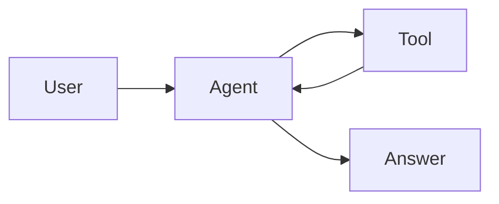

# Workflow 07: Web Markdown Output

This workflow explains how to render the final agent answer in a web UI.

## Objective

Render `answer_markdown` safely and richly:

- text;
- headings;
- lists;
- tables;
- code blocks;
- links;
- diagrams;
- charts;
- citations.

## Output Contract

Backend response:

```json
{
  "answer_markdown": "## Answer\n\n...",
  "sources": [],
  "artifacts": []
}
```

The answer is Markdown, not HTML.

## Prompt Instruction

Tell the model:

```text
Return final answers as GitHub-flavored Markdown.
Use fenced code blocks with language names for code.
Use tables for comparisons.
Use Mermaid fenced blocks for diagrams only when helpful.
Use Vega-Lite fenced JSON for charts only when data is available.
Cite sources with Markdown links when source URLs are available.
Do not include hidden reasoning or raw tool logs.
```

## Renderer Pipeline

```text
answer_markdown
-> parse Markdown with GFM
-> transform custom code fences
-> sanitize HTML and URLs
-> render web components
```

Recommended supported features:

| Feature | Markdown | Renderer |
|---|---|---|
| Headings | `## Title` | Typography component |
| Tables | GFM table | Responsive table |
| Code | fenced block | Syntax highlighter |
| Mermaid | fenced `mermaid` | Mermaid renderer |
| Charts | fenced `vega-lite` | Vega-Lite renderer |
| Math | `$x^2$` | KaTeX or MathJax |
| Links | `[title](url)` | Safe link component |

## Code Blocks

Markdown:

````markdown
```python
def answer() -> str:
    return "hello"
```
````

Frontend behavior:

- show language label;
- syntax highlight;
- provide copy button;
- do not execute code.

## Tables

Markdown:

```markdown
| Item | Limit |
|---|---:|
| Ergonomic equipment | 300 USD |
| Internet stipend | 50 USD/month |
```

Frontend behavior:

- support horizontal scroll on mobile;
- preserve alignment;
- avoid overflowing containers.

## Mermaid Diagrams

Markdown:

````markdown

````

Frontend behavior:

- validate or sanitize diagram text;
- render errors as plain code blocks;
- avoid running unsafe scripts.

## Vega-Lite Charts

Markdown:

````markdown
```vega-lite
{
  "$schema": "https://vega.github.io/schema/vega-lite/v5.json",
  "mark": "bar",
  "encoding": {
    "x": {"field": "month", "type": "nominal"},
    "y": {"field": "count", "type": "quantitative"}
  },
  "data": {
    "values": [
      {"month": "Jan", "count": 10},
      {"month": "Feb", "count": 15}
    ]
  }
}
```
````

Frontend behavior:

- parse JSON;
- validate schema;
- limit data size;
- render fallback if invalid.

## Sources

Do not parse all sources only from Markdown. Use structured `sources`.

Markdown citation:

```markdown
The limit is **300 USD** according to the
[Remote Work Policy](https://example.internal/policies/remote-work).
```

Structured source:

```json
{
  "id": "remote-work-policy",
  "title": "Remote Work Policy",
  "url": "https://example.internal/policies/remote-work",
  "section": "Reimbursement"
}
```

Frontend behavior:

- render source chips or cards;
- link citations to source panel entries if possible;
- hide sources the user is not allowed to open.

## Security Rules

Markdown is untrusted content.

Required:

- disable raw HTML or sanitize it;
- block unsafe URLs such as `javascript:`;
- limit image domains or proxy images;
- do not execute code blocks;
- validate chart specs;
- validate Mermaid diagrams;
- apply Content Security Policy;
- cap output length.

## Junior Developer Mental Model

The model returns text. The browser renders UI.

Do not let the model return arbitrary HTML that the browser trusts.

Safe pipeline:

```text
model markdown
-> parse markdown
-> sanitize
-> render known components
```

Unsafe pipeline:

```text
model output
-> innerHTML
```

The backend should return structured data:

```json
{
  "answer_markdown": "...",
  "sources": [],
  "artifacts": []
}
```

The frontend decides how to render each part.

## End-To-End Rendering Recipe

### 1. Receive Web Response

```json
{
  "answer_markdown": "## Answer\n\nThe limit is **300 USD**.",
  "sources": [
    {
      "id": "remote-work-policy",
      "title": "Remote Work Policy",
      "url": "https://example.internal/policies/remote-work"
    }
  ],
  "artifacts": []
}
```

### 2. Parse Markdown With GFM

Enable:

- tables;
- task lists;
- fenced code blocks;
- autolinks if needed.

### 3. Transform Special Code Fences

Rules:

| Fence language | Render as |
|---|---|
| `python`, `typescript`, `json`, etc. | Code block |
| `mermaid` | Diagram component |
| `vega-lite` | Chart component |
| unknown language | Plain code block |

### 4. Sanitize Links And HTML

Reject or escape:

- `javascript:`;
- unsafe `data:` URLs;
- inline event handlers;
- unknown HTML if raw HTML is enabled.

### 5. Render Sources Separately

Do not rely only on Markdown links. Render `sources` as source cards or a side
panel.

## Suggested Frontend Component Contract

```typescript
type AgentResponse = {
  answer_markdown: string;
  sources: Source[];
  artifacts: Artifact[];
};

type Source = {
  id: string;
  title: string;
  url?: string;
  section?: string;
  quote?: string;
};

type Artifact = {
  id: string;
  type: "table" | "vega-lite" | "mermaid" | "file" | "image" | "json";
  title?: string;
  data: unknown;
};
```

Render:

```text
AgentAnswer
├── MarkdownRenderer(answer_markdown)
├── SourcePanel(sources)
└── ArtifactPanel(artifacts)
```

## Handling Large Tables And Charts

Markdown is fine for small tables:

```markdown
| Item | Limit |
|---|---:|
| Equipment | 300 USD |
```

For large data, use artifacts:

```json
{
  "artifacts": [
    {
      "id": "table_1",
      "type": "table",
      "title": "Reimbursement Limits",
      "data": {
        "columns": ["item", "limit"],
        "rows": [["Equipment", "300 USD"]]
      }
    }
  ]
}
```

Markdown can reference it:

```markdown
See the reimbursement table below.
```

Why:

- large Markdown tables are hard to render on mobile;
- structured artifacts are easier to sort, download, and validate;
- chart data should not be hidden inside model prose.

## Citation Rendering

Recommended UI:

```text
Answer text with citation chips
Source side panel with title, section, quote, link
```

Markdown citation:

```markdown
The limit is **300 USD** [Remote Work Policy].
```

Structured source:

```json
{
  "id": "remote-work-policy",
  "title": "Remote Work Policy",
  "url": "https://example.internal/policies/remote-work",
  "section": "Reimbursement",
  "quote": "Approved ergonomic equipment may be reimbursed up to 300 USD."
}
```

If you need clickable citation chips, use a simple syntax convention:

```markdown
The limit is **300 USD** [^remote-work-policy].
```

Then map `remote-work-policy` to the structured source list.

## Concrete Rendering Trace

Backend returns:

````json
{
  "answer_markdown": "## Summary\n\nThe limit is **300 USD**.\n\n```python\nprint('hello')\n```\n\n```mermaid\nflowchart LR\nA-->B\n```",
  "sources": [{"id": "policy", "title": "Policy"}],
  "artifacts": []
}
````

Frontend:

1. Parses heading and paragraph.
2. Renders Python block with syntax highlighting.
3. Detects Mermaid block and renders diagram.
4. Renders source panel with `Policy`.
5. Blocks raw HTML or unsafe links if present.

## Testing The Renderer

### Test Unsafe Link

```typescript
it("blocks javascript links", () => {
  renderMarkdown("[click](javascript:alert(1))");
  expect(screen.queryByRole("link")).not.toHaveAttribute("href", "javascript:alert(1)");
});
```

### Test Code Block

```typescript
it("renders code blocks without executing them", () => {
  renderMarkdown("```js\nwindow.evil = true\n```");
  expect(window.evil).toBeUndefined();
});
```

### Test Table Responsiveness

```typescript
it("wraps tables in a scroll container", () => {
  renderMarkdown("| A | B |\n|---|---|\n| 1 | 2 |");
  expect(screen.getByTestId("markdown-table-container")).toBeInTheDocument();
});
```

### Test Invalid Chart Fallback

```typescript
it("renders invalid vega-lite as code fallback", () => {
  renderMarkdown("```vega-lite\n{bad json}\n```");
  expect(screen.getByText(/bad json/)).toBeInTheDocument();
});
```

## Debugging Rendering

If Markdown looks broken:

- inspect raw `answer_markdown`;
- check code fences are closed;
- check table pipes and separator row;
- check sanitizer is not removing expected nodes.

If charts do not render:

- validate JSON;
- check schema version;
- check data size limits;
- render fallback errors in development.

If sources do not show:

- inspect `sources` array;
- verify source IDs match citation syntax if using citation chips;
- do not depend only on model-written links.

## Common Mistakes

- Rendering Markdown as raw HTML.
- Letting `javascript:` links through.
- Executing generated code.
- Trusting chart JSON without validation.
- Putting huge data arrays inside Markdown instead of artifacts.
- Showing raw intermediate steps to all users.
- Trusting model-generated citations without structured source data.
- Letting invalid Mermaid or chart specs crash the whole answer.

## Done Checklist

- [ ] Backend returns `answer_markdown`.
- [ ] Renderer supports GFM.
- [ ] Code blocks are highlighted but not executed.
- [ ] Tables are responsive.
- [ ] Mermaid and Vega-Lite are validated.
- [ ] Links and HTML are sanitized.
- [ ] Sources render separately.
- [ ] Large tables/charts can be returned as artifacts.
- [ ] Renderer tests cover unsafe links, code blocks, tables, diagrams, charts, and source cards.
- [ ] Invalid rich blocks fall back safely.
