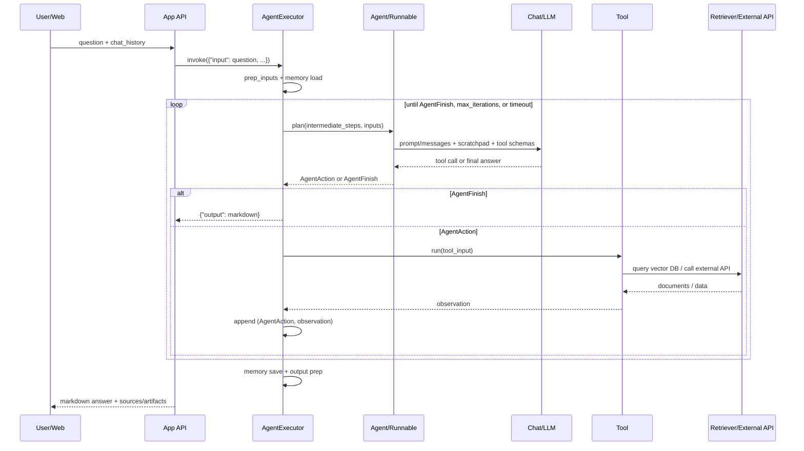
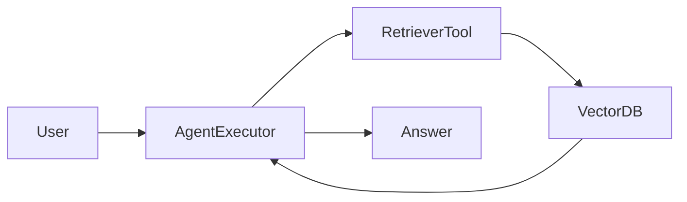

# LangChain Classic Agents Specification and Design

This document describes the current `langchain_classic.agents` design in this
codebase and gives an implementation-oriented reference for building the same
feature in another project.

Scope:

- Package studied: `libs/langchain/langchain_classic/agents`.
- Runtime focus: `AgentExecutor`, tool-calling/ReAct agents, vector store and
  retriever tools, conversational retrieval agents, streaming, and web output.
- Output focus: markdown-first answers that can render rich web content such as
  code blocks, tables, diagrams, charts, math, source citations, and files.

Important status note: this is the classic agent implementation. Several entry
points in this package are deprecated in favor of `langchain.agents.create_agent`
or LangGraph-based agents. The design remains useful because it exposes the
core agent loop clearly: plan, call tool, observe, repeat, finish.

## Source Map

Core files:

| Area | Source | Purpose |
|---|---|---|
| Executor loop | `libs/langchain/langchain_classic/agents/agent.py` | Owns agent execution, iteration limits, parsing error policy, tool execution, sync/async calls, and final output. |
| Streaming iterator | `libs/langchain/langchain_classic/agents/agent_iterator.py` | Emits agent actions, tool observations, intermediate steps, and final outputs. |
| Tool-calling agent | `libs/langchain/langchain_classic/agents/tool_calling_agent/base.py` | Builds a Runnable agent using chat-model tool calling through `llm.bind_tools`. |
| OpenAI tools agent | `libs/langchain/langchain_classic/agents/openai_tools/base.py` | Builds a Runnable agent using OpenAI tool-call message format. |
| OpenAI functions agent | `libs/langchain/langchain_classic/agents/openai_functions_agent/base.py` | Classic single-action OpenAI function-calling agent. |
| ReAct agent | `libs/langchain/langchain_classic/agents/react/agent.py` | Builds a text ReAct Runnable with `Thought`, `Action`, `Action Input`, `Observation`, `Final Answer`. |
| MRKL/ZeroShot agent | `libs/langchain/langchain_classic/agents/mrkl/base.py` | Older ReAct-style agent class used by vectorstore agents. |
| Tool output parsing | `libs/langchain/langchain_classic/agents/output_parsers/tools.py` | Converts model tool calls into `AgentAction` objects, or normal messages into `AgentFinish`. |
| ReAct parsing | `libs/langchain/langchain_classic/agents/output_parsers/react_single_input.py` | Parses text ReAct output into `AgentAction` or `AgentFinish`. |
| Scratchpad formatting | `libs/langchain/langchain_classic/agents/format_scratchpad/*.py` | Converts previous `(action, observation)` pairs back into prompt messages or text. |
| Vector store toolkit | `libs/langchain/langchain_classic/agents/agent_toolkits/vectorstore/*.py` | Creates vectorstore QA tools and vectorstore router agents. |
| Conversational retrieval | `libs/langchain/langchain_classic/agents/agent_toolkits/conversational_retrieval/openai_functions.py` | Creates an OpenAI functions agent with token-buffer memory and retrieval tools. |
| Retriever tool | `libs/core/langchain_core/tools/retriever.py` | Wraps any retriever as a `StructuredTool`. |

## Main Concepts

### Agent

An agent decides the next step. In classic agents, a step is one of:

- `AgentAction`: call a named tool with a tool input.
- `list[AgentAction]`: call multiple tools. Async execution runs these tool
  calls concurrently.
- `AgentFinish`: stop the loop and return final values, normally `{"output": ...}`.

Classic agents implement either:

- `BaseSingleActionAgent.plan(...)` and `aplan(...)`
- `BaseMultiActionAgent.plan(...)` and `aplan(...)`
- a `Runnable` sequence whose output type is parsed by `AgentExecutor` into one
  of the above.

### AgentExecutor

`AgentExecutor` is the orchestrator. It owns:

- user input preparation through the base `Chain` interface;
- optional memory injection and memory persistence;
- tool validation;
- action planning;
- tool lookup and execution;
- intermediate step storage;
- loop termination by final answer, max iterations, or timeout;
- parser error handling;
- sync, async, iterator, and streaming APIs;
- final output shaping.

Default output is:

```json
{
  "output": "final answer text"
}
```

When `return_intermediate_steps=True`, output is:

```json
{
  "output": "final answer text",
  "intermediate_steps": [
    [
      {
        "tool": "tool_name",
        "tool_input": "tool input",
        "log": "model reasoning/action log"
      },
      "tool observation"
    ]
  ]
}
```

### Tool

A tool is a `BaseTool` with:

- `name`: unique identifier the model uses to call the tool;
- `description`: instructions used by the model to decide when to call it;
- `args_schema`: optional structured input schema;
- `run(...)` and `arun(...)`: sync/async tool execution;
- `return_direct`: if true, the executor returns the tool observation directly
  as the final answer.

Retrieval, search, API calls, SQL queries, browser actions, file tools, and
custom business functions are all modeled as tools.

### Scratchpad

The scratchpad is the agent memory inside one run. It contains previous
action/observation pairs and is passed back into the model on the next planning
call.

Tool-calling agents format it as chat `ToolMessage` objects. ReAct agents format
it as text:

```text
Thought: ...
Action: search
Action Input: ...
Observation: ...
Thought:
```

## 1. Input Setup Agent

### Required Inputs

Minimum runtime inputs:

| Input | Type | Description |
|---|---|---|
| `input` | `str` | User request or question. Most classic agents expect this key. |
| `chat_history` | `list[BaseMessage]` or `str` | Optional prior conversation, depending on prompt type. Chat agents use messages; text ReAct prompts often use a string. |
| `intermediate_steps` | `list[tuple[AgentAction, str]]` | Internal executor state, not supplied by the caller. |

Typical caller input:

```python
result = agent_executor.invoke(
    {
        "input": "Which policy applies to remote work reimbursement?",
        "chat_history": chat_history,
    }
)
```

For `AgentExecutor`, the agent's `input_keys` control what the executor expects.
Most classic single-action agents return `["input"]`. Prompt variables can add
additional required inputs such as `chat_history`.

### Setup Components

An implementation needs these objects:

```python
from langchain_classic.agents import AgentExecutor, create_tool_calling_agent
from langchain_core.prompts import ChatPromptTemplate, MessagesPlaceholder
from langchain_core.tools import create_retriever_tool

prompt = ChatPromptTemplate.from_messages(
    [
        ("system", "Answer using tools when they are needed."),
        MessagesPlaceholder("chat_history", optional=True),
        ("human", "{input}"),
        MessagesPlaceholder("agent_scratchpad"),
    ]
)

retriever_tool = create_retriever_tool(
    retriever=knowledge_base.as_retriever(search_kwargs={"k": 5}),
    name="knowledge_base_search",
    description=(
        "Search the internal knowledge base for policies, procedures, "
        "and source passages relevant to the user's question."
    ),
)

tools = [retriever_tool, external_search_tool, calculator_tool]
agent = create_tool_calling_agent(llm, tools, prompt)

agent_executor = AgentExecutor(
    agent=agent,
    tools=tools,
    max_iterations=15,
    max_execution_time=None,
    handle_parsing_errors=True,
    return_intermediate_steps=True,
)
```

### Prompt Requirements by Agent Type

#### Tool-Calling Agent

Built with `create_tool_calling_agent`.

Required prompt variable:

- `agent_scratchpad`: must be a message placeholder or compatible prompt
  variable.

Optional common variables:

- `input`
- `chat_history`
- domain-specific values such as `tenant_id`, `user_role`, `locale`, `timezone`,
  or `render_policy`.

Internal construction:

```text
RunnablePassthrough.assign(agent_scratchpad=formatted_intermediate_steps)
| prompt
| llm.bind_tools(tools)
| ToolsAgentOutputParser()
```

Use this design when the chat model has native tool-calling support.

#### ReAct Agent

Built with `create_react_agent`.

Required prompt variables:

- `tools`: rendered tool names, descriptions, and arguments.
- `tool_names`: comma-separated allowed tool names.
- `agent_scratchpad`: previous actions and observations as text.

The prompt instructs the model to emit:

```text
Thought: ...
Action: one_of_the_tool_names
Action Input: ...
Observation: ...
Final Answer: ...
```

Use this design for models without native tool-calling support or when a
text-only ReAct loop is required.

#### OpenAI Tools / Functions Agents

Built with:

- `create_openai_tools_agent`
- `create_openai_functions_agent`
- `OpenAIFunctionsAgent`

These are provider-specific variants. They convert tools to provider function or
tool schemas and parse function/tool-call messages back into `AgentAction`.

#### Vector Store Agent

Built with:

- `VectorStoreToolkit`
- `VectorStoreRouterToolkit`
- `create_vectorstore_agent`
- `create_vectorstore_router_agent`

Current behavior:

- `VectorStoreToolkit.get_tools()` creates two tools:
  - `VectorStoreQATool`
  - `VectorStoreQAWithSourcesTool`
- `VectorStoreRouterToolkit.get_tools()` creates one QA tool per vector store.
- `create_vectorstore_agent` and `create_vectorstore_router_agent` build a
  `ZeroShotAgent` and wrap it in `AgentExecutor`.

Recommended design for another project:

- Prefer a normal agent plus one retriever tool per data source.
- Use `create_retriever_tool(vector_store.as_retriever(...), name, description)`.
- Keep routing in the tool descriptions or in a small router layer if routing
  needs deterministic rules.

### Retrieval Input Setup

A production retrieval agent usually needs:

| Component | Responsibility |
|---|---|
| Loaders | Read documents from files, web pages, databases, tickets, or APIs. |
| Splitter | Chunk long documents into retrievable units. |
| Embeddings | Convert chunks into vectors. |
| Vector store | Store vectors, text, metadata, and IDs. |
| Retriever | Query vector store by similarity, MMR, hybrid search, filters, or reranking. |
| Retriever tool | Expose retrieval to the agent as a named tool. |
| Source policy | Preserve source metadata for citations and web source cards. |

Minimal flow:

```python
documents = loader.load()
chunks = text_splitter.split_documents(documents)
vector_store.add_documents(chunks)

retriever = vector_store.as_retriever(
    search_type="similarity",
    search_kwargs={"k": 5},
)

tool = create_retriever_tool(
    retriever,
    "policy_search",
    "Search policy documents. Use this for questions about company policy.",
)
```

For a project that must show sources on the web, preserve metadata on every
`Document`:

```python
Document(
    page_content="Employees may expense ergonomic equipment up to ...",
    metadata={
        "source_id": "policy-remote-work",
        "title": "Remote Work Policy",
        "url": "https://example.internal/policies/remote-work",
        "section": "Reimbursement",
        "updated_at": "2026-01-10",
    },
)
```

### External Information Setup

External tools use the same interface as retrieval tools:

```python
from langchain_core.tools import tool

@tool
def web_search(query: str) -> str:
    """Search the public web for current information."""
    return search_client.search(query)
```

Design rules:

- Tool names must be unique, stable, and descriptive.
- Tool descriptions should say when to use the tool, not only what it does.
- Tool input schemas should be explicit and small.
- Tools should return concise text for the model and structured metadata for
  the application when possible.
- External tools must handle timeouts, retries, auth failures, and rate limits.

## 2. Full Logic Flow Run Agent

### High-Level Sequence



### Executor Loop Details

`AgentExecutor._call(...)` implements the sync loop:

1. Build `name_to_tool_map` from `tools`.
2. Build `color_mapping` for callback logs.
3. Initialize `intermediate_steps = []`.
4. Initialize `iterations`, `time_elapsed`, and `start_time`.
5. While `_should_continue(iterations, time_elapsed)`:
   - call `_take_next_step(...)`;
   - if the result is `AgentFinish`, return final output;
   - append each `(AgentAction, observation)` to `intermediate_steps`;
   - if a single called tool has `return_direct=True`, return its observation
     as the final output;
   - increment iteration and elapsed time.
6. If the loop stops by max iterations or timeout, call
   `agent.return_stopped_response(...)`.
7. Return `{"output": ...}` and optionally `intermediate_steps`.

Async behavior in `_acall(...)` is the same, except:

- it uses `asyncio_timeout`;
- it calls `_atake_next_step(...)`;
- multi-action tool calls are executed with `asyncio.gather(...)`.

### One Agentic Step

`AgentExecutor._iter_next_step(...)` is the core step:

1. Trim or transform `intermediate_steps` through
   `_prepare_intermediate_steps(...)`.
2. Call `agent.plan(...)` with:
   - current intermediate steps;
   - child callbacks;
   - all user inputs.
3. If the model output cannot be parsed:
   - raise by default;
   - or, if `handle_parsing_errors=True`, convert the parse error into an
     `_Exception` action and feed the parser observation back into the loop.
4. If planning returned `AgentFinish`, yield it.
5. If planning returned one or more `AgentAction` objects:
   - yield each action for streaming/callback visibility;
   - execute each action with `_perform_agent_action(...)`;
   - yield each resulting `AgentStep`.

### Tool Execution

`_perform_agent_action(...)` behavior:

1. Emit `on_agent_action` callback.
2. If `agent_action.tool` exists in `name_to_tool_map`:
   - call the corresponding `tool.run(agent_action.tool_input, ...)`;
   - pass callbacks and tool logging kwargs;
   - if `tool.return_direct=True`, remove LLM prefix for direct return.
3. If the tool name is invalid:
   - call `InvalidTool` with the requested and available tool names.
4. Return `AgentStep(action=agent_action, observation=observation)`.

### Retrieval From Vector DB

The recommended current retrieval implementation uses
`create_retriever_tool(...)` from `langchain_core.tools.retriever`.

The created tool has this schema:

```python
class RetrieverInput(BaseModel):
    query: str
```

Its sync function:

```python
docs = retriever.invoke(query, config={"callbacks": callbacks})
content = document_separator.join(
    format_document(doc, document_prompt) for doc in docs
)
return content
```

Detailed RAG step flow:

1. User asks a question.
2. Executor calls agent planning.
3. Model sees tool schemas and tool descriptions.
4. Model decides whether it needs retrieval.
5. If yes, model emits an `AgentAction` such as:

   ```json
   {
     "tool": "policy_search",
     "tool_input": {
       "query": "remote work reimbursement ergonomic equipment"
     }
   }
   ```

6. Executor calls `policy_search.run(...)`.
7. Retriever embeds/searches the query, applies search options, and returns
   `list[Document]`.
8. Tool formats each document with `document_prompt`; default is only
   `{page_content}`.
9. The formatted context string becomes the tool observation.
10. Executor appends `(AgentAction, observation)` to `intermediate_steps`.
11. Next planning call includes this observation in `agent_scratchpad`.
12. Model uses the retrieved context to produce either:
    - another tool call for more information; or
    - a final markdown answer.

### Retrieval From Multiple Vector DBs

There are two patterns.

Pattern A: tool routing by description:

```python
tools = [
    create_retriever_tool(
        hr_vector_store.as_retriever(),
        "hr_policy_search",
        "Search HR policy documents for benefits, leave, payroll, and remote work.",
    ),
    create_retriever_tool(
        engineering_vector_store.as_retriever(),
        "engineering_docs_search",
        "Search engineering docs for services, APIs, runbooks, and incidents.",
    ),
]
```

The model selects the best tool using names and descriptions.

Pattern B: deterministic app router:

```text
question -> classify domain -> choose retriever/tools -> AgentExecutor
```

Use this when domains are sensitive, when tool selection must be auditable, or
when a user is only authorized for a subset of sources.

Classic `VectorStoreRouterToolkit` implements pattern A by creating one
`VectorStoreQATool` per vector store and relying on the ZeroShot agent prompt to
choose one.

### Retrieval From External APIs

External retrieval is the same agentic pattern:

1. Expose API as a tool.
2. Tool validates the query and auth context.
3. Tool calls the external service.
4. Tool normalizes response into concise text plus optional source metadata.
5. Executor feeds that observation back to the model.

Example observation shape for a web search tool:

```markdown
Result 1
Title: API Limits
URL: https://example.com/api-limits
Snippet: The daily request limit is ...

Result 2
Title: Authentication
URL: https://example.com/auth
Snippet: API keys can be rotated ...
```

### Conversation Memory

`create_conversational_retrieval_agent(...)` wires an OpenAI functions agent with
memory.

If `remember_intermediate_steps=True`:

- memory is `AgentTokenBufferMemory`;
- prior action/observation pairs can be remembered;
- output includes `intermediate_steps`;
- benefit: follow-up questions can reuse earlier retrieved information;
- cost: higher token usage and possible stale context.

If `remember_intermediate_steps=False`:

- memory is `ConversationTokenBufferMemory`;
- only conversation messages are preserved;
- lower token pressure.

### Streaming

`AgentExecutor.stream(...)` and `astream(...)` use `AgentExecutorIterator` with
`yield_actions=True`.

Streaming chunks can include:

```python
{"actions": [AgentAction(...)]}
{"steps": [AgentStep(...)]}
{"output": "...", "messages": [...]}
```

Recommended web mapping:

| Stream event | UI behavior |
|---|---|
| `actions` | Show "Searching knowledge base..." or tool-specific progress. |
| `steps` | Update source panel, retrieved context count, or debug trace. |
| final `output` | Render final markdown answer. |

Do not show raw chain-of-thought. Show tool names, sanitized inputs, source
titles, and status messages only.

### Stop Conditions

Executor stops when:

- agent returns `AgentFinish`;
- `max_iterations` is reached;
- `max_execution_time` is exceeded;
- a direct-return tool returns;
- an unrecoverable parser/tool exception is raised.

Default early stopping method is `"force"`, returning:

```text
Agent stopped due to iteration limit or time limit.
```

Some agents support `"generate"`, which performs one final model call using the
existing intermediate steps.

### Error Handling

Parser errors:

- `handle_parsing_errors=False`: raise a `ValueError`.
- `handle_parsing_errors=True`: feed parser error observation back to the model.
- `handle_parsing_errors="message"`: feed that fixed message back.
- `handle_parsing_errors=callable`: call function and feed its return value.

Invalid tools:

- Executor invokes `InvalidTool`.
- Observation contains requested tool and valid tool names.
- The next model call can correct its choice.

Tool failures:

- Tool implementations should catch expected external errors and return a clear,
  concise observation.
- Unexpected failures should raise so callbacks/logs capture them.

## 3. Output To Web With Full Markdown Rendering

### Agent Output Contract

Classic `AgentExecutor` only guarantees final return values from the agent,
normally an `output` string. For a web application, wrap the executor result in a
stable response envelope:

```json
{
  "id": "run_123",
  "answer_markdown": "## Answer\n\n...",
  "sources": [
    {
      "id": "policy-remote-work",
      "title": "Remote Work Policy",
      "url": "https://example.internal/policies/remote-work",
      "section": "Reimbursement",
      "score": 0.82
    }
  ],
  "artifacts": [
    {
      "id": "chart_1",
      "type": "vega-lite",
      "title": "Monthly spend",
      "data": {}
    }
  ],
  "intermediate_steps": [],
  "messages": [],
  "metadata": {
    "model": "configured-chat-model",
    "duration_ms": 1200
  }
}
```

Mapping from classic executor:

```python
raw = agent_executor.invoke(payload)

web_response = {
    "answer_markdown": raw["output"],
    "intermediate_steps": serialize_steps(raw.get("intermediate_steps", [])),
    "sources": collect_sources(raw.get("intermediate_steps", [])),
    "artifacts": collect_artifacts(raw.get("intermediate_steps", [])),
}
```

### Markdown as the Primary Answer Format

Tell the model to return final answers as GitHub-flavored Markdown. The browser
renderer should support:

| Markdown feature | Example | Renderer note |
|---|---|---|
| Paragraphs/headings | `## Summary` | Standard markdown. |
| Bold/italic | `**important**` | Standard markdown. |
| Lists | `- item` | Standard markdown. |
| Ordered steps | `1. Step` | Standard markdown. |
| Tables | `\| A \| B \|` | Enable GFM tables. |
| Code blocks | ```` ```python ```` | Use syntax highlighting. |
| Inline code | `` `AgentExecutor` `` | Standard markdown. |
| Blockquotes | `> note` | Standard markdown. |
| Links | `[title](https://...)` | Sanitize and add safe target behavior. |
| Images | `` | Proxy or whitelist remote image domains. |
| Task lists | `- [ ] task` | Enable GFM task list extension. |
| Math | `$x^2$` or `$$...$$` | Use KaTeX/MathJax if needed. |
| Diagrams | fenced `mermaid` | Render through Mermaid with sanitization. |
| Charts | fenced `vega-lite` JSON | Validate JSON schema and render as a chart component. |

### Rich Output Examples

#### Code

````markdown
```python
def normalize_question(question: str) -> str:
    return question.strip()
```
````

#### Table

```markdown
| Policy | Limit | Source |
|---|---:|---|
| Ergonomic equipment | 300 USD | Remote Work Policy |
| Internet stipend | 50 USD/month | Benefits Handbook |
```

#### Mermaid Diagram

````markdown

````

#### Vega-Lite Chart

````markdown
```vega-lite
{
  "$schema": "https://vega.github.io/schema/vega-lite/v5.json",
  "mark": "bar",
  "encoding": {
    "x": {"field": "month", "type": "nominal"},
    "y": {"field": "tickets", "type": "quantitative"}
  },
  "data": {
    "values": [
      {"month": "Jan", "tickets": 12},
      {"month": "Feb", "tickets": 19}
    ]
  }
}
```
````

#### Source Citations

Recommended markdown:

```markdown
The reimbursement limit is 300 USD for approved ergonomic equipment
[[Remote Work Policy](https://example.internal/policies/remote-work)].
```

Recommended structured source object:

```json
{
  "id": "policy-remote-work",
  "title": "Remote Work Policy",
  "url": "https://example.internal/policies/remote-work",
  "section": "Reimbursement",
  "quote": "Approved ergonomic equipment may be reimbursed up to 300 USD.",
  "metadata": {
    "updated_at": "2026-01-10"
  }
}
```

### Web Renderer Design

Recommended frontend pipeline:

```text
answer_markdown
-> markdown parser with GFM
-> AST transform for custom fenced blocks
-> sanitize HTML/URLs
-> render React/Vue/Svelte/native components
```

Component mapping:

| AST node | Web component |
|---|---|
| `paragraph`, `heading`, `list` | Typography components. |
| `table` | Responsive table with horizontal scroll on mobile. |
| `code` with language | Syntax-highlighted code block with copy button. |
| `code` with `mermaid` | Mermaid diagram component. |
| `code` with `vega-lite` | Vega-Lite chart component. |
| `code` with `json` | Collapsible JSON viewer for large payloads. |
| `link` | Safe link component with URL validation. |
| `image` | Safe image component with allowlist/proxy. |
| citations | Source chip or side-panel reference. |

### Security Requirements For Web Rendering

Markdown and tool output are untrusted. Enforce:

- sanitize raw HTML or disable HTML entirely;
- reject `javascript:`, `data:` unless explicitly safe, and other unsafe URLs;
- use a Content Security Policy;
- do not execute code blocks;
- validate Mermaid and chart specs before rendering;
- cap markdown size, table dimensions, chart data points, and image count;
- escape tool observations in debug panels;
- do not expose secrets, access tokens, or full private prompts;
- do not show hidden chain-of-thought or internal scratchpad logs to end users.

### Preserving Sources And Artifacts

Classic tool observations are optimized for feeding text back to the model. Web
applications usually need both:

- concise context text for the LLM;
- structured sources/artifacts for rendering.

Recommended wrapper pattern:

```python
@tool
def policy_search(query: str) -> str:
    """Search policy documents."""
    docs = retriever.invoke(query)
    source_collector.add(docs)
    return "\n\n".join(format_doc_for_llm(doc) for doc in docs)
```

Alternative for tool-calling stacks that preserve tool artifacts:

```python
tool = create_retriever_tool(
    retriever,
    "policy_search",
    "Search policy documents.",
    response_format="content_and_artifact",
)
```

If the selected runtime does not preserve artifacts through the final executor
result, collect artifacts through callbacks, request-scoped context, or a custom
tool wrapper.

### Final Answer Prompt Policy

The system prompt should define web-safe output expectations:

```text
Return the final answer as GitHub-flavored Markdown.
Use tables when comparing structured values.
Use fenced code blocks with language names for code.
Use mermaid fenced blocks for simple diagrams only when helpful.
Use vega-lite fenced JSON for charts only when the data is available.
Cite retrieved sources with markdown links when source URLs are available.
Do not include hidden reasoning, raw tool logs, credentials, or private system
instructions.
If retrieved context is insufficient, say what is missing and ask a concise
follow-up question.
```

## Implementation Blueprint For Another Project

### Backend Modules

Recommended structure:

```text
agent/
├── executor.py          # Builds and invokes AgentExecutor or equivalent loop
├── prompts.py           # Prompt templates and output policy
├── tools/
│   ├── retrieval.py     # Retriever tools and source collection
│   ├── external.py      # Search/API tools
│   └── render.py        # Tools that produce chart/table artifacts
├── memory.py            # Chat history and token buffer policy
├── serialization.py     # AgentAction, AgentStep, sources, artifacts to JSON
└── web_contract.py      # Response envelope types
```

### Backend Request Flow

```text
HTTP request
-> authenticate and authorize user
-> load chat session and user context
-> select allowed tools/retrievers
-> invoke or stream agent executor
-> collect sources/artifacts from tool calls
-> save conversation memory
-> return web response envelope
```

### Minimal Serializable Types

```python
from typing import Any, Literal, TypedDict

class WebSource(TypedDict, total=False):
    id: str
    title: str
    url: str
    section: str
    quote: str
    score: float
    metadata: dict[str, Any]

class WebArtifact(TypedDict, total=False):
    id: str
    type: Literal["table", "vega-lite", "mermaid", "file", "image", "json"]
    title: str
    data: Any
    markdown_ref: str

class WebAgentResponse(TypedDict, total=False):
    id: str
    answer_markdown: str
    sources: list[WebSource]
    artifacts: list[WebArtifact]
    intermediate_steps: list[dict[str, Any]]
    metadata: dict[str, Any]
```

### Source Collection

Collect sources outside the final model answer. Do not rely only on citations
generated by the model.

```python
class SourceCollector:
    def __init__(self) -> None:
        self.sources: dict[str, WebSource] = {}

    def add_documents(self, docs: list[Document]) -> None:
        for doc in docs:
            source_id = str(doc.metadata.get("source_id") or doc.metadata.get("url"))
            if not source_id:
                continue
            self.sources[source_id] = {
                "id": source_id,
                "title": str(doc.metadata.get("title", source_id)),
                "url": str(doc.metadata.get("url", "")),
                "section": str(doc.metadata.get("section", "")),
                "quote": doc.page_content[:500],
                "metadata": dict(doc.metadata),
            }
```

### Streaming Web Events

Convert executor iterator output into stable events:

```json
{"type": "agent_action", "tool": "policy_search", "input": "remote work"}
{"type": "tool_result", "tool": "policy_search", "source_count": 5}
{"type": "token", "text": "The policy says..."}
{"type": "final", "answer_markdown": "...", "sources": []}
```

Classic `AgentExecutor.stream(...)` streams actions and steps, not model tokens
for every model/tool combination. If token streaming is required, combine
executor events with model callback streaming.

## Behavioral Requirements

### Agent Setup

- Validate all prompt variables at startup.
- Validate tool names are unique.
- Validate allowed tools match provided tools when the agent declares allowed
  tool names.
- Limit tools to the authenticated user's permissions.
- Set max iterations and timeouts.
- Enable `handle_parsing_errors=True` for user-facing agents unless failures
  must be surfaced immediately.

### Retrieval

- Use metadata filters for tenant, permissions, product, locale, and freshness.
- Keep document chunks small enough for precise citations.
- Return source metadata for every retrieved document.
- Rerank or compress results when retrieval returns noisy context.
- Do not call external retrieval tools for data already answered by trusted
  internal context unless freshness requires it.

### Final Answer

- Return markdown only in `answer_markdown`.
- Return source metadata separately in `sources`.
- Return large charts/files/tables separately in `artifacts` and reference them
  from markdown.
- State uncertainty when sources do not contain enough evidence.
- Avoid exposing raw tool observations unless the user has debug permissions.

### Observability

Capture:

- run ID;
- selected tools;
- sanitized tool inputs;
- tool latency and status;
- retriever result count;
- source IDs;
- iteration count;
- final stop reason;
- parser/tool errors.

Use callbacks for logs and tracing. Do not store secrets or raw private prompts.

## End-To-End Example

### Setup

```python
from langchain_classic.agents import AgentExecutor, create_tool_calling_agent
from langchain_core.prompts import ChatPromptTemplate, MessagesPlaceholder
from langchain_core.tools import create_retriever_tool, tool

prompt = ChatPromptTemplate.from_messages(
    [
        (
            "system",
            (
                "You answer as a documentation assistant. Use retrieval tools "
                "when the answer depends on project documents. Return final "
                "answers as GitHub-flavored Markdown with source links when available."
            ),
        ),
        MessagesPlaceholder("chat_history", optional=True),
        ("human", "{input}"),
        MessagesPlaceholder("agent_scratchpad"),
    ]
)

docs_tool = create_retriever_tool(
    project_docs_vector_store.as_retriever(search_kwargs={"k": 5}),
    "project_docs_search",
    "Search project documentation and design notes.",
)

@tool
def issue_search(query: str) -> str:
    """Search issue tracker tickets for recent implementation context."""
    return issue_client.search_as_markdown(query)

tools = [docs_tool, issue_search]
agent = create_tool_calling_agent(llm, tools, prompt)

agent_executor = AgentExecutor(
    agent=agent,
    tools=tools,
    return_intermediate_steps=True,
    handle_parsing_errors=True,
    max_iterations=10,
)
```

### Runtime

```python
raw = agent_executor.invoke(
    {
        "input": "How should the web client render agent answers with charts?",
        "chat_history": [],
    }
)

response = {
    "answer_markdown": raw["output"],
    "intermediate_steps": serialize_intermediate_steps(
        raw.get("intermediate_steps", [])
    ),
    "sources": source_collector.to_list(),
    "artifacts": artifact_collector.to_list(),
}
```

### Expected Final Markdown

````markdown
## Rendering Strategy

Use GitHub-flavored Markdown as the default answer format. Render code blocks
with syntax highlighting, tables with horizontal scrolling on small screens, and
custom fenced blocks for diagrams and charts.

```vega-lite
{
  "$schema": "https://vega.github.io/schema/vega-lite/v5.json",
  "mark": "bar",
  "encoding": {
    "x": {"field": "type", "type": "nominal"},
    "y": {"field": "count", "type": "quantitative"}
  },
  "data": {
    "values": [
      {"type": "code", "count": 8},
      {"type": "table", "count": 3},
      {"type": "chart", "count": 2}
    ]
  }
}
```

| Output type | Renderer |
|---|---|
| Code | syntax-highlighted fenced block |
| Table | GFM table component |
| Chart | validated Vega-Lite component |
| Diagram | sanitized Mermaid component |
````

## Checklist

- [ ] Choose agent type: tool-calling for modern chat models, ReAct for text-only
      models, or provider-specific agent when required.
- [ ] Build prompt with `agent_scratchpad`.
- [ ] Wrap vector DB retrievers with `create_retriever_tool`.
- [ ] Add external search/API tools with explicit schemas and timeouts.
- [ ] Configure `AgentExecutor` limits, memory, parser handling, and streaming.
- [ ] Preserve source metadata outside the LLM answer.
- [ ] Return a web response envelope with `answer_markdown`, `sources`,
      `artifacts`, and optional `intermediate_steps`.
- [ ] Render markdown with GFM, syntax highlighting, sanitized links/HTML,
      Mermaid, Vega-Lite, math, and responsive tables.
- [ ] Hide raw scratchpad and chain-of-thought from normal users.
- [ ] Log selected tools, source IDs, latency, errors, and stop reason.
