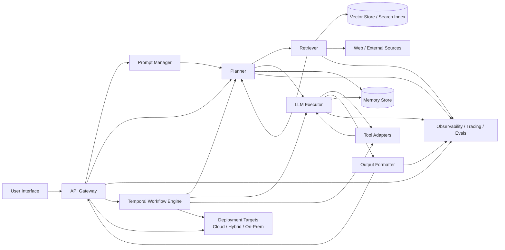
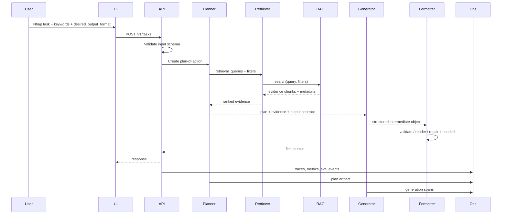

# Nghiên cứu chuyên sâu về giải pháp điều phối agent đáp ứng yêu cầu người dùng

## Tóm tắt điều hành

Khuyến nghị mạnh nhất cho một giải pháp điều phối agent cấp sản phẩm là **kiến trúc hai lớp**: dùng một **orchestrator ở mức agent/runtime** để quản lý prompt, state, gọi tool, bộ nhớ ngắn hạn, phân nhánh, human-in-the-loop và định dạng đầu ra; đồng thời dùng một **workflow engine bền vững** cho các tác vụ dài, có retry, có hàng đợi, có SLA và cần khả năng tiếp tục sau lỗi. Trong mặt bằng công cụ hiện nay, lựa chọn mặc định tốt nhất cho đa số tổ chức là **LangGraph cho vòng lặp agent trực tuyến** và **Temporal cho workflow bền vững phía sau**. LangGraph tập trung rõ vào durable execution, persistence, streaming và human-in-the-loop; còn Temporal là nền tảng durable execution với workflow, activity, retry policy, task queue và khả năng chạy cloud hoặc self-hosted. citeturn3search0turn3search2turn3search3turn3search10turn14search6turn14search18turn20search1turn20search2

Nếu tổ chức đã có một **RAG hiện hữu** và muốn tối ưu chất lượng câu trả lời hơn là chạy nhiều agent tổng quát, nên đặt một **planning stage có cấu trúc** trước giai đoạn sinh đầu ra. Planner không nên dựa vào “chain-of-thought” thô như artifact điều khiển hệ thống; thay vào đó, planner nên phát ra một **plan-of-action** có schema rõ ràng gồm mục tiêu, giả định, nhu cầu truy hồi, truy vấn truy hồi, tiêu chí hoàn tất, ràng buộc định dạng và danh sách bước thực thi. Cách này bền hơn, dễ kiểm thử, dễ log, dễ audit và ít phụ thuộc vào cách từng provider bộc lộ reasoning. Điều đó cũng phù hợp với xu hướng “LLM quyết định ở đâu, code quyết định ở đâu” trong tài liệu orchestration chính thức. citeturn18search0turn18search1turn6search19turn15search0

Về stack công cụ, nếu tổ chức thiên **RAG-first**, **LlamaIndex Workflows** là ứng viên rất mạnh nhờ mô hình event-driven workflow, citation query engine, nhiều retriever nâng cao, observability và pattern multi-agent/report generation. Nếu tổ chức thiên **Microsoft/.NET/enterprise controls**, **Semantic Kernel** vẫn hữu ích nhờ plugin, process framework, OpenTelemetry và vector-store abstraction; tuy nhiên cần lưu ý rằng một phần tính năng orchestration/agent của Semantic Kernel vẫn đang ở trạng thái experimental, và Microsoft hiện mô tả **Microsoft Agent Framework** là hậu duệ trực tiếp của Semantic Kernel + AutoGen cho bài toán agent orchestration. citeturn11search10turn11search16turn11search7turn4search4turn9search5turn9search0turn9search2turn9search19turn0search3

Về mặt hợp đồng đầu vào/đầu ra, nên **chuẩn hóa đầu vào dưới dạng schema** gồm `task`, `keywords`, `desired_output_format` và các field phụ trợ như audience, tone, max_length, citation_mode, language, constraints; sau đó **cưỡng chế đầu ra bằng structured output + validator + converter**. JSON nên là “format gốc chuẩn” để kiểm định; các định dạng trình bày như markdown report hay slide deck outline nên được sinh từ một object trung gian đã được validate. Đây là hướng thực tế nhất để giảm lỗi format, giảm parsing lỗi và dễ tái sử dụng trong API/UI. citeturn6search0turn6search19turn10search0turn10search2turn10search6turn6search2

## Nguyên tắc thiết kế và khuyến nghị tổng thể

Một hệ điều phối agent tốt không nên được xem là “một prompt lớn”, mà là **một hệ thống điều khiển có hợp đồng dữ liệu rõ ràng**. Theo tài liệu về agent của LangChain, agent thực chất là “model + harness”, trong đó harness là toàn bộ phần bao quanh vòng lặp model/tool: prompt, tools, middleware, context, persistence và control logic. OpenAI Agents SDK cũng mô tả orchestration theo hai hướng chính: để LLM ra quyết định về bước tiếp theo, hoặc điều phối bằng code; trên thực tế, kiến trúc tốt nhất thường là kết hợp cả hai. citeturn3search4turn3search7turn18search0turn18search1

Từ đó, giải pháp nên tách thành bốn lớp logic. Lớp đầu là **contract layer**, nhận input theo schema và validate. Lớp hai là **planning layer**, đổi yêu cầu người dùng thành một kế hoạch thực thi có cấu trúc và yêu cầu truy hồi. Lớp ba là **execution layer**, nơi agent/generator gọi RAG, tools, bộ nhớ và các adapter. Lớp bốn là **delivery layer**, nơi đầu ra được kiểm tra schema, chuyển đổi định dạng, gắn citation và phát tới UI hay API. Cách chia lớp này phù hợp với các framework hiện đại: LangGraph nhấn mạnh state, node, edge, persistence; LlamaIndex nhấn mạnh workflows event-driven; Temporal nhấn mạnh workflow/activity/task queue cho durable execution. citeturn3search6turn3search11turn11search10turn11search8turn14search3turn14search6

Khuyến nghị triển khai mặc định là như sau. **Trong request path**: dùng LangGraph hoặc LlamaIndex Workflow để điều phối planner, retriever, generator, formatter. **Ngoài request path**: dùng Temporal cho các run dài, nhiều bước, cần resume, approval hoặc batch fan-out/fan-in. **Với môi trường Microsoft-first**: thay LangGraph bằng Semantic Kernel Process/Agent Framework nếu đội ngũ đã đầu tư sâu vào C#/.NET, plugin model, Foundry/Azure Monitor và policy enterprise. citeturn3search0turn3search3turn11search10turn11search11turn14search2turn14search14turn9search2turn9search0

Một nguyên tắc đặc biệt quan trọng là **không coi reasoning thô là API hợp đồng**. Một số provider có cơ chế “thinking” hay “extended thinking”, nhưng artifact này không ổn định giữa model/provider, đôi khi không được đảm bảo schema, và không phải là vật liệu tốt để làm state nghiệp vụ. Thay vào đó, planner nên xuất ra một plan-of-action có field rõ ràng như `goal`, `subtasks`, `queries`, `required_sources`, `output_contract`, `stop_conditions`, `risks`. Đây là phần có thể log, test, diff, version và replay. citeturn15search0turn18search0turn6search19

## Schema khuyến nghị cho system prompt và hồ sơ agent

Bảng dưới đây là schema khuyến nghị cho **system prompt/profile** của một agent. Cấu trúc này tổng hợp các thực hành tốt từ tài liệu chính thức về agent definition, context engineering, persistence/memory, tools, guardrails và orchestration; trọng tâm là tách rõ **vai trò**, **năng lực**, **ràng buộc**, **nguồn dữ liệu**, **bộ nhớ**, **cách đánh giá**, thay vì nhồi tất cả vào một prompt tự nhiên dài. citeturn18search1turn3search15turn3search21turn18search4turn18search2turn3search0

| Heading | Mục đích | Ví dụ nội dung | Hướng dẫn thực hành tốt |
|---|---|---|---|
| `profile` | Xác định danh tính tác vụ của agent | “Bạn là Research Planner Agent cho hệ thống tạo báo cáo có trích dẫn.” | Mô tả ngắn, 1 nhiệm vụ chính, tránh mô tả mơ hồ kiểu “general assistant”. |
| `skills` | Khai báo năng lực được phép dùng | “Phân rã bài toán; viết truy vấn retrieval; tổng hợp có citation; kiểm tra schema.” | Viết dưới dạng capability quan sát được; tránh từ trừu tượng như “thông minh”, “sáng tạo”. |
| `constraints` | Giới hạn hành vi | “Không suy đoán nếu thiếu bằng chứng; không truy cập tool ngoài danh sách; không bỏ citation khi dữ kiện đến từ retrieval.” | Tách ràng buộc nghiệp vụ khỏi ràng buộc an toàn; ràng buộc cần kiểm được qua evaluator. |
| `goals` | Mục tiêu tối ưu của agent | “Ưu tiên độ đúng, faithfulness, đúng định dạng và chi phí hợp lý.” | Sắp xếp ưu tiên rõ thứ tự; ví dụ đúng > an toàn > đầy đủ > văn phong. |
| `persona` | Điều chỉnh giọng điệu và UX | “Giọng điệu phân tích, ngắn gọn, không khoa trương.” | Persona nên nhẹ; không để persona xung đột với accuracy hoặc safety. |
| `memory` | Định nghĩa bộ nhớ ngắn hạn và dài hạn | “Short-term: thread state; Long-term: user preferences, glossary, approved sources.” | Chỉ lưu cái có giá trị tái sử dụng; lưu facts thô hơn là đoạn văn đã format; định nghĩa TTL và quyền ghi. |
| `tools` | Mô tả tool và khi nào dùng | “retriever.search(query, filters), web.fetch(url), formatter.render(format_id)” | Với mỗi tool, nên ghi rõ input, output, timeout, lỗi hay gặp, và điều kiện sử dụng/không sử dụng. |
| `data_sources` | Gắn trust/freshness cho từng nguồn | “RAG corpus nội bộ: trust cao, freshness theo index; web: dùng khi dữ liệu có thể thay đổi gần đây.” | Mỗi nguồn nên có `trust_level`, `freshness`, `license/privacy`, `citation_style`. |
| `evaluation_criteria` | Chuẩn đầu ra để tự kiểm và chấm điểm | “Đúng schema, có citation, không claim vô bằng chứng, trả lời đủ các phần yêu cầu.” | Chuyển các tiêu chí thành rubric chấm tự động và dataset eval. |
| `safety_guardrails` | Quy tắc an toàn/cấm đoán | “Từ chối yêu cầu nguy hại; che thông tin bí mật; yêu cầu phê duyệt người dùng trước tool nhạy cảm.” | Gắn guardrail ở cả input, output và tool call; không chỉ đặt trong system prompt. |
| `example_interactions` | Few-shot cho pattern khó | Ví dụ 1 input lập kế hoạch; ví dụ 1 input tạo JSON; ví dụ 1 từ chối an toàn | Chỉ few-shot các quyết định quan trọng; ví dụ nên phản ánh schema và citation muốn nhận. |
| `prompt_templates` | Mẫu prompt cho từng phase | `planner_template`, `generator_template`, `critic_template`, `repair_template` | Đừng dùng một prompt duy nhất cho mọi phase; version từng template độc lập. |

Một biểu diễn YAML thực tế cho agent profile có thể trông như sau:

```yaml
agent_id: research_planner_v1
profile:
  role: "Research Planner Agent"
  mission: "Biến yêu cầu người dùng thành kế hoạch có cấu trúc và truy hồi phù hợp"
skills:
  - task_decomposition
  - retrieval_query_writing
  - evidence_synthesis
  - structured_output
constraints:
  - "Không bịa nguồn"
  - "Không xuất định dạng sai schema"
  - "Không gọi tool ngoài whitelist"
goals:
  priority_order:
    - faithfulness
    - schema_validity
    - completeness
    - latency
persona:
  tone: "analytical"
  style: "concise"
memory:
  short_term:
    enabled: true
    store: "thread_state"
  long_term:
    enabled: true
    writable_fields:
      - user_preferences
      - approved_sources
tools:
  - name: retriever.search
    when_to_use: "Khi cần bằng chứng từ corpus nội bộ"
  - name: formatter.render
    when_to_use: "Sau khi JSON trung gian đã hợp lệ"
data_sources:
  - name: internal_rag
    trust_level: high
    freshness: indexed
  - name: web
    trust_level: medium
    freshness: live
evaluation_criteria:
  - schema_valid
  - cited_claims
  - evidence_alignment
safety_guardrails:
  - pii_redaction
  - tool_approval_required
prompt_templates:
  planner: "..."
  generator: "..."
  critic: "..."
```

Điểm quan trọng nhất của schema này là **mỗi ô đều phải có tác dụng vận hành**. Nếu một heading không được dùng bởi code, evaluator, policy engine hay log pipeline, nó sẽ nhanh chóng trở thành “prompt prose” khó bảo trì. Vì vậy, nên version hóa profile như dữ liệu cấu hình, không chỉ như một chuỗi system prompt rời rạc. Cách tiếp cận này rất phù hợp với hướng typed/observable của LangGraph, Semantic Kernel plugins/processes và Agents SDK có guardrails/tracing. citeturn3search3turn18search7turn9search14turn9search2turn18search13

## Hợp đồng đầu vào và cơ chế cưỡng chế đầu ra

Đầu vào nên được chấp nhận theo một **Input Contract** tối thiểu gồm `task`, `keywords`, `desired_output_format`, nhưng trong triển khai thực tế nên mở rộng thêm `audience`, `language`, `tone`, `length_budget`, `required_sections`, `citation_mode`, `delivery_channel`, `strictness` và `template_id`. Lý do là JSON body có thể được validate sớm bằng framework API, sinh OpenAPI/JSON Schema tự động và trả lỗi rõ ràng khi field sai kiểu hay thiếu field. FastAPI và Pydantic hỗ trợ rất tốt mô hình này; JSON Schema Draft 2020-12 cung cấp nền tảng chung để định nghĩa và validate các object như vậy. citeturn10search0turn10search6turn10search2turn6search2turn10search13

Một contract khuyến nghị:

```json
{
  "task": "Tạo báo cáo phân tích phương án điều phối agent",
  "keywords": ["agent orchestration", "RAG", "structured output", "citations"],
  "desired_output_format": "markdown_report",
  "audience": "technical leadership",
  "language": "vi",
  "required_sections": [
    "executive_summary",
    "tool_comparison",
    "architecture",
    "roadmap"
  ],
  "citation_mode": "inline",
  "strictness": "high"
}
```

Ở lớp API, nên validate đầu vào theo ba vòng. **Vòng một**: validate schema ở gateway/API. **Vòng hai**: normalize dữ liệu, ví dụ chuẩn hóa `desired_output_format` vào một enum đóng, tách keywords, chặn giá trị mâu thuẫn. **Vòng ba**: suy luận một `ResolvedTaskConfig` dùng nội bộ, ví dụ nếu `desired_output_format=slide_deck_outline` thì template và validator downstream sẽ đổi theo. Cách làm này tránh việc agent phải tự “đoán” format hay policy từ prompt tự nhiên. citeturn10search0turn10search9turn10search10

Với đầu ra, chiến lược chắc chắn nhất là **JSON trung gian trước, render sau**. Công cụ như LangChain hỗ trợ structured output để agent trả dữ liệu theo JSON object, Pydantic model hoặc dataclass; JSON Schema/Pydantic sau đó kiểm lại lần nữa. Nếu user yêu cầu markdown report hay slide outline, hệ thống sẽ convert từ object hợp lệ sang format trình bày. Điều này đáng tin hơn nhiều so với yêu cầu model “hãy viết markdown đúng mẫu” ngay từ đầu. citeturn6search0turn6search13turn6search19turn10search2turn10search8

Một pipeline cưỡng chế đầu ra nên có năm bước: **template selection**, **provider-side structured output nếu có**, **server-side validation**, **repair loop** nếu sai schema, và **format converter**. Nếu model tạo lỗi parse, nên retry có kiểm soát bằng prompt repair ngắn, thay vì re-run toàn bộ vòng lập kế hoạch. Tài liệu LangChain cũng khuyến nghị ưu tiên tool calling hoặc structured output thay vì output parser tự do khi muốn giá trị parseable đáng tin cậy. citeturn6search21turn6search0turn6search15

Ví dụ flow **input → output** cho ba format:

**Flow A: JSON**

```json
{
  "task": "Liệt kê 3 rủi ro lớn nhất của kiến trúc này",
  "keywords": ["risk", "architecture"],
  "desired_output_format": "json"
}
```

Kết quả mong muốn:

```json
{
  "summary": "Ba rủi ro lớn nhất là drift prompt/schema, retrieval quality không ổn định, và chi phí/độ trễ tăng do multi-step orchestration.",
  "risks": [
    {"name": "prompt_schema_drift", "severity": "high"},
    {"name": "retrieval_quality_variance", "severity": "high"},
    {"name": "latency_cost_growth", "severity": "medium"}
  ],
  "citations": [
    {"source_id": "doc-12", "span": "p4"},
    {"source_id": "doc-19", "span": "p2"}
  ]
}
```

**Flow B: Markdown report**

```json
{
  "task": "Viết bản phân tích ngắn cho CTO",
  "keywords": ["orchestration", "scalability"],
  "desired_output_format": "markdown_report"
}
```

Kết quả mong muốn là object trung gian kiểu:

```json
{
  "title": "Đề xuất kiến trúc điều phối agent",
  "executive_summary": "...",
  "sections": [
    {"heading": "Tại sao cần planner", "body": "..."},
    {"heading": "Rủi ro chính", "body": "..."}
  ],
  "citations": [...]
}
```

Sau đó formatter render thành markdown.

**Flow C: Slide deck outline**

```json
{
  "task": "Chuẩn bị outline 8 slide cho buổi review kiến trúc",
  "keywords": ["architecture", "roadmap", "tradeoffs"],
  "desired_output_format": "slide_deck_outline"
}
```

Object trung gian:

```json
{
  "deck_title": "Agent Orchestration Architecture Review",
  "slides": [
    {"title": "Executive Summary", "bullets": ["...", "..."]},
    {"title": "Target Architecture", "bullets": ["...", "..."]}
  ],
  "speaker_notes": true
}
```

Ba template đầu ra khuyến nghị:

**Template JSON**

```json
{
  "type": "object",
  "required": ["title", "summary", "sections", "citations"],
  "properties": {
    "title": {"type": "string"},
    "summary": {"type": "string"},
    "sections": {
      "type": "array",
      "items": {
        "type": "object",
        "required": ["heading", "body"],
        "properties": {
          "heading": {"type": "string"},
          "body": {"type": "string"}
        }
      }
    },
    "citations": {
      "type": "array",
      "items": {
        "type": "object",
        "required": ["source_id", "span"],
        "properties": {
          "source_id": {"type": "string"},
          "span": {"type": "string"}
        }
      }
    }
  }
}
```

**Template Markdown report**

```markdown
# {{title}}

## Executive Summary
{{executive_summary}}

## Context
{{context}}

## Analysis
{{analysis}}

## Recommendation
{{recommendation}}

## Risks
{{risks}}

## Citations
{{citation_list}}
```

**Template Slide deck outline**

```markdown
Deck Title: {{deck_title}}

Slide: {{slide_1_title}}
- {{bullet_1}}
- {{bullet_2}}
Speaker Notes:
{{notes}}

Slide: {{slide_2_title}}
- {{bullet_1}}
- {{bullet_2}}
Speaker Notes:
{{notes}}
```

Khuyến nghị vận hành là: **đừng để agent quyết định template cuối cùng một cách tự do**. Hãy map `desired_output_format` tới một template registry do code kiểm soát, ví dụ `json_v2`, `markdown_report_v3`, `deck_outline_v1`. Khi cần tương thích nhiều LLM/provider, phần structured output nên nằm trong abstraction nội bộ, không gắn cứng vào một API duy nhất. citeturn18search10turn6search11turn10search2

## Tích hợp LLM và RAG cho giai đoạn lập kế hoạch

Cốt lõi của thiết kế nên là một **planner tăng cường bởi retrieval**. Ý tưởng không phải chỉ “RAG rồi trả lời”, mà là: từ input người dùng, planner viết ra truy vấn truy hồi, xác định thiếu hụt thông tin, chọn nguồn dữ liệu, và sinh plan-of-action trước khi generator viết đầu ra cuối cùng. Đây là cách tốt để tận dụng tri thức tham số của LLM cùng với bộ nhớ phi tham số từ RAG, đúng tinh thần của nghiên cứu RAG gốc. citeturn7search0turn7search16

Một pipeline planning hợp lý gồm các bước: chuẩn hóa task; planner sinh `subtasks` và `retrieval_queries`; retriever chạy tìm kiếm; reranker lọc ngữ cảnh; planner cập nhật kế hoạch dựa trên bằng chứng; executor/generator viết bản nháp; critic/evaluator chấm độ đúng, faithfulness và schema; nếu cần thì chạy refinement loop. Mô hình “generate → feedback → refine” có nền tảng nghiên cứu khá mạnh từ Self-Refine, trong khi CRAG cho thấy việc đánh giá chất lượng retrieval và kích hoạt truy hồi bổ sung có thể tăng độ bền vững của RAG khi tài liệu truy hồi ban đầu kém. citeturn7search1turn7search2turn7search10

Về **chiến lược retrieval**, nên tránh phụ thuộc một retriever duy nhất. Ít nhất nên hỗ trợ: dense retrieval, BM25/keyword retrieval, hybrid retrieval, metadata filter, multi-query hoặc sub-question decomposition, và reranking. LlamaIndex có sẵn nhiều hướng này, gồm BM25, hybrid search, reciprocal rerank fusion, multi-document/querying patterns và citation query engine. Với kho dữ liệu doanh nghiệp, điều này giúp planner truy hồi đúng hơn cho task nhiều bước thay vì chỉ tìm “top-k gần nhất”. citeturn4search7turn4search11turn4search15turn4search23turn4search3turn11search14turn11search11

Về **chunking**, không có một giá trị chunk_size chung cho mọi use case. Tài liệu chính thức của LangChain khuyên bắt đầu bằng `RecursiveCharacterTextSplitter` cho văn bản tổng quát; LlamaIndex cung cấp semantic splitter khi cần giữ coherence theo câu/chủ đề. Ngoài ra, pattern sentence-window hay metadata replacement hữu ích khi truy hồi cần độ chính xác theo câu nhưng generator vẫn cần thêm ngữ cảnh xung quanh. Quan trọng hơn, nghiên cứu “Lost in the Middle” cho thấy LLM có thể dùng ngữ cảnh dài không ổn định, đặc biệt khi thông tin quan trọng nằm giữa context dài; vì vậy planner và retriever nên ưu tiên **ngữ cảnh ít nhưng có liên quan cao**, thay vì nhồi mọi thứ vào prompt. citeturn8search1turn8search15turn8search17turn8search2turn8search18turn7search3turn7search7

Về **citation**, mỗi hit retrieval nên mang ít nhất `source_id`, `document_id`, `chunk_id`, `offset/span`, `retrieval_score`, `rerank_score`, `timestamp/index_version`. Generator chỉ nên được phép trích dẫn từ tập hit đã được planner/executor phê duyệt, thay vì tự bịa citation. Tài liệu LlamaIndex có cả `CitationQueryEngine` và ví dụ “RAG with in-line citations”, rất phù hợp để thiết kế lớp citation có kiểm soát. citeturn11search3turn11search7turn4search13

Về **chain-of-thought so với plan-of-action**, khuyến nghị kỹ thuật là: cho model tự reason nội bộ nếu provider/model hỗ trợ, nhưng **không log và không dùng reasoning thô làm protocol điều phối**. Artifact phục vụ hệ thống nên là:

```json
{
  "goal": "Tạo báo cáo so sánh orchestrator",
  "subtasks": [
    "so sánh orchestration runtime",
    "so sánh durable workflows",
    "đối chiếu monitoring"
  ],
  "retrieval_queries": [
    "LangGraph durable execution official docs",
    "Temporal workflow retries official docs"
  ],
  "required_evidence": [
    "durability",
    "tool use",
    "monitoring",
    "cost/latency tradeoffs"
  ],
  "completion_criteria": [
    ">=4 frameworks",
    "có bảng so sánh",
    "có roadmap",
    "có Mermaid diagram"
  ]
}
```

Artifact này giúp hệ thống dễ debug hơn rất nhiều so với việc cố lấy reasoning verbatim của model. Cách “LLM quyết định cục bộ, code điều phối toàn cục” cũng đúng với mô tả orchestration chính thức của OpenAI Agents SDK. citeturn18search0turn15search0

Một **planner prompt** mẫu:

```text
Bạn là Planning Agent. Hãy chuyển yêu cầu người dùng thành một plan-of-action có cấu trúc JSON.
Mục tiêu:
- Không trả lời nội dung cuối cùng.
- Chỉ phát ra kế hoạch thực thi.
- Xác định thiếu hụt thông tin, truy vấn retrieval, định dạng đầu ra, và tiêu chí hoàn tất.
- Nếu nhiệm vụ cần dữ kiện thay đổi theo thời gian, đánh dấu requires_fresh_retrieval=true.
Schema đầu ra:
{
  "goal": string,
  "subtasks": string[],
  "retrieval_queries": string[],
  "filters": object,
  "required_sources": string[],
  "output_contract": object,
  "completion_criteria": string[],
  "risks": string[],
  "requires_fresh_retrieval": boolean
}
```

Một **generator prompt** mẫu:

```text
Bạn là Generator Agent.
Nhiệm vụ của bạn là tạo đầu ra cuối cùng dựa trên:
1) plan-of-action đã được phê duyệt,
2) danh sách evidence chunks đã truy hồi,
3) output contract.
Quy tắc:
- Không đưa claim nếu không có evidence tương ứng.
- Mỗi claim quan trọng phải ánh xạ đến ít nhất một citation.
- Nếu evidence mâu thuẫn, nêu rõ mâu thuẫn.
- Phải tuân thủ schema/format được yêu cầu.
- Không thêm phần ngoài template.
```

Cuối cùng, hệ thống nên có **eval loops** ở cả offline lẫn online. LangSmith phân biệt rõ các kiểu đánh giá trước triển khai như benchmarking, regression tests, pairwise evaluation và đánh giá trong production như online evaluation/anomaly detection. Với agent orchestration, các chỉ số thực tế nhất là schema validity, citation coverage, faithfulness, task completion, tool success rate, latency theo phase và cost theo run. citeturn22search2turn22search5turn22search9turn22search11turn22search14

## So sánh orchestrator và lựa chọn khuyến nghị

Bảng dưới đây so sánh bảy lựa chọn phổ biến. Đánh giá “độ trễ”, “chi phí”, “độ phù hợp” là **nhận định kiến trúc** dựa trên khả năng runtime, deployment và observability được mô tả trong tài liệu chính thức; chúng không phải báo giá hay benchmark tuyệt đối, vì chi phí thực còn phụ thuộc model, vector store, token volume và hạ tầng triển khai. citeturn3search0turn14search6turn21search1turn20search13turn19search1turn19search0

| Công cụ | Khi nên dùng | Ưu điểm chính | Hạn chế chính | Scalability / Latency / Cost / Monitoring / Tool-RAG-Plan | Nguồn chính |
|---|---|---|---|---|---|
| **LangGraph + LangChain** | Mặc định tốt nhất cho agentic apps trực tuyến | Durable execution, persistence, HITL, subgraphs, streaming; LangChain `create_agent` chạy trên LangGraph; LangSmith hỗ trợ tracing/evals | Cần thiết kế state graph cẩn thận; nếu lạm dụng agent loop dễ tăng latency/cost | Scale tốt ở mức ứng dụng; latency trung bình do multi-step loop; chi phí vận hành OSS thấp nhưng cần engineering; rất mạnh cho tool use, stateful plans, multi-step orchestration và observability qua LangSmith | citeturn3search0turn3search3turn3search10turn3search19turn22search2turn22search7 |
| **LlamaIndex Workflows** | Tổ chức RAG-first, document-intensive | Workflows event-driven; retrievers phong phú; citation engine; mô hình query/index rõ ràng; nhiều pattern multi-agent/report generation | Orchestration nghiệp vụ dài hạn và durable business process không mạnh bằng Temporal; hệ sinh thái agent tổng quát nhỏ hơn LangChain ở một số mảng | Scale tốt cho retrieval-heavy apps; latency thường cạnh tranh nếu RAG pipeline tối ưu; chi phí hợp lý khi đã có RAG stack; rất mạnh cho RAG, citations, query planning, observability theo step | citeturn11search10turn11search11turn11search16turn11search7turn4search4turn4search7 |
| **Microsoft Semantic Kernel** | Đội ngũ .NET/C#/Azure/Microsoft-first | Plugin model, process framework, OpenTelemetry, vector-store abstractions, enterprise middleware | Một số tính năng agent orchestration/memory còn experimental; stack Microsoft đang tiến hóa sang Agent Framework | Scale tốt trong enterprise stack; latency phụ thuộc model/tool; cost tốt nếu tận dụng hạ tầng Microsoft sẵn có; mạnh cho plugins, function calling, telemetry; cần theo dõi thay đổi API/tính năng | citeturn9search5turn9search14turn9search2turn9search0turn9search19turn0search3 |
| **Temporal** | Workflow bền vững, approval, retry, long-running tasks | Durable execution rất mạnh; retry/timeouts/task queues; cloud và self-hosted; resume sau lỗi là first-class | Không tự cung cấp agent prompt/runtime abstractions; cần ghép với LangGraph/LlamaIndex/SK | Scale rất mạnh cho background workflows; latency request-path kém phù hợp nếu dùng trực tiếp cho mọi agent turn; chi phí cloud cao hơn OSS thuần nhưng giảm ops; monitoring/tracing rất tốt; tool/RAG phải do app layer hiện thực | citeturn14search6turn14search2turn14search3turn14search4turn20search1turn20search2turn20search14 |
| **Prefect** | Pythonic orchestration, event-driven ops, data/AI workflows | Flow/task model linh hoạt; work pools, concurrency/rate limits; Cloud hoặc self-hosted; observability tốt | Agent loop stateful chuyên sâu không phải lõi thiết kế; durability dài hạn không cùng lớp với Temporal | Scale tốt cho flow-based automation; latency phù hợp backend automation hơn chat turn-by-turn; cost/ops mềm hơn Temporal ở một số use case; monitoring mạnh; tool use gián tiếp qua Python tasks | citeturn13search9turn13search1turn13search3turn13search7turn21search1turn21search5 |
| **Airflow** | DAG định kỳ, batch, lịch chạy dữ liệu | Scheduler mạnh, web UI tốt, logging/metrics/OpenTelemetry, dynamic task mapping | Kém tự nhiên cho agent loops, human-in-the-loop mềm dẻo và conversational state; cảm giác “quá nặng” cho request/response orchestration | Scale tốt cho pipelines định kỳ; latency không tối ưu cho tác vụ tương tác; chi phí ops đáng kể nếu tự vận hành; monitoring/logging mạnh; tool/RAG phải tự dựng ở mức operator | citeturn2search8turn2search5turn2search2turn2search3turn2search12 |
| **Ray** | Distributed compute, model serving, LLM serving ở quy mô lớn | Actors/tasks cho stateful services; Ray Serve mạnh cho inference và LLM serving; dashboard/Grafana tốt | Không phải framework orchestration agent hoàn chỉnh; thường vẫn phải ghép với LangGraph/LlamaIndex | Scale rất mạnh cho phục vụ model và compute song song; latency tốt cho model serving; cost có thể hiệu quả ở tải lớn nhưng ops cao hơn; monitoring tốt; tool/plan orchestration thường cần công cụ khác | citeturn12search1turn12search4turn12search3turn12search15turn12search7 |

Kết luận lựa chọn. **Nếu cần một stack cân bằng nhất cho sản phẩm agent có RAG, tool use, memory, monitoring và khả năng mở rộng về sau**, hãy chọn **LangGraph ở lớp agent** và **Temporal ở lớp workflow bền vững**. Bộ đôi này phân tách rất sạch giữa “decision loop gần model” và “execution reliability gần hệ thống”. citeturn3search0turn3search10turn14search6turn20search10

Nếu use case của bạn **nghiêng nặng về tài liệu, search, indexing, citations và report generation**, có thể dùng **LlamaIndex Workflows** làm lớp orchestration chính rồi chỉ bổ sung Temporal khi cần long-running durable workflows. Nếu đội ngũ **thuần Microsoft**, cân nhắc **Semantic Kernel** hoặc lộ trình chuyển dần sang Microsoft Agent Framework cho greenfield. citeturn11search16turn11search7turn9search19turn0search3

## Kiến trúc triển khai và luồng mẫu

Kiến trúc khuyến nghị gồm các thành phần bắt buộc: **User Interface**, **API Gateway**, **Prompt Manager**, **Planner**, **Retriever**, **LLM Executor**, **Output Formatter**, **Tool Adapters**, **Memory Store**, **Observability**, và **Deployment Layer**. Prompt Manager phải version hóa prompt/profile/template; Planner phải sinh plan-of-action theo schema; Retriever phải trả về evidence chunks có metadata và citation handles; LLM Executor chỉ nên làm generation dựa trên kế hoạch và evidence; Formatter chịu trách nhiệm convert object hợp lệ sang JSON/markdown/slide outline. Persistence cho short-term memory nên nằm gần orchestration runtime; long-term memory và preferences nên nằm ở store khác có policy ghi/TTL rõ ràng. citeturn3search3turn3search21turn18search7turn9search0turn11search2



Luồng tuần tự mẫu cho một tác vụ “tạo báo cáo markdown có citation” nên diễn ra như sau: UI gửi task và format mong muốn; gateway validate Input Contract; planner sinh plan-of-action và query retrieval; retriever lấy top-k evidence từ index và nguồn ngoài nếu được phép; planner cập nhật kế hoạch; generator viết object trung gian; formatter render markdown; validator kiểm tra schema/citation; nếu fail thì repair loop chạy; nếu pass thì trả kết quả cho UI và ghi traces/metrics. Đây là cách biến một bài toán prompt thành một pipeline có thể quan sát và đánh giá. citeturn18search0turn6search19turn22search5turn22search11



Với các tác vụ dài như “thu thập dữ liệu từ nhiều nguồn, chờ người phê duyệt, rồi dựng tài liệu và gửi email”, nên chuyển phần orchestration bền vững sang Temporal hoặc Prefect thay vì giữ toàn bộ trong request lifecycle. Temporal phù hợp hơn khi bạn cần resume chính xác sau crash, timeout, approval hoặc external events; Prefect phù hợp hơn khi thiên về Python flows, event/rate/concurrency controls và data/automation workflows. citeturn14search6turn14search14turn13search4turn13search7turn21search1

## Lộ trình triển khai, API, schema dữ liệu, đánh giá và kiểm thử

Lộ trình thực thi nên đi theo các mốc sau, không bắt đầu bằng “đào prompt” mà bắt đầu bằng **contract và evals**. Đó cũng là cách mà các nền tảng observability/evaluation như LangSmith khuyến nghị: xác định “good” là gì, tạo dataset, benchmark và regression trước khi mở rộng production. citeturn22search5turn22search9turn22search12

| Giai đoạn | Mục tiêu | Deliverables chính | Exit criteria |
|---|---|---|---|
| **Foundation** | Chuẩn hóa contract và prompt registry | `TaskRequest`, `AgentProfile`, `PlanArtifact`, template registry, schema validator | 100% request hợp lệ đi qua validation; format enum đóng |
| **Planning MVP** | Tạo planning stage có cấu trúc | Planner prompt, plan schema, retrieval query generator, logs plan artifact | Plan tạo đúng schema > 95% trên dataset dev |
| **RAG Integration** | Kết nối retriever hiện hữu và citations | Retriever adapter, reranker, chunk metadata, citation mapping | Claim quan trọng có citation coverage đạt mục tiêu nội bộ |
| **Generation & Formatting** | Sinh output trung gian và render nhiều format | JSON intermediate schema, markdown renderer, slide outline renderer, repair loop | Schema-valid output > 98% trên regression suite |
| **Workflow Hardening** | Chịu lỗi và xử lý tác vụ dài | Temporal/Prefect integration, idempotency keys, retries, approval flow | Run dài có thể resume; không mất trạng thái sau lỗi mô phỏng |
| **Observability & Evals** | Đo chất lượng thật | Tracing, dashboards, offline/online evaluators, alerts | Có baseline accuracy/faithfulness/latency/cost |
| **Production Rollout** | Mở lưu lượng thật có kiểm soát | Rate limits, canary, rollback, governance, security review | Online metrics ổn định, không hồi quy vượt ngưỡng |

Một bộ API tối thiểu nên có:

```http
POST /v1/tasks
GET  /v1/runs/{run_id}
POST /v1/runs/{run_id}/resume
POST /v1/templates/validate
GET  /v1/agents/{agent_id}
POST /v1/evals/run
GET  /v1/evals/{eval_id}
```

Schema dữ liệu nội bộ nên chia rõ giữa **request**, **plan**, **evidence**, **response** và **telemetry**. Một mô hình dữ liệu đơn giản:

```json
{
  "TaskRequest": {
    "request_id": "uuid",
    "task": "string",
    "keywords": ["string"],
    "desired_output_format": "json|markdown_report|slide_deck_outline",
    "language": "string",
    "constraints": {}
  },
  "PlanArtifact": {
    "goal": "string",
    "subtasks": ["string"],
    "retrieval_queries": ["string"],
    "output_contract": {},
    "completion_criteria": ["string"]
  },
  "RetrievalHit": {
    "source_id": "string",
    "document_id": "string",
    "chunk_id": "string",
    "text": "string",
    "retrieval_score": 0.0,
    "rerank_score": 0.0,
    "metadata": {}
  },
  "FinalResponse": {
    "format": "string",
    "payload": {},
    "citations": [{"source_id": "string", "span": "string"}]
  },
  "RunMetrics": {
    "latency_ms": 0,
    "input_tokens": 0,
    "output_tokens": 0,
    "tool_calls": 0,
    "cost_estimate": 0.0,
    "schema_valid": true
  }
}
```

Về **evaluation metrics**, nên đo ít nhất bốn nhóm. **Chất lượng nội dung**: accuracy/correctness, completeness, faithfulness, citation coverage. **Chất lượng vận hành**: schema validity, task completion rate, tool success rate, retry rate. **Hiệu năng**: p50/p95 latency theo phase và end-to-end. **Kinh tế**: token cost/run, tool cost/run, retrieval cost/run. LangSmith phân biệt rõ offline benchmarking/regression với online evaluation; với production, nên có ngưỡng cảnh báo cho faithfulness, latency và cost drift. citeturn22search2turn22search11turn22search15turn18search7

Về **testing strategy**, cần ít nhất sáu lớp kiểm thử: unit tests cho template/validator; contract tests cho API schemas; golden-set regression cho planner/generator; retrieval tests cho query rewrite và reranking; adversarial/red-team tests cho prompt injection, citation spoofing, data exfiltration và unsafe tool calls; cuối cùng là load/chaos tests cho hàng đợi, retry, worker crash và memory consistency. Tư duy này tương thích với tracing/evals ở LangSmith, observability của Semantic Kernel và workflow durability của Temporal. citeturn22search5turn9search0turn14search14turn20search20

Một **planner prompt** khởi đầu cho production pilot:

```text
System:
Bạn là Planner Agent cho hệ thống nghiên cứu có cấu trúc.
Bạn không được viết câu trả lời cuối cùng.
Bạn phải tạo kế hoạch JSON hợp lệ theo schema đã cho.
Ưu tiên:
1. đúng phạm vi nhiệm vụ,
2. xác định dữ liệu cần truy hồi,
3. nêu rõ output contract,
4. đưa tiêu chí hoàn tất có thể đánh giá.

User:
{{task_request_json}}
```

Một **generator prompt** khởi đầu:

```text
System:
Bạn là Generator Agent.
Hãy tạo đầu ra cuối cùng chỉ từ plan artifact và evidence đã cho.
Quy tắc:
- Không nêu claim nếu không có evidence.
- Mỗi claim quan trọng phải ánh xạ tới citation.
- Nếu format là markdown_report, chỉ xuất markdown.
- Nếu format là json, chỉ xuất object đúng schema.
- Nếu không đủ bằng chứng, trả về thiếu hụt thay vì đoán.

Inputs:
PLAN={{plan_json}}
EVIDENCE={{retrieval_hits}}
OUTPUT_CONTRACT={{output_contract}}
```

Bảng sau là gợi ý ngắn về **lựa chọn cloud/on-prem**. Đây là **so sánh định tính**: “chi phí” là tổng chi phí sở hữu tương đối; “độ trễ” là khuynh hướng kiến trúc, không phải benchmark cố định. Khả năng triển khai cloud/self-hosted của Temporal, Prefect, LangSmith, Qdrant và vLLM đều đã được tài liệu hóa chính thức. citeturn20search1turn20search2turn21search1turn22search13turn19search1turn19search12turn19search0turn19search19

| Phương án | Stack gợi ý | Độ trễ tương đối | Chi phí tương đối | Khi nên chọn |
|---|---|---:|---:|---|
| **Managed cloud nhanh ra sản phẩm** | API LLM managed + Qdrant Cloud/managed DB + LangGraph/LangSmith + Temporal Cloud | Trung bình đến thấp nếu colocate tốt | Cao biến đổi, thấp vận hành | Cần time-to-market nhanh, ít DevOps |
| **Cloud self-managed cân bằng** | LangGraph OSS + Temporal self-hosted + pgvector/Qdrant trên Kubernetes | Trung bình | Trung bình | Cần kiểm soát hạ tầng và dữ liệu hơn, nhưng vẫn chạy cloud |
| **Hybrid regulated** | LLM API cloud + RAG/vector/on-prem + Temporal/Prefect self-hosted | Trung bình đến cao do cross-boundary | Trung bình đến cao | Dữ liệu nhạy cảm phải ở on-prem nhưng vẫn muốn chất lượng model bên ngoài |
| **Fully on-prem** | vLLM + Qdrant/pgvector + Temporal/Prefect self-hosted + observability nội bộ | Thấp nếu hạ tầng/GPU đủ và gần người dùng; ngược lại có thể cao | Cao cố định, thấp biến đổi ở tải lớn | Yêu cầu data residency nghiêm ngặt, lưu lượng lớn, có năng lực MLOps/Platform |

Khuyến nghị cuối cùng là: **bắt đầu bằng LangGraph + retriever hiện hữu + JSON intermediate object + markdown/deck converters + LangSmith hoặc OpenTelemetry tracing**. Khi use case vượt khỏi request-response ngắn và bắt đầu có approval, retry lâu, fan-out, tác vụ nền hoặc SLA mạnh, hãy thêm **Temporal** như lớp orchestration bền vững. Đây là lộ trình ít rủi ro nhất vì nó cho phép bạn chứng minh chất lượng bằng evals ngay từ MVP, thay vì đầu tư quá sớm vào một kiến trúc nặng mà chưa có contract và benchmark rõ ràng. citeturn3search0turn22search2turn14search6turn20search10