# Custom Models

Custom models in Open WebUI are reusable **presets** built on top of an existing
base model. A custom model is *not* a new LLM — it is a saved configuration
(system prompt, inference parameters, attached knowledge, tools, capabilities,
and access rules) layered over a base model such as `llama3`, `gpt-4o`, or any
connected model. This lets you package a purpose-built assistant ("a Python
tutor", "a contract reviewer", "Mario from Super Mario Bros") that anyone with
access can pick from the model selector and use directly in chat.

> Custom models are managed under **Workspace → Models**.

---

## Table of contents

- [Concepts](#concepts)
- [Creating a custom model](#creating-a-custom-model)
- [Editor fields reference](#editor-fields-reference)
  - [Identity](#identity)
  - [Base model](#base-model)
  - [System prompt & advanced parameters](#system-prompt--advanced-parameters)
  - [Prompt suggestions](#prompt-suggestions)
  - [Knowledge](#knowledge)
  - [Tools & skills](#tools--skills)
  - [Filters & actions](#filters--actions)
  - [Capabilities](#capabilities)
  - [Default features & built-in tools](#default-features--built-in-tools)
  - [Terminal](#terminal)
  - [TTS voice](#tts-voice)
  - [Access control](#access-control)
- [Saving & the JSON preview](#saving--the-json-preview)
- [Editing an existing model](#editing-an-existing-model)
- [Data model](#data-model)
- [Runtime Flow Diagram](#runtime-flow-diagram)
- [FAQ](#faq)

---

## Concepts

A custom model record has two main containers:

| Container | What it holds |
| --------- | ------------- |
| `params`  | Runtime/inference settings: the system prompt and advanced parameters (temperature, stop sequences, etc.) sent to the base model. |
| `meta`    | Everything else: profile image, description, tags, attached knowledge, tool/skill IDs, filter/action IDs, capabilities, default features, built-in tools, terminal binding, TTS voice. |

The base model is referenced by `base_model_id`. When a user chats with a custom
model, Open WebUI resolves the base model, prepends the configured system prompt,
applies the parameters, and exposes the attached knowledge, tools, and
capabilities.

**Configuration precedence.** Defaults are layered in three levels:

1. Built-in defaults (e.g. `DEFAULT_CAPABILITIES`).
2. Admin-configured defaults (`DEFAULT_MODEL_METADATA`), fetched when the editor opens.
3. Per-model values stored on the custom model itself — these win.

---

## Creating a custom model

1. Go to **Workspace → Models**.
2. Click the **+** (New Model) button to open the model editor at
   `/workspace/models/create`.
3. Fill in at minimum a **Model Name** and a **Base Model**. The Model ID is
   auto-generated from the name (lowercased, spaces → hyphens, non-alphanumeric
   characters stripped) but can be edited before saving.
4. Configure any optional sections (system prompt, knowledge, tools, etc.).
5. Click **Save & Create**.

On success the model appears in the Workspace model list and in the chat model
selector for everyone who has access.

> You can also pre-fill the editor by importing a model configuration from the
> community site (openwebui.com) — the create page listens for an imported
> config and populates the form.

---

## Editor fields reference

### Identity

| Field | Required | Notes |
| ----- | -------- | ----- |
| **Profile image** | No | Click the avatar to upload (`png`, `jpeg`, `gif`, `webp`, `svg`). Static images are resized/compressed to 250×250 WebP; animated `gif`/`webp` are kept as-is to preserve animation. Use **Reset Image** to revert to the default favicon. |
| **Model Name** | Yes | Display name shown in the selector. |
| **Model ID** | Yes | Unique identifier. Auto-derived from the name when creating; **locked once the model is created**. Creating a model with an existing ID is rejected. |
| **Description** | No | Toggle between **Default** (inherits base model description) and **Custom** (your own text). When set to Default, the description is stored as `null`. |
| **Tags** | No | Free-form tags for organizing/filtering models in the workspace. |

### Base model

Select the underlying model the preset runs on (e.g. `llama3`, `gpt-4o`). The
dropdown excludes other presets, arena models, and direct-connection models to
prevent circular references. A base model is **required** for a preset.

### System prompt & advanced parameters

- **System Prompt** — instructions injected at the start of every conversation
  ("You are Mario from Super Mario Bros, acting as an assistant."). Stored in
  `params.system`; an empty prompt is saved as `null`.
- **Advanced Params** — click **Show** to reveal inference parameters
  (temperature, top-p, stop sequences, etc.). The `stop` field accepts a
  comma-separated list and is stored as an array. Empty/null parameters are
  stripped on save so the base model's defaults apply.

### Prompt suggestions

Toggle between **Default** and **Custom**. When Custom, you can define starter
prompts (with a title) that appear as clickable suggestions on a new chat with
this model. Empty suggestions are filtered out on save.

### Knowledge

Attach knowledge bases (collections) or individual files. Their content becomes
available for retrieval-augmented generation when chatting with the model.
Files still uploading block saving until they finish. Legacy collection formats
are migrated to the current shape when an existing model is loaded.

### Tools & skills

- **Tools** — select from the workspace tool registry; the model can call these
  during a conversation. Stored as `meta.toolIds`.
- **Skills** — select from available skills. Stored as `meta.skillIds`.

### Filters & actions

Shown only when filter or action functions exist in the workspace:

- **Filters** — pipeline functions that pre/post-process messages
  (`meta.filterIds`).
- **Default Filters** — among toggleable/global filters, which are enabled by
  default for this model (`meta.defaultFilterIds`).
- **Actions** — custom action buttons attached to responses
  (`meta.actionIds`).

### Capabilities

Checkboxes that declare what the model supports. Defaults come from admin
configuration, falling back to built-in defaults:

| Capability | Meaning |
| ---------- | ------- |
| **Vision** | Model accepts image inputs. |
| **File Upload** | Model accepts file inputs. |
| **File Context** | Inject file content directly into the conversation context. (Requires File Upload.) |
| **Web Search** | Model can search the web. |
| **Image Generation** | Model can generate images from text prompts. |
| **Code Interpreter** | Model can execute code and perform calculations. |
| **Terminal** | Model can access Open Terminal for command execution and file management. |
| **Citations** | Display citations in responses. |
| **Status Updates** | Display progress updates (e.g. web search progress) in responses. |
| **Usage** | Send `stream_options: { include_usage: true }`; supported providers return token-usage info. |
| **Builtin Tools** | Auto-inject system tools (timestamps, memory, chat history, notes, etc.) in native function-calling mode. |

### Default features & built-in tools

- **Default Features** — for enabled capabilities among `web_search`,
  `code_interpreter`, and `image_generation`, choose which are toggled **on by
  default** when a chat with this model starts (`meta.defaultFeatureIds`).
- **Built-in Tools** — when the **Builtin Tools** capability is enabled, pick
  which system tools to auto-inject (`meta.builtinTools`).

### Terminal

When the **Terminal** capability is enabled, bind a specific terminal
configuration to the model (`meta.terminalId`).

### TTS voice

Optional default text-to-speech voice for responses (e.g. `alloy`, `echo`,
`shimmer`). Stored under `meta.tts.voice`; left blank means no override.

### Access control

Click **Access** to open the access-control modal and choose who can use the
model:

- **Private / shared with specific users or groups**, with `read` or `write`
  grants.
- **Public** sharing, subject to the user's permissions
  (`sharing.models`, `sharing.public_models`) — admins always have full control.

For an existing model, changing access grants saves immediately via the access
API; for a new model, grants are saved together with the model on create.

---

## Saving & the JSON preview

- **Save & Create** (new) / **Save & Update** (edit) validates that the Model ID
  and Name are present and that no knowledge files are still uploading, then
  persists the model.
- On save, the editor performs cleanup: empty/`null` parameters and empty `meta`
  collections are **removed** rather than stored. An absent key means "use
  default behavior", which keeps records compact.
- **JSON Preview** — click **Show** to inspect the exact `info` object that will
  be saved. Useful for debugging and for exporting/sharing a configuration.

---

## Editing an existing model

1. From **Workspace → Models**, open a model's menu and choose **Edit** (route
   `/workspace/models/edit`).
2. The editor loads the stored configuration. The **Model ID is read-only**;
   everything else is editable.
3. Per-model values override admin defaults when the form is populated.
4. Click **Save & Update**.

---

## Data model

A saved custom model is roughly:

```jsonc
{
  "id": "python-tutor",
  "name": "Python Tutor",
  "base_model_id": "gpt-4o",
  "params": {
    "system": "You are a patient Python tutor...",
    "temperature": 0.7,
    "stop": ["</end>"]
  },
  "meta": {
    "profile_image_url": "data:image/webp;base64,...",
    "description": "Helps beginners learn Python.",
    "tags": [{ "name": "education" }],
    "suggestion_prompts": [{ "title": ["Explain", "a concept"], "content": "Explain decorators" }],
    "knowledge": [ /* collections / files */ ],
    "toolIds": ["web-scraper"],
    "skillIds": [],
    "filterIds": [],
    "defaultFilterIds": [],
    "actionIds": [],
    "capabilities": { "vision": true, "code_interpreter": true, "...": true },
    "defaultFeatureIds": ["code_interpreter"],
    "builtinTools": { /* ... */ },
    "terminalId": "",
    "tts": { "voice": "alloy" }
  },
  "access_grants": [ /* read/write grants */ ]
}
```

> Keys with empty/default values are omitted from the stored record.

---

## Runtime Flow Diagram

The diagram below shows the complete backend lifecycle for a chat request targeting a custom model. Rendered version: https://claude.ai/code/artifact/bc33ab2a-d311-4714-a398-b68f5f771be2

```mermaid
flowchart TD
    A["<b>POST /api/chat/completions</b><br/>main.py:1666 · chat_completion()"]
    B["<b>Model Loading</b><br/>Model.get_model_by_id()<br/>merge DEFAULT_MODEL_PARAMS ← preset params<br/>resolve base_model_id → base model"]
    C["<b>process_chat_payload()</b><br/>middleware.py — sequential body mutation"]
    C1["knowledge → form_data['files']<br/>middleware.py:2484"]
    C2["inlet filters — user-configured<br/>may rewrite messages"]
    C3["skills → system msg append=True<br/>middleware.py:2624"]
    C4["native tools → payload['tools']<br/>middleware.py:2864"]
    C5["non-native tools → system msg XML<br/>middleware.py:2876"]
    C6["RAG / file context → messages<br/>middleware.py:2886"]
    D{"provider type?<br/>chat.py:274"}
    E["<b>pipe</b><br/>generate_function_chat_completion()<br/>single-pass, no orchestration loop"]
    F["<b>ollama</b><br/>convert payload<br/>ollama_handler()"]
    G["<b>openai / other</b><br/>openai_handler()"]
    H["<b>In provider handler</b><br/>ollama.py:1018 · openai.py:1077<br/>① payload['model'] ← base_model_id<br/>② apply_model_params_to_body_*()<br/>③ apply_system_prompt_to_body() — PREPEND<br/>   payload.py:16 · append=False"]
    I["<b>HTTP streaming request → base model</b>"]
    J{"tool_calls<br/>in response?<br/>middleware.py:4534"}
    K["execute tools<br/>append results → messages<br/>iterations++ · max 256"]
    L["<b>Outlet filters</b><br/>post-process only<br/>cannot re-generate"]
    M["<b>Response stream → client</b>"]

    A --> B --> C
    C --> C1 --> C2 --> C3 --> C4 --> C5 --> C6 --> D
    D -->|pipe| E
    D -->|ollama| F
    D -->|openai| G
    E & F & G --> H --> I --> J
    J -->|yes| K --> I
    J -->|no| L --> M

    style A fill:#1a1500,stroke:#f59e0b,color:#fcd34d
    style B fill:#1a1500,stroke:#f59e0b,color:#fcd34d
    style C fill:#001a17,stroke:#2dd4bf,color:#99f6e4
    style C1 fill:#001a17,stroke:#1d4840,color:#a7f3d0
    style C2 fill:#001a17,stroke:#1d4840,color:#a7f3d0
    style C3 fill:#001a17,stroke:#1d4840,color:#a7f3d0
    style C4 fill:#001a17,stroke:#1d4840,color:#a7f3d0
    style C5 fill:#001a17,stroke:#1d4840,color:#a7f3d0
    style C6 fill:#001a17,stroke:#1d4840,color:#a7f3d0
    style D fill:#0f0f2a,stroke:#818cf8,color:#c7d2fe
    style E fill:#0f0f2a,stroke:#818cf8,color:#c7d2fe
    style F fill:#0f0f2a,stroke:#818cf8,color:#c7d2fe
    style G fill:#0f0f2a,stroke:#818cf8,color:#c7d2fe
    style H fill:#0f0f2a,stroke:#818cf8,color:#c7d2fe
    style I fill:#1a0010,stroke:#fb7185,color:#fda4af
    style J fill:#1a0010,stroke:#fb7185,color:#fda4af
    style K fill:#1a0010,stroke:#fb7185,color:#fda4af
    style L fill:#0d1117,stroke:#64748b,color:#94a3b8
    style M fill:#001a0f,stroke:#34d399,color:#6ee7b7
```



---

## Agent Preset Layer

### `backend/open_webui/models/models.py:75–112` — DB schema

```python
class ModelParams(BaseModel):
    model_config = ConfigDict(extra='allow')  # any inference key is valid


class ModelMeta(BaseModel):
    profile_image_url: str | None = None
    description: str | None = None
    capabilities: dict | None = None
    model_config = ConfigDict(extra='allow')
    # extra fields (all optional): toolIds, skillIds, filterIds, defaultFilterIds,
    # actionIds, knowledge, defaultFeatureIds, builtinTools, terminalId, tts


class Model(Base):
    __tablename__ = 'model'

    id = Column(Text, primary_key=True, unique=True)   # preset id; matches base → override
    user_id = Column(Text)
    base_model_id = Column(Text, nullable=True)         # None = direct override; set = named preset
    name = Column(Text)
    params = Column(JSONField)                          # ModelParams
    meta = Column(JSONField)                            # ModelMeta
    is_active = Column(Boolean, default=True)
    updated_at = Column(BigInteger)
    created_at = Column(BigInteger)
```

### `backend/open_webui/models/models.py:201–230` — preset vs base query

```python
async def get_models(self, db=None) -> list[ModelUserResponse]:
    # presets only: base_model_id != None
    result = await db.execute(select(Model).filter(Model.base_model_id != None))
    ...

async def get_base_models(self, db=None) -> list[ModelModel]:
    # base models only: base_model_id == None
    result = await db.execute(select(Model).filter(Model.base_model_id == None))
    ...
```

### `backend/open_webui/models/models.py:243–263` — access control

```python
async def get_models_by_user_id(self, user_id, permission='write', db=None):
    models = await self.get_models(db=db)
    user_groups = await Groups.get_groups_by_member_id(user_id, db=db)
    user_group_ids = {group.id for group in user_groups}

    result = []
    for model in models:
        if model.user_id == user_id:
            result.append(model)
        elif await AccessGrants.has_access(
            user_id=user_id,
            resource_type='model',
            resource_id=model.id,
            permission=permission,
            user_group_ids=user_group_ids,
            db=db,
        ):
            result.append(model)
    return result
```

### `backend/open_webui/utils/models.py:131–220` — model list merge loop

```python
custom_models = await Models.get_all_models()

# O(1) lookup: Ollama base names first, then exact IDs (exact wins)
base_model_lookup = {}
for model in models:
    if model.get('owned_by') == 'ollama':
        base_model_lookup.setdefault(model['id'].split(':')[0], model)
    base_model_lookup[model['id']] = model

existing_ids = {m['id'] for m in models}

for custom_model in custom_models:
    if custom_model.base_model_id is None:
        # Direct override: replace the base model entry in-place
        model = base_model_lookup.get(custom_model.id)
        if model:
            if custom_model.is_active:
                model['name'] = custom_model.name
                model['info'] = custom_model.model_dump()
                action_ids = model['info']['meta'].get('actionIds', [])
                filter_ids = model['info']['meta'].get('filterIds', [])
                del model['info']['params']          # strip params for non-owners
                model['action_ids'] = action_ids
                model['filter_ids'] = filter_ids
            else:
                models.remove(model)                 # is_active=False hides base

    elif custom_model.is_active:
        # Named preset: create a synthetic entry alongside the base
        base_model = base_model_lookup.get(custom_model.base_model_id)
        if base_model is None:
            base_model = base_model_lookup.get(custom_model.base_model_id.split(':')[0])

        model = {
            'id': custom_model.id,
            'name': custom_model.name,
            'object': 'model',
            'created': custom_model.created_at,
            'owned_by': base_model.get('owned_by', 'openai') if base_model else 'openai',
            'preset': True,
            **({'pipe': base_model['pipe']} if base_model and 'pipe' in base_model else {}),
            **({'provider': base_model.get('provider')} if base_model and base_model.get('provider') else {}),
        }

        info = custom_model.model_dump()
        del info['params']                           # strip params for non-owners
        model['info'] = info
        model['action_ids'] = custom_model.meta.model_dump().get('actionIds', [])
        model['filter_ids'] = custom_model.meta.model_dump().get('filterIds', [])
        models.append(model)
```

---

## Agent Runtime Architecture

### `backend/open_webui/main.py:1666–1726` — endpoint entry + param merge

```python
@app.post('/api/chat/completions')
async def chat_completion(request, form_data, user):
    model_id = form_data.get('model', None)
    model = request.app.state.MODELS[model_id]
    model_info = await Models.get_model_by_id(model_id)

    # Global defaults as base, per-model params win
    default_model_params = getattr(request.app.state.config, 'DEFAULT_MODEL_PARAMS', None) or {}
    model_info_params = {
        **default_model_params,
        **(model_info.params.model_dump() if model_info and model_info.params else {}),
    }

    # If base_model_id is missing from MODELS cache, fall back to DEFAULT_MODELS
    if model_info and model_info.base_model_id:
        base_model_id = model_info.base_model_id
        if base_model_id not in request.app.state.MODELS:
            if ENABLE_CUSTOM_MODEL_FALLBACK:
                fallback_model_id = (request.app.state.config.DEFAULT_MODELS or '').split(',')[0].strip()
                model = request.app.state.MODELS[fallback_model_id]
                form_data['model'] = fallback_model_id
            else:
                raise Exception('Model not found')
```

### `backend/open_webui/utils/middleware.py:2484–2524` — knowledge injection

```python
# Model "Knowledge" handling
user_message = get_last_user_message(form_data['messages'])
model_knowledge = model.get('info', {}).get('meta', {}).get('knowledge', False)

if model_knowledge and metadata.get('params', {}).get('function_calling') != 'native':
    knowledge_files = []
    for item in model_knowledge:
        if item.get('collection_name'):
            knowledge_files.append({'id': item['collection_name'], 'name': item['name'], 'legacy': True})
        elif item.get('collection_names'):
            knowledge_files.append({'name': item['name'], 'type': 'collection',
                                    'collection_names': item['collection_names'], 'legacy': True})
        else:
            knowledge_files.append(item)

    files = form_data.get('files', [])
    files.extend(knowledge_files)
    form_data['files'] = files          # RAG query + retrieval runs in chat_completion_files_handler
```

### `backend/open_webui/utils/middleware.py:2624–2659` — skills injection

```python
user_skill_ids = set(form_data.pop('skill_ids', None) or [])
user_skill_ids |= extract_skill_ids_from_messages(form_data.get('messages', []))
model_skill_ids = set(model.get('info', {}).get('meta', {}).get('skillIds', []))
all_skill_ids = user_skill_ids | model_skill_ids

for skill in available_skills:
    if skill.id in user_skill_ids:
        # User-selected: inject full content into system message
        form_data['messages'] = add_or_update_system_message(
            f'<skill name="{skill.name}">\n{skill.content}\n</skill>',
            form_data['messages'],
            append=True,
        )
    else:
        # Model-attached: name + description only
        skill_descriptions += (
            f'<skill>\n<id>{skill.id}</id>\n<name>{skill.name}</name>\n'
            f'<description>{skill.description or ""}</description>\n</skill>\n'
        )

if skill_descriptions:
    form_data['messages'] = add_or_update_system_message(
        f'<available_skills>\n{skill_descriptions}</available_skills>',
        form_data['messages'],
        append=True,
    )
```

### `backend/open_webui/utils/middleware.py:2864–2894` — tool injection (both modes)

```python
if tools_dict:
    metadata['tools'] = tools_dict

    if metadata.get('params', {}).get('function_calling') == 'native':
        # Native FC: pass as OpenAI tools array
        form_data['tools'] = [
            {'type': 'function', 'function': tool.get('spec', {})}
            for tool in tools_dict.values()
        ]
        if inlet_filter_tools:
            form_data['tools'].extend(inlet_filter_tools)
    else:
        # Non-native: eager execution + XML tool descriptions → system message
        form_data, flags = await chat_completion_tools_handler(
            request, form_data, extra_params, user, models, tools_dict
        )

# RAG: retrieve sources and inject into messages
form_data, flags = await chat_completion_files_handler(request, form_data, extra_params, user)
if sources and prompt:
    form_data['messages'] = await apply_source_context_to_messages(
        request, form_data['messages'], sources, prompt
    )
```

### `backend/open_webui/utils/misc.py:459–475` — system message composition

```python
def add_or_update_system_message(content: str, messages: list[dict], append: bool = False):
    if messages and messages[0].get('role') == 'system':
        messages[0] = update_message_content(messages[0], content, append)
        # append=False → content prepended:  f'{content}\n{existing}'
        # append=True  → content appended:   f'{existing}\n{content}'
    else:
        messages.insert(0, {'role': 'system', 'content': content})
    return messages
```

### `backend/open_webui/utils/payload.py:16–40` — preset system prompt applied

```python
async def apply_system_prompt_to_body(system, form_data, metadata=None, user=None, replace=False):
    if not system:
        return form_data

    if metadata:
        variables = metadata.get('variables', {})
        if variables:
            system = prompt_variables_template(system, variables)

    system = await prompt_template(system, user)   # legacy variable substitution

    if replace:
        form_data['messages'] = replace_system_message_content(system, form_data.get('messages', []))
    else:
        # prepend=True (append=False): preset system prompt placed BEFORE all middleware additions
        form_data['messages'] = add_or_update_system_message(system, form_data.get('messages', []))
    return form_data
```

### `backend/open_webui/utils/payload.py:86–117` — OpenAI param application

```python
def apply_model_params_to_body_openai(params: dict, form_data: dict) -> dict:
    params = remove_open_webui_params(params)       # strip: stream_response, system, function_calling, …
    custom_params = params.pop('custom_params', {})
    if custom_params:
        params = deep_update(params, custom_params)

    mappings = {
        'temperature': float,
        'top_p': float,
        'min_p': float,
        'max_tokens': int,
        'frequency_penalty': float,
        'presence_penalty': float,
        'reasoning_effort': str,
        'seed': lambda x: x,
        'stop': lambda x: [bytes(s, 'utf-8').decode('unicode_escape') for s in x],
        'logit_bias': lambda x: x,
        'response_format': dict,
    }
    return apply_model_params_to_body(params, form_data, mappings)
```

### `backend/open_webui/utils/payload.py:120–197` — Ollama param application

```python
def apply_model_params_to_body_ollama(params: dict, form_data: dict) -> dict:
    params = remove_open_webui_params(params)
    custom_params = params.pop('custom_params', {})
    if custom_params:
        params = deep_update(params, custom_params)

    # max_tokens → num_predict (Ollama name)
    if params.get('max_tokens') is not None:
        params['num_predict'] = params.pop('max_tokens')

    # Root-level Ollama params: format, keep_alive, think
    ollama_root_params = {'format': parse_json, 'keep_alive': parse_json, 'think': lambda x: x}
    for key, fn in ollama_root_params.items():
        if (param := params.get(key)) is not None:
            form_data[key] = fn(param)
            del params[key]

    # Remaining inference params go under options key
    form_data['options'] = apply_model_params_to_body(params, form_data.get('options', {}) or {}, mappings)
    return form_data
```

### `backend/open_webui/utils/chat.py:274–299` — provider dispatch

```python
if model.get('pipe'):
    return await generate_function_chat_completion(request, form_data, user=user, models=models)

if model.get('owned_by') == 'ollama':
    form_data = convert_payload_openai_to_ollama(form_data)
    response = await generate_ollama_chat_completion(request=request, form_data=form_data, user=user)
    if form_data.get('stream'):
        return StreamingResponse(convert_streaming_response_ollama_to_openai(response), ...)
    else:
        return convert_response_ollama_to_openai(response)
else:
    return await generate_openai_chat_completion(request=request, form_data=form_data, user=user)
```

### `backend/open_webui/routers/ollama.py:1018–1031` — Ollama base model swap

```python
model_id = payload['model']
model_info = await Models.get_model_by_id(model_id)

if model_info is not None:
    if model_info.base_model_id:
        payload['model'] = model_info.base_model_id   # swap preset id → upstream id

    params = model_info.params.model_dump()
    if params:
        system = params.pop('system', None)
        payload = apply_model_params_to_body_ollama(params, payload)
        if not bypass_system_prompt:
            payload = await apply_system_prompt_to_body(system, payload, metadata, user)
```

### `backend/open_webui/routers/openai.py:1077–1096` — OpenAI base model swap

```python
model_id = form_data.get('model')
model_info = await Models.get_model_by_id(model_id)

if model_info:
    if model_info.base_model_id:
        payload['model'] = model_info.base_model_id   # swap preset id → upstream id
        model_id = model_info.base_model_id

    params = model_info.params.model_dump()
    if params:
        system = params.pop('system', None)
        payload = apply_model_params_to_body_openai(params, payload)
        if not bypass_system_prompt:
            payload = await apply_system_prompt_to_body(system, payload, metadata, user)
```

### `backend/open_webui/utils/middleware.py:4534–4650` — agent tool loop

```python
while tool_calls and (
    CHAT_RESPONSE_MAX_TOOL_CALL_ITERATIONS is None
    or tool_call_iterations < CHAT_RESPONSE_MAX_TOOL_CALL_ITERATIONS   # default 256
):
    tool_call_iterations += 1
    response_tool_calls = tool_calls.pop(0)

    tools = metadata.get('tools', {})
    results = []

    for tool_call in response_tool_calls:
        tool_function_name = tool_call['function']['name']
        tool_function_params = json.loads(tool_call['function']['arguments'])

        if tool_function_name in tools:
            tool = tools[tool_function_name]
            if tool.get('direct'):
                # Direct tool server (HTTP)
                tool_result = await event_caller({'type': 'execute:tool', 'data': {...}})
            else:
                # Server-side callable (builtin / MCP)
                tool_function = await get_updated_tool_function(tool['callable'], extra_params)
                tool_result = await tool_function(**tool_function_params)
        else:
            tool_result = f'Error: Tool "{tool_function_name}" not found.'

        results.append({'tool_call_id': tool_call['id'], 'content': tool_result})

    # Inject role='tool' messages into history
    tool_messages = convert_output_to_messages(results)
    form_data['messages'].extend(tool_messages)

    # Re-invoke LLM with accumulated history; preset system prompt NOT re-applied
    res = await generate_chat_completion(request, form_data, user, bypass_system_prompt=True)

    # Continue loop if LLM emits new tool calls
    tool_calls = extract_tool_calls_from_response(res)
```

---

## FAQ

**Is a custom model a separate model I have to download?**
No. It is a configuration preset that always runs on top of an existing base
model. Deleting a custom model does not affect the base model.

**Why is the Model ID greyed out when editing?**
The ID is the stable key other parts of the system (chats, references) use, so
it is locked after creation. Create a new model if you need a different ID.

**My capability checkbox is on but the feature doesn't work in chat.**
Capabilities declare *intent*; the underlying base model/provider and server
configuration must actually support the feature (e.g. a vision-capable model for
**Vision**, an image backend for **Image Generation**).

**Who can see and use my custom model?**
Whoever you grant access to via the **Access** control, plus admins. Public
sharing depends on your account's sharing permissions.
