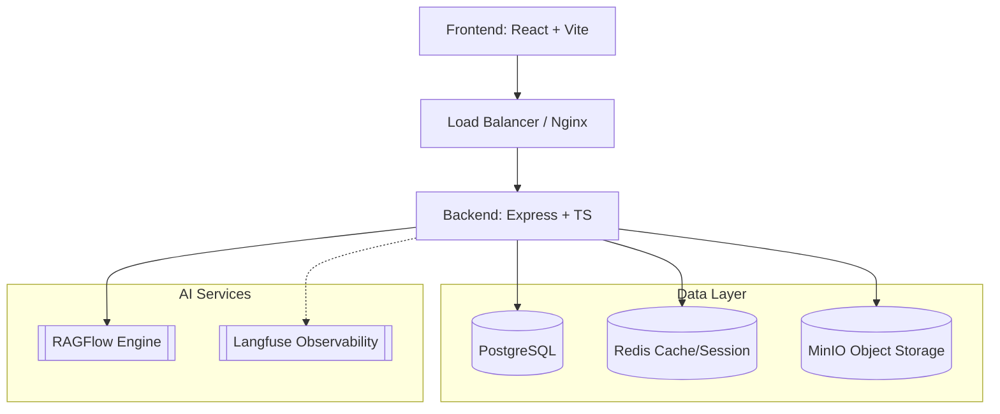

# System Architecture

## Overview

The Knowledge Base application follows a modular, tiered architecture designed for scalability, security, and maintainability. It leverages a modern stack with React on the frontend and Node.js (Express) on the backend, integrated with enterprise-grade services.

## Backend Architecture (MVC-S)

The backend implements a Model-View-Controller-Service (MVC-S) pattern to separate concerns:

1.  **Routes (`be/src/routes`)**:
    *   Define API endpoints.
    *   Apply middleware (Auth, Validation, Rate Limiting).
    *   Delegate request handling to Controllers.

2.  **Controllers (`be/src/controllers`)**:
    *   Handle HTTP request/response lifecycle.
    *   Extract parameters and validate input.
    *   Call Services for business logic.
    *   Format responses.

3.  **Services (`be/src/services`)**:
    *   Contain core business logic.
    *   Interact with Models and external APIs (MinIO, RAGFlow).
    *   Implemented as Singletons for efficient resource management (e.g., `QueueService`, `AuditService`).

4.  **Models (`be/src/models`)**:
    *   Data Access Layer using **Knex.js**.
    *   `ModelFactory` provides access to model instances.
    *   BaseModel handles common CRUD operations.
    *   **No raw SQL**; all queries use the Query Builder for safety and abstraction.

## Database & Migrations

*   **PostgreSQL** is the primary data store.
*   **Knex.js** handles schema migrations and seeding.
*   **Migrations**: Located in `be/src/db/migrations`. Immutable once applied.
*   **Seeds**: Located in `be/src/db/seeds` for initial data population.

## Authentication & Authorization (RBAC)

The system uses a robust Role-Based Access Control (RBAC) system:

*   **Authentication**: Azure Entra ID (OAuth2) or Local Root Login (Dev).
*   **Session Management**: Redis-backed sessions with secure cookies.
*   **Permissions**: granular permissions assigned to roles (`admin`, `manager`, `user`).
*   **Middleware**:
    *   `requireAuth`: Ensures user is logged in.
    *   `requireRole`: Enforces specific roles.
    *   `requirePermission`: Enforces specific capabilities (e.g., `manage_users`, `view_audit_log`).

## External Integrations

### RAGFlow
*   Acts as a proxy to the RAGFlow engine.
*   Manages multiple knowledge base sources (Chat/Search).
*   Handles authentication token injection.

### MinIO
*   S3-compatible object storage for document management.
*   Supports file preview generation and secure download links.
*   Organized by Buckets and Folders.

### Langfuse
*   Observability integration for tracking AI interactions.
*   Captures traces, scores, and user feedback.
*   Supports external trace submission via API.

## Frontend Architecture

*   **React 19**: Leveraging latest React features.
*   **Vite**: Fast build tool and dev server.
*   **Tailwind CSS**: Utility-first styling.
*   **Ant Design**: Enterprise UI component library.
*   **React Query**: Server state management and caching.
*   **i18next**: Internationalization (en, vi, ja).
