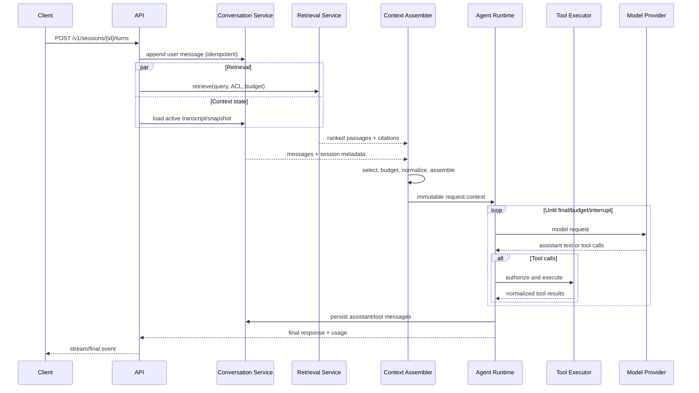

# Kiến trúc tổng thể

## 1. Mục tiêu

Xây dựng một nền tảng agent có thể hội thoại dài hạn, gọi tools, truy xuất tài liệu và chạy tác vụ nền mà vẫn kiểm soát được chi phí, bảo mật và tính đúng đắn của context.

## 2. Non-goals

- Không xây model inference engine.
- Không bắt buộc một model provider, vector database hoặc framework agent cụ thể.
- Không đưa mọi integration vào core; integration chuyên biệt đi qua adapter/plugin.
- Không sửa lại transcript quá khứ để tối ưu prompt cache.

## 3. Thành phần

| Component | Trách nhiệm |
|---|---|
| API Gateway | Auth, rate limit, request validation, streaming transport |
| Conversation Service | Session, message, branch, resume, rewind |
| Context Assembler | Xây request context từ các context block |
| Context Manager | Token accounting, compression, retention, prompt cache |
| Agent Runtime | Model loop, budget, retry, interrupt, finalization |
| Tool Registry | Tool discovery, schema, availability, authorization metadata |
| Tool Executor | Approval, concurrency, timeout, output normalization |
| Retrieval Service | Query rewrite, hybrid retrieval, reranking, citations |
| Ingestion Workers | Parse, normalize, chunk, embed và index tài liệu |
| Memory Service | User facts, preferences và cross-session recall |
| Scheduler | Chạy job định kỳ hoặc one-shot |
| Audit/Telemetry | Logs, metrics, traces và immutable audit events |

## 4. Luồng một turn



## 5. Ranh giới dữ liệu

### 5.1 Durable state

- Session metadata và lineage.
- Original transcript.
- Compression snapshots và archived messages.
- Documents, chunks, embedding metadata và ACL.
- Tool run, approval, job và audit records.

### 5.2 Request-local state

- Selected retrieval passages.
- Ephemeral instructions.
- Provider-specific cache markers.
- Tool schemas được chọn cho request.
- Retry/failover decoration.

Request-local state MUST NOT ghi đè durable transcript.

## 6. Deployment topology

### MVP

```text
API + Agent Runtime + Workers
          │
     PostgreSQL/pgvector
          │
     S3-compatible storage
```

Job queue và locks dùng PostgreSQL. Phù hợp một đến vài instance.

### Scale-out

```text
Load Balancer
  ├─ Stateless API replicas
  ├─ Agent workers
  ├─ Ingestion workers
  └─ Scheduler leader
       │
PostgreSQL/pgvector ─ Redis/Queue ─ Object Storage
```

Mỗi run có lease và heartbeat. Worker khác chỉ claim khi lease hết hạn.

## 7. Module boundaries tham chiếu

```text
src/
├── api/
├── conversation/
├── context/
├── runtime/
├── tools/
├── retrieval/
├── ingestion/
├── memory/
├── scheduler/
├── providers/
└── observability/
```

Mỗi module MUST chỉ công khai interface; module khác không truy cập trực tiếp bảng nội bộ nếu đã có service contract.

## 8. SLO mặc định

| Chỉ số | Mục tiêu |
|---|---|
| API availability | 99.9% theo tháng |
| Turn orchestration overhead p95 | ≤ 300 ms, không tính model/tool/retrieval ngoài |
| Retrieval p95 warm | ≤ 1.5 s |
| Transcript write durability | Không mất message đã ACK |
| Duplicate side effect | 0 với cùng idempotency key |
| Cross-tenant data exposure | 0 |
| Graceful interrupt propagation | ≤ 2 s tới worker/tool hỗ trợ cancel |

## 9. Nguyên tắc mở rộng

- Provider, tool, parser, embedding, reranker và memory backend dùng adapter.
- Adapter MUST khai báo capabilities và health check không gây side effect.
- Chỉ một default implementation cho mỗi interface trong core.
- Capability chuyên biệt SHOULD được nạp theo cấu hình thay vì thêm vào mọi request.

## 10. Quyết định kỹ thuật

| Quyết định | Lý do |
|---|---|
| PostgreSQL làm source of truth | Transaction, locking, FTS và vận hành phổ biến |
| pgvector mặc định | Giảm số hệ thống phải vận hành; có thể thay qua adapter |
| Object storage cho binary | Database chỉ giữ metadata và extracted text/chunks |
| Immutable transcript | Cho audit, replay và phục hồi sau lỗi |
| Hybrid retrieval | Keyword tốt cho identifier; vector tốt cho ý nghĩa |
| Prompt tiers | Tối đa cache reuse và kiểm soát volatility |

## 11. Acceptance criteria

- `ARCH-AC-001`: Một turn có thể hoàn tất từ API đến model và ghi transcript.
- `ARCH-AC-002`: Tool call có thể pause để approval rồi resume đúng run.
- `ARCH-AC-003`: Tài liệu được ingest và citation trả về trỏ đúng chunk/source.
- `ARCH-AC-004`: Restart mọi stateless process không làm mất acknowledged state.
- `ARCH-AC-005`: Hai tenant có cùng document ID logic vẫn bị cách ly hoàn toàn.
- `ARCH-AC-006`: Provider failover không sửa transcript hoặc nhân đôi tool side effect.
