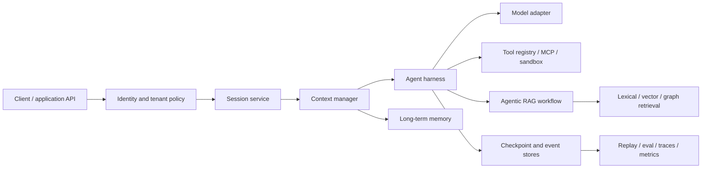
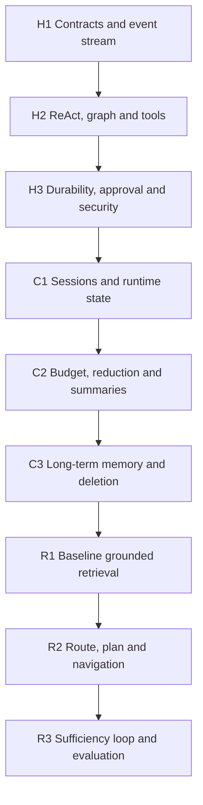

# Go Agentic Application Portability Specs

Status: implementation-ready specification set

Source baseline: RAGFlow Go source at the revision containing these documents

Audience: architecture, backend, platform, AI, security, SRE, and QA teams implementing equivalent capabilities in another application

## Purpose

These specifications extract portable behavior from the Go implementation. They define observable contracts rather than copying RAGFlow package layout, prompts, persistence schema, or infrastructure vendors.

The keywords **MUST**, **MUST NOT**, **SHOULD**, **SHOULD NOT**, and **MAY** are normative. A citation identifies reference evidence in the current Go code; it does not require the target to reuse that code or dependency.

## Specification map

| Priority | Specification | Responsibility | Depends on |
|---|---|---|---|
| P0 | [Harness Engineering](harness-engineering.md) | ReAct and graph execution, workflows, tools, approval, MCP, sandboxing, checkpoint/resume, events, replay, telemetry, evaluation. | Model and infrastructure adapters. |
| P1 | [Context Management](context-management.md) | Runtime state, sessions, prompt assembly, token budgets, reduction, summarization, long-term memory, privacy and retention. | P0 lifecycle, persistence, embedding adapter. |
| P2 | [Agentic RAG](agentic-rag.md) | Query routing, navigation, planning, hybrid/graph retrieval, sufficiency loops, grounded answers and citations. | P0 execution, P1 context, search adapters. |

Harness Engineering is the strongest and most complete Go capability and MUST be implemented first. Context Management builds on its state and durability boundaries. Agentic RAG is an application workflow over both.

## System context



## Shared identifiers and invariants

Every cross-boundary record MUST carry:

- `tenant_id`, derived from authenticated identity rather than trusted request data;
- `thread_id` for the durable conversation/execution lineage;
- `run_id` for one execution attempt;
- a stable entity or event ID;
- creation timestamp in UTC;
- schema version;
- trace correlation ID where telemetry exists.

Every external operation MUST accept `context.Context`, honor cancellation/deadlines, return structured errors, and be safe against duplicate delivery or carry an idempotency key. Stored secrets MUST be encrypted; logs, events, checkpoints, summaries, and traces MUST redact them.

## Shared adapter boundaries

```go
type Model interface {
    Generate(ctx context.Context, in ModelInput) (Message, Usage, error)
    Stream(ctx context.Context, in ModelInput) (MessageStream, error)
    BindTools(definitions []ToolDefinition) error
}

type CheckpointStore interface {
    Get(ctx context.Context, tenantID, threadID, checkpointID string) (Checkpoint, error)
    Put(ctx context.Context, checkpoint Checkpoint) error
    List(ctx context.Context, tenantID, threadID string, page PageRequest) (Page[Checkpoint], error)
}

type EventStore interface {
    Append(ctx context.Context, events ...RunEvent) error
    Query(ctx context.Context, filter EventFilter) (Page[RunEvent], error)
}

type Retriever interface {
    Search(ctx context.Context, request SearchRequest) (SearchResult, error)
}
```

The reference implementation already separates model tool binding ([contracts.go](../../internal/harness/core/contracts.go#L38)), checkpoint storage ([checkpoint.go](../../internal/harness/graph/checkpoint/checkpoint.go#L20)), event querying ([store.go](../../internal/harness/events/store.go#L105)), and retrieval orchestration ([orchestrator.go](../../internal/agent/harness/orchestrator.go#L25)).

## Implementation order and integration gates



| Gate | Required evidence |
|---|---|
| H3 complete | Forced interrupt/resume produces the same committed state as uninterrupted execution; denied tools never execute; tenant isolation passes. |
| C3 complete | Prompt assembly is deterministic and budget-safe; invalid memories never enter prompts; deletion covers every derived store. |
| R3 complete | Citation targets resolve to authorized chunks; insufficient evidence abstains; cycle and cost ceilings hold under failure. |

## Deliberate non-goals

- Exact RAGFlow UI, API routes, table names, or configuration keys.
- Exact prompt wording or model provider.
- Python implementation parity.
- Reproducing ingestion and parsing; the target only needs the retrieval index contract described in the Agentic RAG spec.
- Multiple interchangeable adapters before a second real implementation is required.

## Cross-spec definition of done

The port is complete when all normative requirements and conformance suites pass in CI; the production checkpoint, event, session, memory, and retrieval stores enforce tenant isolation; an operator can trace a final citation back through retrieval evidence, agent events, and checkpoints; and retention/deletion reaches all derived data.
