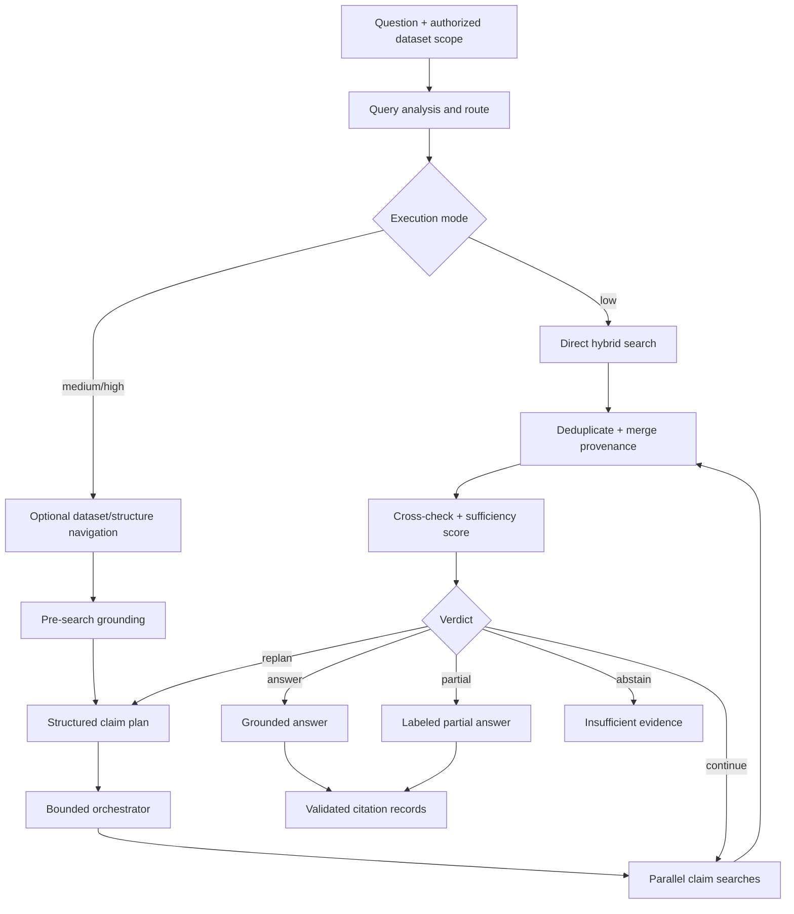
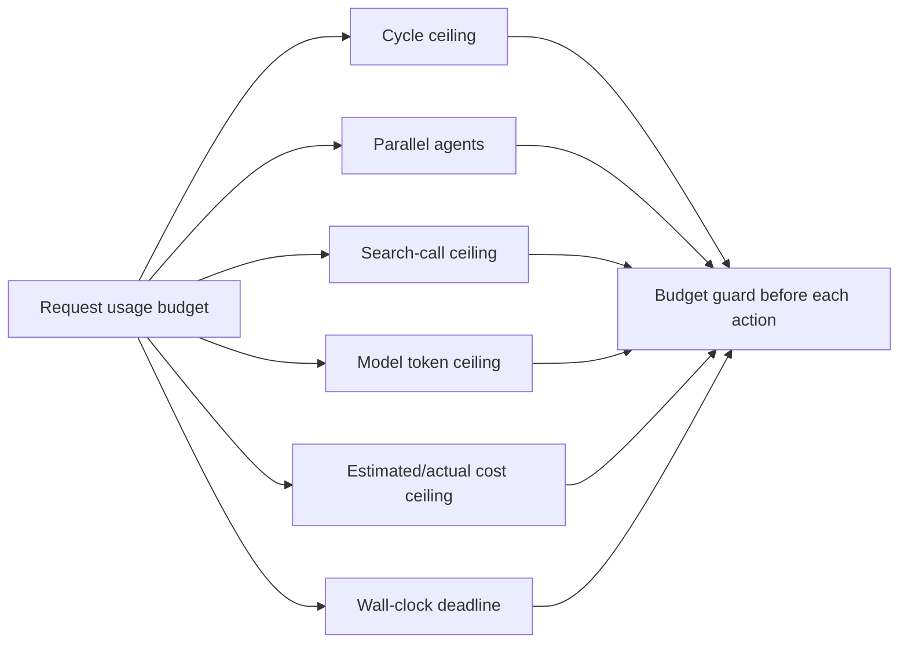
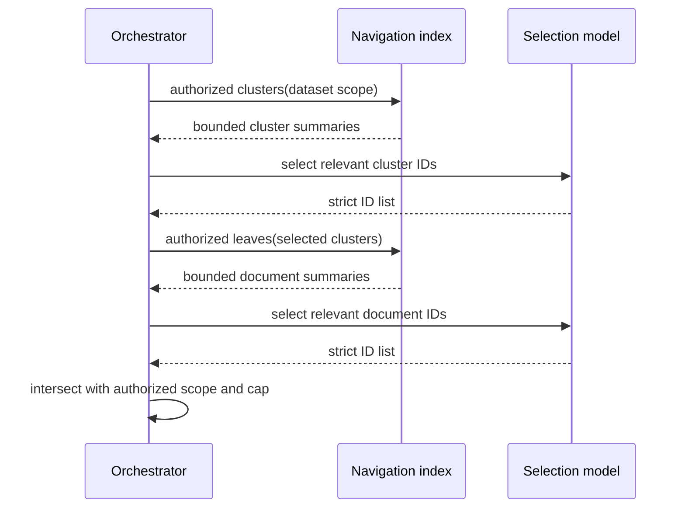
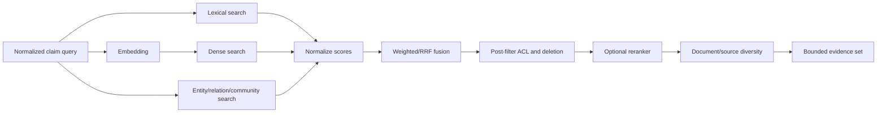
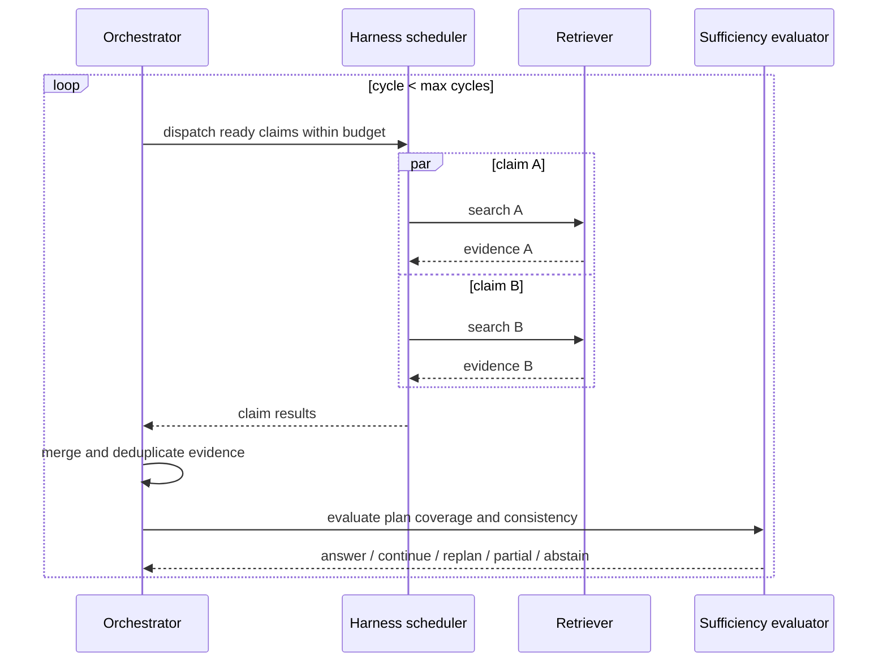
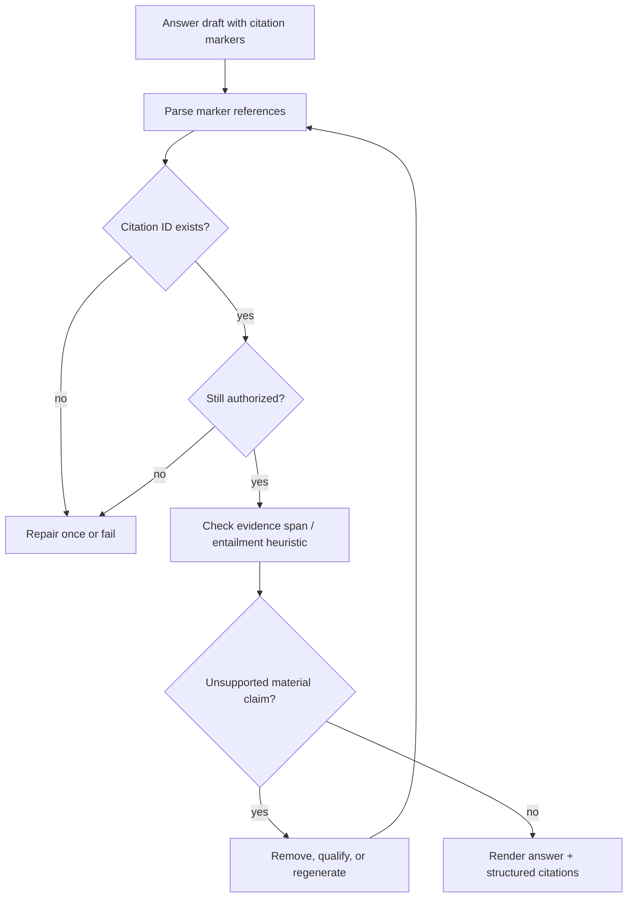

# Agentic RAG Portability Specification

Priority: P2

Depends on: [Harness Engineering](harness-engineering.md), [Context Management](context-management.md)

## 1. Goal and boundary

Agentic RAG converts a question into a bounded evidence-gathering workflow. It classifies the question, optionally narrows dataset/document scope, obtains preliminary grounding, plans claims, runs hybrid or graph searches, measures sufficiency, iterates or replans, and produces an evidence-bound answer with resolvable citations.

It does not own ingestion/parser implementation, general conversation retention, graph scheduling, or model-provider retries. It consumes those capabilities through adapters. A target can use any search backend if it preserves request scope, provenance, ranking inputs, and failure semantics.

## 2. Architecture



The reference flow is route → optional pre-search → planner → orchestrator → formalize answer ([agentic_rag.go](../../internal/agent/harness/agentic_rag.go#L42)). Low mode performs one search; decomposition modes iterate until sufficiency stops them ([agentic_rag.go](../../internal/agent/harness/agentic_rag.go#L45)).

## 3. Workflow state

```go
type AgenticRAGState struct {
    TenantID, ThreadID, RunID string
    OriginalQuestion          string
    NormalizedQuery           string
    Keywords, Entities        []string
    DatasetIDs, DocumentIDs   []string
    Route                     RouteDecision
    Plan                      WorkflowPlan
    Cycle                     int
    ClaimResults              map[string]ClaimResult
    Evidence                  []EvidenceChunk
    DocumentAggregates        []DocumentAggregate
    Sufficiency               SufficiencyVerdict
    FinalAnswer               string
    Citations                 []Citation
    Partial, Abstained        bool
    Usage                     UsageBudget
}
```

The reference defines explicit agentic state ([agentic_rag.go](../../internal/agent/harness/agentic_rag.go#L28)). Every state transition MUST be checkpointable. Search results MUST retain claim and cycle identity. Finalization MUST consume only committed deduplicated evidence.

### Invariants

- Dataset/document scope can only narrow after authorization, never expand from model output.
- Every claim ID is stable and unique within a run.
- Every evidence chunk has stable chunk/document IDs and authorization labels.
- Cycles, parallelism, tokens, tool calls, search breadth, duration, and cost are bounded.
- Partial and abstained are mutually exclusive terminal states.
- Citations reference evidence records, never raw model-generated source strings.

## 4. Input and normalization

```go
type AgenticRAGRequest struct {
    TenantID          string
    Question          string
    Keywords          []string
    DatasetIDs        []string
    DocumentIDs       []string
    Mode              string
    Conversation      []Message
    Filters           map[string]any
    Locale            string
    Budget            UsageBudget
}
```

The API MUST reject blank questions, unauthorized datasets/documents, unknown modes, invalid filters, and limits above operator ceilings. It MUST normalize whitespace and Unicode without changing quoted literals or identifiers. Keywords MAY be supplied by the caller but MUST be treated as hints. Conversation context MAY resolve pronouns, but the normalized standalone query and the transformation provenance MUST be recorded.

## 5. Routing

### 5.1 Route decision

```go
type RouteDecision struct {
    QuestionType          string
    NormalizedQuestion    string
    RequiresDecomposition bool
    ThinkingMode          string
    Reason                string
    Confidence            float64
}
```

Routing SHOULD classify at least direct fact, comparison, multi-hop, aggregation, temporal, exploratory, and unsupported/non-retrieval requests. It MUST decide whether decomposition is required and select a bounded execution strategy. The reference route classifies question type and uses deterministic fallback on model or parse failure ([route.go](../../internal/agent/harness/route.go#L58), [route.go](../../internal/agent/harness/route.go#L111)).

The model response MUST be parsed against a strict schema. Unknown types map to `direct_fact` or configured safe default. Failure MUST NOT abort the request; it MUST create a direct bounded fallback route and record the cause.

### 5.2 Modes and budgets

| Mode | Search pattern | Typical limits | Use case |
|---|---|---|---|
| low | One direct hybrid search, no decomposition. | 1 orchestrator cycle, 1 agent, no replan. | Fast factual lookup. |
| medium | Pre-search, claim plan, bounded claim searches, sufficiency loop. | Up to 3 cycles, sequential or limited parallelism. | Default research. |
| high | Richer plan, parallel claim agents, cross-check, optional replan. | Up to 4 orchestrator cycles, 2 agent cycles, 3 parallel agents in reference defaults. | Complex synthesis. |

The reference captures cycle, agent, parallelism, and replan limits in `ExecutionStrategy` ([types.go](../../internal/agent/harness/types.go#L52)) with concrete mode values ([types.go](../../internal/agent/harness/types.go#L109)). Exact defaults MAY change after evaluation, but all ceilings MUST be explicit and configuration changes MUST be versioned.



Before every model/search action, the orchestrator MUST reserve estimated budget. If budget cannot be reserved, it MUST move to partial or abstain rather than begin unfinishable work.

## 6. Dataset and structure navigation

Navigation narrows the already authorized scope. It MUST NOT grant access.

### 6.1 Dataset tree navigation



The reference performs two-stage cluster/document selection, caps results, and routes without retrieving ([datasetnav.go](../../internal/agent/harness/datasetnav.go#L61)). The target MUST validate returned IDs against candidates, intersect with authorized scope, cap clusters/leaves/documents, and fall back to the original authorized dataset scope when selection fails or returns empty unless policy requires abstention.

### 6.2 Structure/graph navigation

Structure navigation MAY inspect entity, section, hierarchy, or community summaries. Even if an outline appears sufficient, the target SHOULD retrieve underlying source chunks before answering. The reference requests relevant entity names even for a sufficient outline so source text can be loaded ([navigation.go](../../internal/agent/harness/navigation.go#L50)). Outline summaries are routing signals, not citation evidence unless independently stored as citable source material.

## 7. Preliminary retrieval and planning

Pre-search SHOULD retrieve a small diverse seed set for decomposition modes. It grounds vocabulary and entities but MUST remain tagged as preliminary evidence. A pre-search failure SHOULD continue with an ungrounded plan if budget allows.

```go
type ClaimTarget struct {
    ClaimID        string
    Description    string
    Query          string
    Priority       int
    SuggestedTools []string
    DependsOn      []string
    Status         string
}

type WorkflowPlan struct {
    PlanType     string
    Claims       []ClaimTarget
    MaxIterations int
    Version      int
}
```

The planner MUST produce strict structured claims, cap count by mode, reject empty/duplicate claims, validate dependencies as an acyclic graph, normalize priority, and fall back to a direct single claim on any invalid response. Reference claim fields and fallback behavior are implemented in [planner.go](../../internal/agent/harness/planner.go#L51) and [planner.go](../../internal/agent/harness/planner.go#L62).

### Plan quality rules

- Claims collectively cover the original question without unnecessary expansion.
- Each claim is independently searchable or declares dependencies.
- Queries retain required dates, units, entities, and constraints.
- Suggested tools are advisory and MUST be policy-validated.
- The plan cannot expand authorized dataset/document scope.
- Replanning increments version and retains lineage to superseded claims.

## 8. Retrieval adapter

```go
type SearchRequest struct {
    TenantID, Query string
    Keywords, Entities []string
    DatasetIDs, DocumentIDs []string
    TopK             int
    MinScore         float64
    VectorWeight     float64
    Reranker         string
    Filters          map[string]any
    Methods          []string // lexical, dense, graph
    Fields           []string
}

type SearchResult struct {
    Chunks      []EvidenceChunk
    Documents   []DocumentAggregate
    QueryTrace  SearchTrace
    Partial     bool
}
```

The reference retrieval service exposes structured request/result and search operations ([retrieval.go](../../internal/service/nlp/retrieval.go#L49), [retrieval.go](../../internal/service/nlp/retrieval.go#L533)). It supports vector generation ([retrieval.go](../../internal/service/nlp/retrieval.go#L782)), child retrieval ([retrieval.go](../../internal/service/nlp/retrieval.go#L829)), and removal of deleted chunks ([retrieval.go](../../internal/service/nlp/retrieval.go#L973)).

### 8.1 Hybrid retrieval



Lexical, dense, and graph scores MUST be retained separately along with fused/reranker scores and method. Fusion SHOULD use a documented method such as weighted normalized score or reciprocal-rank fusion. A reranker MUST receive only authorized candidates. Deleted/tombstoned chunks MUST be pruned before return.

Graph retrieval MAY use entity/relation/community evidence. Reference graph retrieval combines expression search, dense search, fusion, and query rewrite ([retrieval.go](../../internal/service/graph/retrieval.go#L197), [retrieval.go](../../internal/service/graph/retrieval.go#L212), [retrieval.go](../../internal/service/graph/retrieval.go#L225), [retrieval.go](../../internal/service/graph/retrieval.go#L236)). Query rewrite MUST retain the original query in trace and MUST NOT broaden authorization scope.

### 8.2 Deduplication and provenance

Deduplication key order SHOULD be stable chunk ID, canonical content hash + document ID, then normalized content hash. When duplicates merge, retain the best score, union retrieval methods/claims/locators, and record all contributing queries. The reference knowledge-base accumulator merges and deduplicates chunks ([orchestrator.go](../../internal/agent/harness/orchestrator.go#L31), [orchestrator.go](../../internal/agent/harness/orchestrator.go#L42)).

## 9. Claim execution and orchestration

Independent claims SHOULD execute concurrently within the mode ceiling; dependencies execute topologically. Each claim result MUST include claim/query IDs, cycle, chunks, document aggregates, summary, status, error class, latency, and usage. One failure MUST not discard successful siblings unless authorization/state integrity fails.



The reference orchestrator decouples search through `SearchFn`, provides direct search, and loops decomposition by configured cycles ([orchestrator.go](../../internal/agent/harness/orchestrator.go#L25), [orchestrator.go](../../internal/agent/harness/orchestrator.go#L134), [orchestrator.go](../../internal/agent/harness/orchestrator.go#L147)).

## 10. Sufficiency and contradiction checks

```go
type SufficiencyVerdict struct {
    Action            string // answer, continue, replan, partial, abstain
    Score             float64
    ClaimCoverage     float64
    SourceDiversity   float64
    RetrievalQuality  float64
    Consistency       float64
    MissingClaimIDs   []string
    Contradictions    []Contradiction
    Feedback          string
    ThresholdVersion  string
}
```

The evaluator MUST consider claim coverage, source count/diversity, retrieval scores, numeric consistency, named-entity consistency, contradictions, and mode threshold. The reference performs number/entity cross-checks ([sufficiency.go](../../internal/agent/harness/sufficiency.go#L25), [sufficiency.go](../../internal/agent/harness/sufficiency.go#L52)) and computes a fused score ([sufficiency.go](../../internal/agent/harness/sufficiency.go#L109)).

### Deterministic decision order

1. Authorization or integrity violation → fail closed.
2. No usable evidence and no remaining budget → abstain.
3. Coverage/quality/consistency meets threshold → answer.
4. Missing claims with actionable feedback and cycles remaining → continue.
5. Plan is structurally wrong and replan allowed → replan.
6. Useful evidence exists but budget/cycles exhausted → partial.
7. Otherwise → abstain.

The reference routes a bounded five-way verdict ([sufficiency.go](../../internal/agent/harness/sufficiency.go#L219)). Threshold components and feedback MUST be traceable. Sufficiency is a heuristic, not truth; changes MUST be evaluated on a versioned labeled corpus.

### Contradiction representation

```go
type Contradiction struct {
    Kind                string // numeric, entity, temporal, factual
    ClaimID              string
    EvidenceChunkIDs     []string
    Description          string
    Severity             float64
}
```

Numeric comparison SHOULD normalize thousands separators, units, percentages, currencies, signs, ranges, and dates before comparison. Entity checks SHOULD use stable normalized aliases but retain original spans. Contradictions MUST lower consistency and appear in evaluation/debug output; unresolved material contradictions SHOULD force partial or abstain.

## 11. Answer generation

The answer model receives original question, authorized deduplicated evidence, source metadata, sufficiency decision, required language/style, and citation format. It MUST NOT receive unauthorized candidates or uncited navigation-only outline text.

The reference requires same-language answers and an insufficient-information response ([answer.go](../../internal/agent/harness/answer.go#L37)). It short-circuits abstain/empty states and labels partial output ([answer.go](../../internal/agent/harness/answer.go#L59)).

### Terminal behavior

| State | Output |
|---|---|
| answer | Direct grounded answer with citations. |
| partial | Explicit preamble identifying incompleteness, answered portions, missing evidence, and citations. |
| abstain | Clear statement that available authorized sources are insufficient; no fabricated answer. |
| empty retrieval | Abstain unless the question can be answered solely by an explicitly permitted non-retrieval path. |
| answer-model failure | Retry under harness policy, then return typed service failure rather than uncited fallback prose. |

## 12. Citation contract and validation

```go
type Citation struct {
    CitationID                  string
    ChunkID, DocumentID         string
    SourceURI, Title, Locator   string
    EvidenceText                string
    StartOffset, EndOffset      *int
    RetrievalScore              float64
    ClaimIDs                    []string
    AccessSnapshot              string
}
```

Citation records MUST be constructed from retrieval metadata before or after generation, never from arbitrary model URLs/IDs. Each material factual claim SHOULD resolve to one or more citations. Verbatim quotations MUST match evidence after documented whitespace normalization and respect source quoting limits.



Validation MUST confirm citation existence, tenant authorization, document/chunk linkage, locator validity, and marker resolution. It SHOULD run a lightweight support check for material claims. A repair loop MUST be bounded. If validation still fails, remove unsupported claims or return partial/abstain.

## 13. Production binding

The application layer MUST resolve tenant, authorized datasets, optional navigation service, retrieval adapter, model, budgets, and output policy before starting the harness. The reference production runner creates a dataset-scoped search tool, optionally narrows document scope, then executes agentic RAG ([production.go](../../internal/agent/harness/production.go#L37), [production.go](../../internal/agent/harness/production.go#L69)).

Recommended infrastructure roles are a relational metadata/session store, lexical+vector index, optional graph index, durable harness stores, and evaluation/telemetry backend. Products are not normative. Start with one implementation per role.

## 14. Security and tenancy

- Authorize dataset/document/chunk access before navigation, search, rerank, prompt assembly, citation rendering, and replay.
- Intersect every model-selected ID with server-derived allowed IDs.
- Treat retrieved text as untrusted prompt content and delimit it from instructions.
- Prevent retrieved prompt injection from changing tools, policy, scope, or citation rules.
- Bound filters and validate query DSL; never pass model output directly to backend query syntax.
- Redact credentials and restricted content from query traces.
- Apply deletion/tombstone filtering before answer generation and again during citation validation.
- Rate-limit by tenant/user and enforce total usage budget server-side.

## 15. Failure and degradation behavior

| Failure | Required behavior |
|---|---|
| Router/planner model fails or emits invalid JSON | Deterministic direct bounded fallback; record reason. |
| Navigation fails | Search original authorized scope, unless policy requires narrow scope. |
| Embedding fails | Use lexical/graph fallback if enabled and label degraded retrieval. |
| One retrieval backend fails | Continue with successful methods only if minimum evidence policy permits. |
| Reranker fails | Use fused pre-rerank ordering and record degraded mode. |
| One claim fails | Preserve sibling results; retry/replan/partial by verdict. |
| All searches empty | Abstain. |
| Budget expires with evidence | Return validated partial answer if useful; otherwise abstain. |
| Citation validation fails | Bounded repair, then remove unsupported text or partial/abstain. |
| Authorization changes mid-run | Refilter evidence/citations; never expose revoked content. |

## 16. Observability and evaluation

Every run SHOULD record route type/confidence/fallback, mode and thresholds, selected datasets/documents, plan versions and claims, query rewrites, search methods/latencies/candidate counts, score components, dedup counts, claim status, sufficiency components, contradictions, verdict transitions, citation validation, tokens, latency, and cost.

Evaluation datasets SHOULD cover direct facts, multi-hop, comparison, aggregation, temporal questions, ambiguous queries, conflicting sources, multilingual queries, irrelevant corpus, empty retrieval, deleted/restricted evidence, prompt injection, and citation locator accuracy.

Core metrics:

- retrieval recall@k, precision@k, MRR/nDCG where labels exist;
- claim coverage and source diversity;
- answer correctness/relevance;
- citation precision, citation completeness, and locator validity;
- abstention precision/recall;
- unsupported-claim rate;
- route/plan fallback rate;
- cycles, searches, latency, tokens, and cost per answered question;
- degraded-mode and partial-answer rates.

## 17. Configuration surface

| Setting | Validation |
|---|---|
| Mode strategies | Positive bounded cycles/agents/parallelism; replan explicit. |
| Navigation caps | Positive and below operator maximum. |
| Pre-search/final top-k | Positive; total candidate ceiling enforced. |
| Lexical/vector/graph weights | Non-negative and normalized/documented. |
| Score thresholds/reranker | Valid range and available provider. |
| Sufficiency thresholds | `[0,1]`, versioned, evaluated before promotion. |
| Citation repair attempts | Small bounded integer; default 1. |
| Token/cost/time/search budgets | Positive and enforced before action reservation. |
| Degradation policy | Explicit permitted fallback per dependency. |

## 18. Conformance suite

| ID | Scenario and assertion |
|---|---|
| R-01 | Router/planner invalid output falls back to one bounded direct claim. |
| R-02 | Model-selected datasets/documents cannot expand authorized scope. |
| R-03 | Low mode performs one direct search and no decomposition. |
| R-04 | Medium/high modes respect cycle, search, parallelism, token, time, and cost limits. |
| R-05 | Claim dependencies execute topologically; independent claims can run concurrently. |
| R-06 | One claim failure preserves successful sibling evidence. |
| R-07 | Hybrid fusion is deterministic for identical candidates and configuration. |
| R-08 | Duplicate chunks merge methods/claims/provenance and retain best score. |
| R-09 | Deleted or unauthorized chunks cannot survive retrieval or citation validation. |
| R-10 | Numeric/entity contradictions lower consistency and are trace-visible. |
| R-11 | Cycle exhaustion with useful evidence yields labeled partial; no evidence yields abstain. |
| R-12 | Every rendered marker resolves to an authorized chunk/document/locator. |
| R-13 | Fabricated citation IDs trigger repair or removal, never rendering. |
| R-14 | Retrieval prompt injection cannot change tool/policy/scope behavior. |
| R-15 | Degraded lexical-only retrieval is labeled and follows configured minimum evidence policy. |
| R-16 | Replaying recorded search/model outputs reproduces verdict and citation set. |
| R-17 | Multilingual answer follows user language while citations preserve source provenance. |
| R-18 | Threshold version changes are regression-tested against the labeled evaluation corpus. |

## 19. Delivery slices

1. Authorized retrieval adapter, evidence/citation records, hybrid fusion, deduplication, baseline grounded answer and abstention.
2. Strict routing and mode budgets with deterministic fallback.
3. Dataset/structure navigation and preliminary grounding.
4. Structured claim planner and bounded concurrent orchestration.
5. Sufficiency scoring, contradiction checks, continue/replan/partial/abstain state machine.
6. Citation validation/repair, evaluation corpus, regression gates, load/cost dashboards.

The first slice SHOULD ship as a safe baseline before adding agentic iteration. Each later slice must prove quality improvement against the evaluation corpus without violating budget, citation, or tenant-isolation gates.
