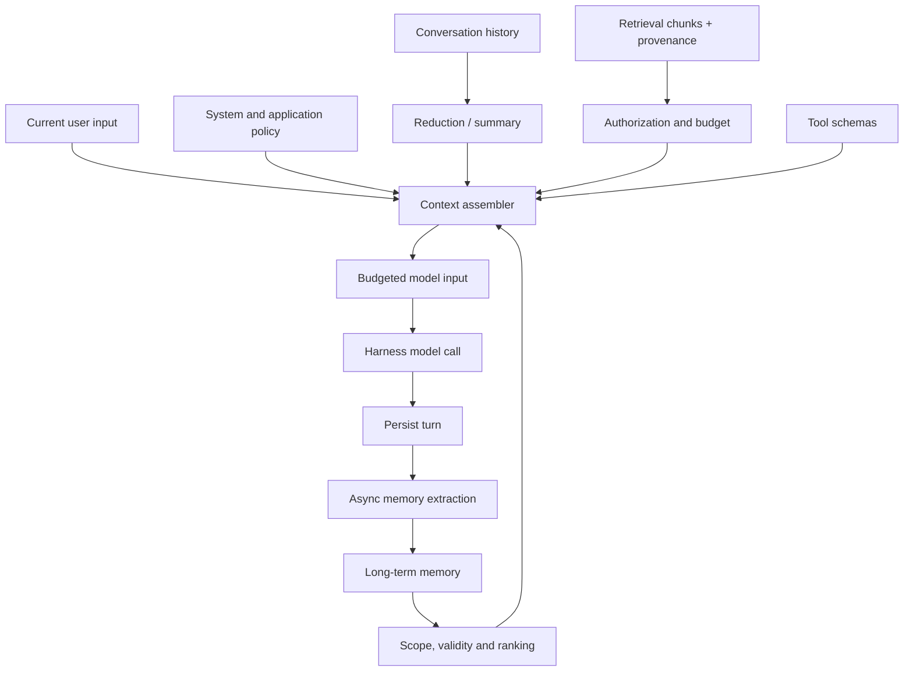
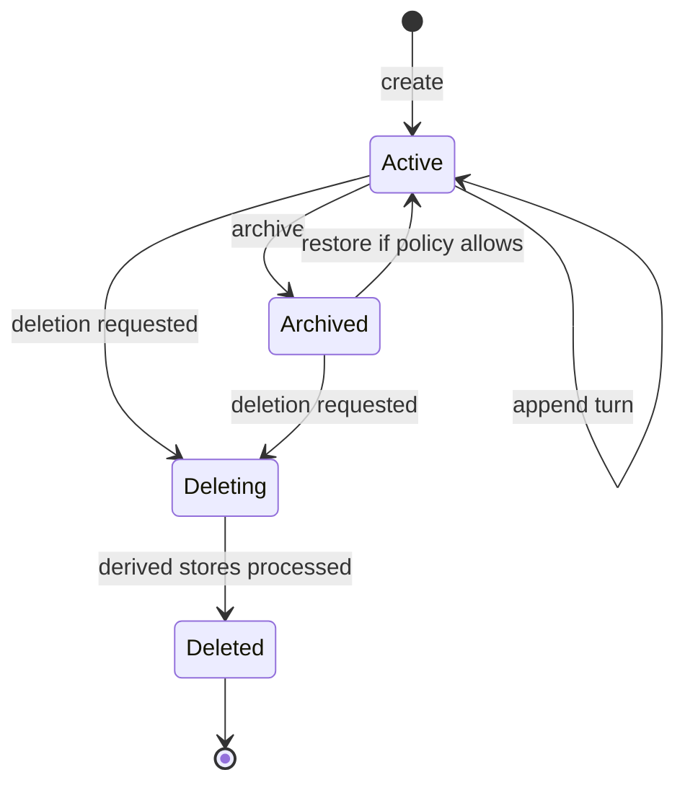
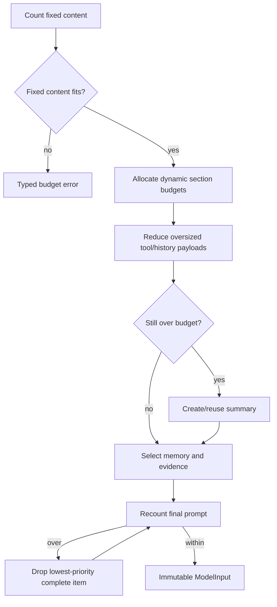
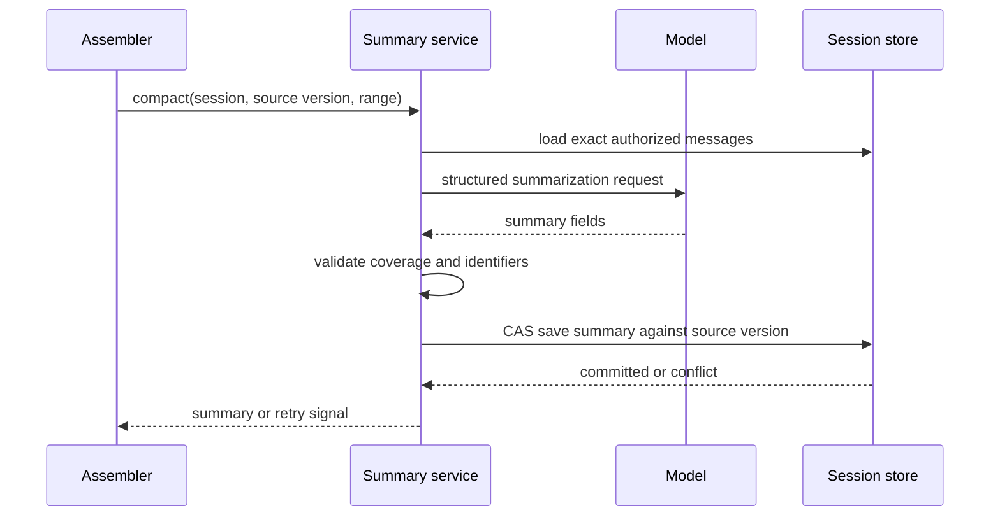
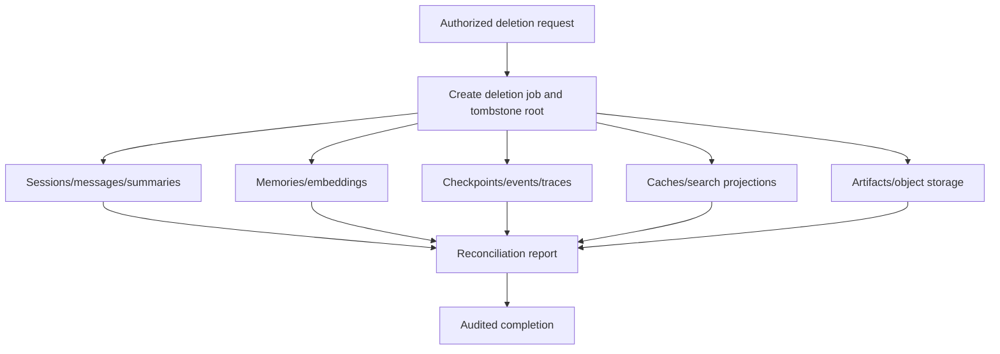

# Context Management Portability Specification

Priority: P1

Depends on: [Harness Engineering](harness-engineering.md)

Used by: [Agentic RAG](agentic-rag.md)

## 1. Goal and boundary

Context Management determines what the model sees, what survives a run, what can be retrieved later, and what must be forgotten. It owns typed runtime state, conversational sessions, deterministic prompt assembly, token budgets, reduction, summarization, long-term memory, context persistence, privacy, and deletion.

It does not execute graph nodes/tools or rank knowledge-base search results. Those belong to the harness and Agentic RAG. The boundary matters: conversation history, long-term memory, and retrieval evidence have different lifecycle, trust, and citation rules and MUST NOT be collapsed into one untyped message list.

## 2. Context domains



The reference canvas state explicitly distinguishes history, memory, and retrieval ([state.go](../../internal/agent/runtime/state.go#L54)) and serializes runtime state ([state.go](../../internal/agent/runtime/state.go#L164)). The target MUST preserve these conceptual domains even with different storage.

## 3. Data model

### 3.1 Message and session

```go
type Message struct {
    ID, TenantID, SessionID string
    Role                    string // system, user, assistant, tool
    Content                 []ContentBlock
    ToolCalls               []ToolCall
    ToolCallID              string
    CreatedAt               time.Time
    TokenCount              int
    Model                   string
    Metadata                map[string]any
}

type Session struct {
    ID, TenantID, UserID, AgentID string
    Status                        string
    MessageVersion                uint64
    Summary                       *Summary
    CreatedAt, UpdatedAt          time.Time
    DeletedAt                     *time.Time
}
```

Message IDs MUST be stable and unique within a tenant. Tool results MUST reference exactly one preceding tool call. Session mutations MUST use optimistic versioning or transactions so concurrent turns cannot overwrite history.

### 3.2 Runtime context

```go
type RuntimeContext struct {
    Identity   IdentityContext
    Execution  ExecutionContext
    History    []Message
    Working    map[string]any
    Memories   []MemoryHit
    Evidence   []EvidenceChunk
    References []CitationRecord
    Budget     ContextBudget
}
```

Working state is run-local unless explicitly checkpointed. Retrieval chunks and references MUST remain separate but linked by stable chunk IDs; the reference has independent setters for both ([state.go](../../internal/agent/runtime/state.go#L760), [state.go](../../internal/agent/runtime/state.go#L779)).

### 3.3 Long-term memory

```go
type Memory struct {
    ID, TenantID, UserID       string
    Type                       string // semantic, episodic, procedural
    Content                    string
    SourceMessageIDs           []string
    Confidence, Importance     float64
    Embedding                  []float32
    EmbeddingModel             string
    ValidAt                    time.Time
    InvalidAt, ForgetAt        *time.Time
    CreatedAt, UpdatedAt       time.Time
    SchemaVersion              int
}
```

Semantic memory stores facts, episodic memory stores events/experiences, and procedural memory stores preferences/instructions. The reference extraction contract requests those types and validity timestamps ([memory.go](../../internal/service/memory.go#L118), [memory.go](../../internal/service/memory.go#L132)).

## 4. Session lifecycle



The API MUST support create, get, list, append/update, archive, and delete. Every operation MUST authorize tenant, user, and agent/canvas resource. The reference checks canvas access before session operations ([agent_sessions.go](../../internal/service/agent_sessions.go#L73)).

Persisted turns SHOULD include message/reference payloads, input/output token usage, latency/duration, round/index, model, finish reason, feedback, timestamps, and run/trace IDs. Reference normalization stores message, reference, token, duration, and round fields ([agent_sessions.go](../../internal/service/agent_sessions.go#L128)).

Before a model call, the service MUST normalize role sequences and assign stable message IDs. Invalid leading assistant/tool messages MUST be rejected or repaired by one documented rule. The reference normalizes, filters invalid leading roles, and generates IDs ([chat_session.go](../../internal/service/chat_session.go#L1747), [chat_session.go](../../internal/service/chat_session.go#L1769), [chat_session.go](../../internal/service/chat_session.go#L1790)).

### Concurrent append algorithm

1. Read session and `message_version` under authorization.
2. Validate the new turn and tool-call linkage.
3. Append messages and usage/reference records in one transaction.
4. Increment `message_version` using compare-and-swap.
5. On conflict, reload and retry only if the request carries a stable idempotency key.
6. Emit a session event after commit.

## 5. Prompt assembly

### 5.1 Deterministic ordering

The assembler MUST use this order:

1. immutable platform safety policy;
2. tenant/application policy;
3. agent instruction and discovered instruction sections;
4. tool definitions;
5. prior summary, if any;
6. retained recent history;
7. relevant valid long-term memories;
8. authorized retrieval evidence and provenance;
9. current user message.

Within a section, ordering MUST be deterministic: policy priority then stable ID; messages by sequence; memory by score then stable ID; evidence by rank then chunk ID. Deduplication MUST use stable IDs first and normalized content hashes second. The reference prompt builder supports budget grouping and deduplication ([prompt_builder.go](../../internal/harness/core/prompt_builder.go#L229), [prompt_builder.go](../../internal/harness/core/prompt_builder.go#L250)).

### 5.2 Budget model

```text
available_input = model_context_limit
                - reserved_output_tokens
                - provider_overhead

dynamic_budget = available_input
               - system_policy_tokens
               - agent_instruction_tokens
               - tool_schema_tokens
               - current_input_tokens
```

All token counts MUST use the selected model's tokenizer when available. A conservative fallback MAY estimate tokens but MUST reserve additional margin. Fixed mandatory content MUST be measured before dynamic sections. The request MUST fail with `context_fixed_content_exceeds_limit` when policy + tools + current input cannot fit safely; it MUST NOT silently remove safety policy or truncate tool JSON schemas.

Recommended dynamic allocation starting point:

| Section | Share | Minimum behavior |
|---|---:|---|
| Recent history and summary | 35% | Preserve current interaction and complete tool pairs. |
| Retrieval evidence | 45% | Preserve provenance and at least one complete top chunk if available. |
| Long-term memory | 15% | Include only relevant, valid, scoped memories. |
| Margin | 5% | Absorb tokenizer/provider formatting variance. |

Shares SHOULD be configurable by workload and rebalanced when a section has unused capacity. Reserved output MUST be configured before assembly.



## 6. History reduction

Reduction MUST precede lossy summarization:

1. remove duplicate system/instruction sections;
2. truncate oversized historical tool outputs using head/tail plus an explicit truncation marker;
3. replace obsolete tool-call arguments/results with compact typed placeholders while preserving linkage;
4. remove low-priority old attachments already represented by durable references;
5. retain the latest complete user/assistant interaction pairs;
6. retain any message referenced by a pending tool, approval, or checkpoint.

The reference middleware truncates old tool output and clears obsolete calls ([reduction.go](../../internal/harness/core/middlewares/reduction/reduction.go#L69), [reduction.go](../../internal/harness/core/middlewares/reduction/reduction.go#L105)). Reduction MUST never produce malformed JSON or an orphan tool result. The operation MUST be deterministic and record removed token count.

## 7. Summarization and compaction

### 7.1 Trigger and summary record

Summarization MAY trigger on token threshold, message count, age, or an explicit operator/run request. The decision and compaction are separate in the reference ([compactor.go](../../internal/harness/core/middlewares/summarization/compactor.go#L46)); trigger conditions are configurable ([summarization.go](../../internal/harness/core/middlewares/summarization/summarization.go#L18)). Current compatibility defaults are 160,000 tokens and ten retained messages ([consts.go](../../internal/harness/core/middlewares/summarization/consts.go#L4)); the target MUST tune by actual model limits.

```go
type Summary struct {
    ID, SessionID             string
    FromSequence, ToSequence  uint64
    SourceMessageIDs          []string
    Content                   string
    Facts, Decisions, OpenItems []string
    Model, PromptVersion      string
    InputTokens, OutputTokens int
    SourceVersion             uint64
    CreatedAt                 time.Time
}
```

### 7.2 Required summary content

A summary MUST preserve user goal, constraints/preferences, decisions and rationale, unresolved questions, named entities and identifiers needed later, commitments, relevant tool outcomes, and citation/source pointers. It MUST distinguish facts from hypotheses and MUST NOT invent resolved status.

The summary MUST cover a contiguous message range and retain source IDs. If any covered message changes or is deleted, the summary becomes stale and MUST be rebuilt before use. Original messages SHOULD remain available to audit until retention deletes them.

### 7.3 Compaction flow



Concurrent history changes MUST cause a compare-and-swap conflict, never a summary covering the wrong range.

## 8. Long-term memory lifecycle

```mermaid
flowchart LR
    Turn["Committed conversation turn"] --> Queue["Idempotent extraction task"]
    Queue --> Extract["Structured memory extraction"]
    Extract --> Validate["Type, confidence, temporal validation"]
    Validate --> Dedup["Deduplicate / supersede"]
    Dedup --> Embed["Embed with version"]
    Embed --> Save["Persist scoped memory"]
    Save --> Retrieve["Future retrieval"]
    Retrieve --> Validity["Tenant + temporal filter"]
    Validity --> Rank["Similarity + recency + confidence + importance"]
    Rank --> Prompt["Budgeted context"]
```



### 8.1 Extraction and write

Memory extraction SHOULD run asynchronously after the user response using a stable task key such as `tenant/session/message-range/extractor-version`. The reference queues save work ([memory_message_service.go](../../internal/service/memory_message_service.go#L131)), extracts structured memories ([memory_extractor.go](../../internal/service/memory_extractor.go#L82)), and embeds/saves them ([memory_message_service.go](../../internal/service/memory_message_service.go#L244)). Failure MUST NOT roll back the response; it MUST retry safely and remain observable.

Candidate memories MUST pass schema, scope, minimum confidence, and sensitive-data policy. New memory SHOULD merge with an equivalent active memory or supersede a contradictory memory by setting `invalid_at`; it SHOULD NOT create unbounded duplicates.

### 8.2 Retrieval

Filtering order MUST be authorization, `valid_at <= now`, `invalid_at is null or > now`, `forget_at is null or > now`, then semantic ranking. Ranking SHOULD combine normalized semantic similarity, recency decay, confidence, and importance. A deterministic stable ID breaks ties. The reference search path considers recent/valid ordering ([memory.go](../../internal/service/memory.go#L1366), [memory.go](../../internal/service/memory.go#L1398)).

Memory hits MUST carry memory ID, type, score components, source IDs, and lifecycle timestamps. The prompt MUST label memory as recalled context, not retrieved documentary evidence; it MUST NOT be used as a citation unless its original authoritative source is independently available.

### 8.3 Forgetting and eviction

Forget requests MUST immediately exclude memory from retrieval and record audit metadata. The reference records `forget_at` ([memory.go](../../internal/service/memory.go#L839)). Physical deletion MAY follow retention rules.

The current reference validates FIFO only ([memory.go](../../internal/service/memory.go#L78)). The target MAY start with FIFO but MUST isolate the policy. Future TTL, capacity, importance, or user-pinned policies MUST not change consumer interfaces.

## 9. Retrieval evidence context

```go
type EvidenceChunk struct {
    ChunkID, DocumentID, TenantID string
    Content                       string
    Locator                       string
    Scores                        map[string]float64
    RetrievalMethod               string
    ACLLabels                     []string
    ContentHash                   string
}

type CitationRecord struct {
    CitationID, ChunkID, DocumentID string
    Title, URI, Locator             string
    EvidenceText                    string
}
```

Evidence MUST preserve authorization labels and provenance from retrieval through prompt and answer. Citation records MUST be derived from stored metadata, never model-generated identifiers. Deduplication MUST merge provenance. Evidence can be truncated only at semantic boundaries and MUST retain locator/linkage.

## 10. Cache and persistence

The target MAY cache token counts, embeddings, summaries, prompt sections, and retrieval results. Cache keys MUST include tenant, content/version hash, model/tokenizer/embedding version, and relevant policy version. Credentials and authorization decisions MUST NOT be cached across tenant/user scope. Deletion or permission change MUST invalidate affected entries.

Checkpoints own run recovery; the session store owns canonical conversation; the memory store owns cross-run memory; the retrieval index owns documentary chunks. The same payload SHOULD NOT be independently mutable in multiple stores. References between stores MUST use stable IDs and tolerate delayed deletion through tombstones.

## 11. Privacy, retention, and deletion



All reads and writes MUST enforce tenant scope server-side. Secrets, credentials, raw authorization headers, restricted tool outputs, and disallowed personal data MUST be removed before summary/memory generation and telemetry. Retention policy MUST separately configure raw messages, summaries, memory, checkpoints, events, traces, caches, and artifacts.

Deletion MUST be idempotent, asynchronous where necessary, observable, and reconciled. Backups MAY retain encrypted data for a documented period but MUST prevent normal restoration into active indexes after deletion.

## 12. Failure behavior

| Failure | Required behavior |
|---|---|
| Tokenizer unavailable | Use conservative estimator and margin; emit degraded-mode metric. |
| Fixed content exceeds limit | Return typed error; do not remove safety policy. |
| Summarizer fails | Use deterministic reduced recent history if it fits; otherwise typed budget error. |
| Summary CAS conflict | Reload source and retry within limit. |
| Memory extraction fails | Keep response committed; retry async task. |
| Embedding backend unavailable | Store pending memory without exposing it to semantic retrieval, then retry. |
| Session append conflict | Retry only with idempotency key; never overwrite. |
| Unauthorized evidence/memory | Drop and emit security audit signal; never include in prompt. |
| Deletion subtask fails | Keep deletion job incomplete and retry; root remains tombstoned. |

## 13. Observability

Metrics SHOULD include prompt tokens by section, reserved/used budget, reduction tokens removed, summary count/latency/compression ratio, memory extraction success/latency, memory retrieval hit count/scores, session conflicts, cache hit rate, deletion lag, and authorization drops. Traces MUST avoid raw sensitive content by default and SHOULD record stable IDs, hashes, counts, and policy/model versions.

## 14. Configuration surface

| Setting | Validation |
|---|---|
| Model context and reserved output | Positive; reserve below total; provider-consistent. |
| Section budget shares/minima | Non-negative; normalized; mandatory content preserved. |
| Reduction limits | Positive byte/token limits; valid truncation marker. |
| Summary triggers/retained turns | Positive and below model ceiling. |
| Memory types/confidence/top-k | Known types; confidence in `[0,1]`; bounded top-k. |
| Recency decay/eviction | Non-negative and versioned. |
| Retention/deletion | Meets legal/operator minimum and covers derived stores. |
| Sensitive-data policy | Cannot be weakened by request-level configuration. |

## 15. Conformance suite

| ID | Scenario and assertion |
|---|---|
| C-01 | Same inputs/versions produce byte-equivalent context ordering and selection. |
| C-02 | Final prompt stays within model budget including provider overhead. |
| C-03 | Oversized fixed policy/tool/current input returns typed error without silent safety truncation. |
| C-04 | Reduction preserves valid tool-call/result pairs and current user input. |
| C-05 | Summary records exact source range/IDs and becomes stale after source mutation. |
| C-06 | Concurrent summary creation cannot commit against the wrong message version. |
| C-07 | Concurrent append cannot lose or reorder turns; idempotent retry does not duplicate. |
| C-08 | Invalid, forgotten, expired, or unauthorized memory never enters prompts. |
| C-09 | Contradictory memory supersedes or invalidates old memory predictably. |
| C-10 | Memory extraction failure does not fail the conversational response. |
| C-11 | Evidence/citation linkage survives truncation and deduplication. |
| C-12 | Tenant A cannot observe tenant B session, summary, memory, cache, or evidence. |
| C-13 | Deletion reaches every derived store and reconciliation reports zero active remnants. |
| C-14 | Secret fixtures do not appear in summary, memory, trace, event, or cache keys. |
| C-15 | Tokenizer fallback remains conservative in multilingual and tool-heavy fixtures. |

## 16. Delivery slices

1. Typed message/session/runtime context records, authorization, stable IDs, transactional append.
2. Deterministic prompt assembler, exact token accounting, section budgets, reduction.
3. Versioned summaries with CAS, source lineage, invalidation, and fallback behavior.
4. Async typed memory extraction, embeddings, retrieval, temporal validity, dedup/supersession.
5. Evidence/citation context linkage, caches, privacy/retention, deletion reconciliation.
6. Evaluation fixtures, load tests, metrics, and operational dashboards.
