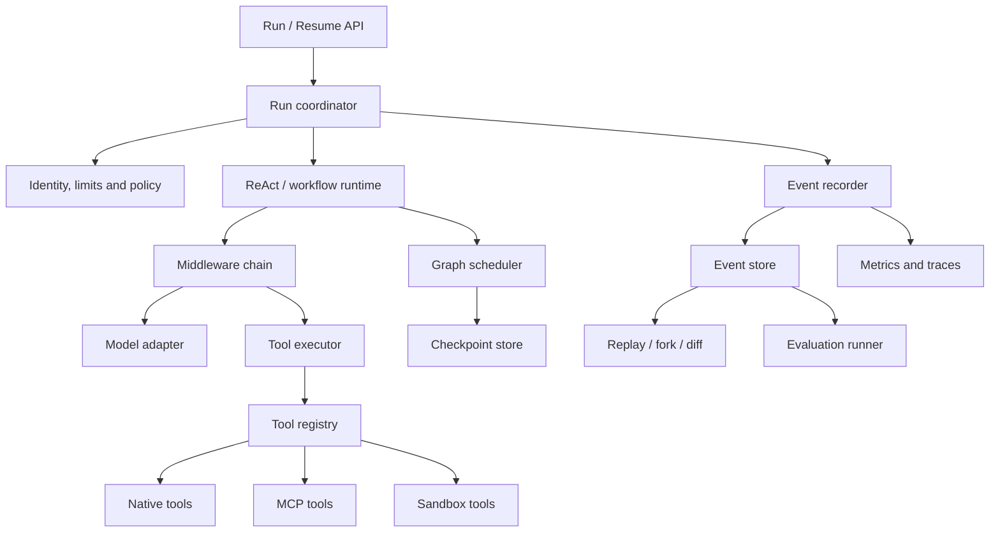
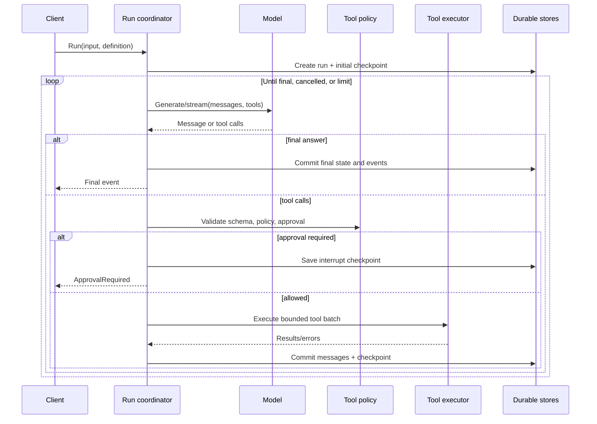
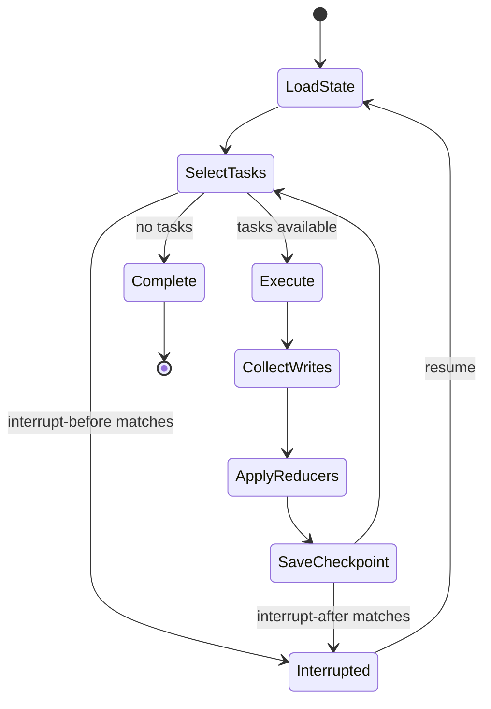
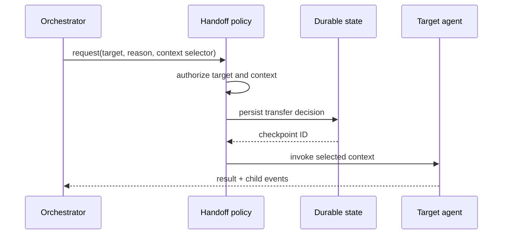
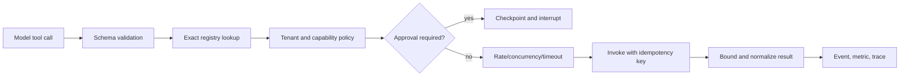
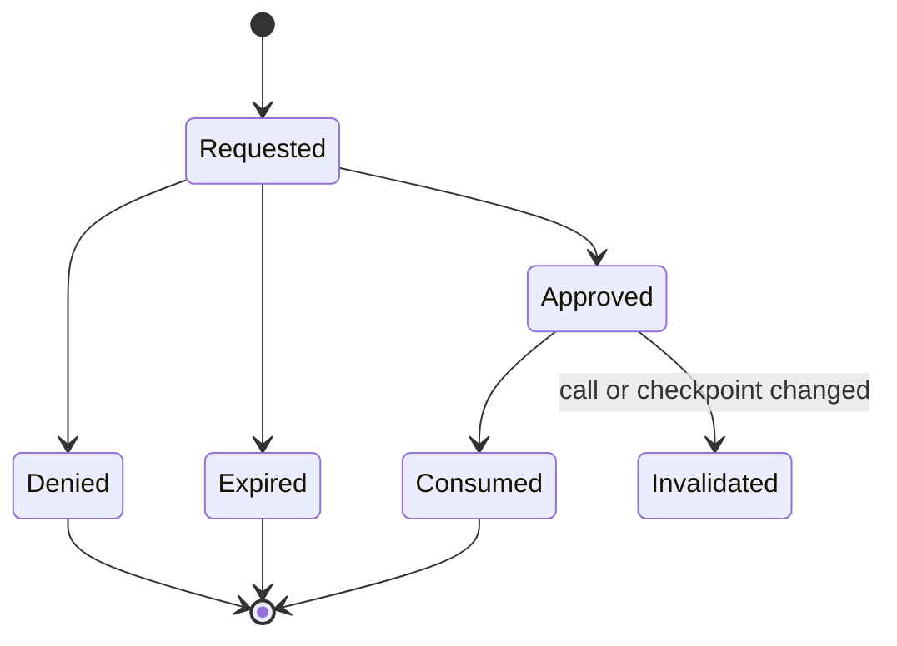
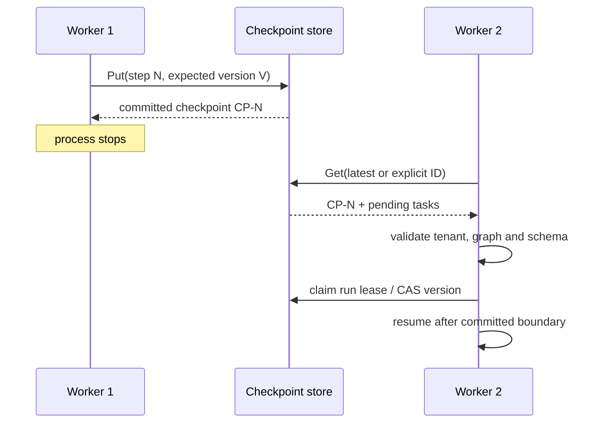

# Harness Engineering Portability Specification

Priority: P0 — implement first

Related: [Specification index](README.md), [Context Management](context-management.md), [Agentic RAG](agentic-rag.md)

## 1. Goal and boundary

The harness is the execution control plane for model-driven workloads. It owns state transitions, graph scheduling, ReAct loops, tool policy, human interrupts, cancellation, durability, streaming, events, replay, and evaluation. It does not own business prompts, retrieval ranking, conversation retention policy, or provider-specific credentials.

A conforming implementation MUST run the same agent definition synchronously or as an event stream, survive process interruption through checkpoints, stop bounded work, prevent unauthorized side effects, and provide enough evidence to replay and diagnose a run.

## 2. Component architecture



The reference configuration groups model, tools, instruction, maximum iterations, middleware, retry/failover, graph execution, checkpointer, and interrupt policy ([react_agent.go](../../internal/harness/core/react_agent.go#L16)). The target MAY split configuration types, but MUST validate them into one immutable run definition before execution.

## 3. Core records

```go
type RunStatus string // pending, running, interrupted, succeeded, failed, cancelled

type RunDefinition struct {
    AgentName       string
    InstructionRef  string
    Model           ModelRef
    Tools           []ToolRef
    MaxIterations   int
    RecursionLimit  int
    MaxConcurrency  int
    Retry           RetryPolicy
    Failover         []ModelRef
    InterruptBefore []string
    InterruptAfter  []string
    SchemaVersion   int
}

type RunState struct {
    TenantID, ThreadID, RunID string
    Status                    RunStatus
    Step, Iteration           int
    Messages                  []Message
    Values                    map[string]any
    Pending                   []Task
    LastCheckpointID          string
    Error                     *ErrorInfo
}

type RunEvent struct {
    EventID, TenantID, ThreadID, RunID string
    Sequence                          uint64
    Type, Node, Tool                  string
    Timestamp                         time.Time
    Payload                           json.RawMessage
    Error                             *ErrorInfo
    SchemaVersion                     int
}
```

Run definitions MUST be immutable after start. State updates MUST be versioned or compare-and-swapped so two workers cannot commit the same step. Event sequence MUST be monotonic within a run and idempotent under redelivery.

## 4. ReAct lifecycle



The lifecycle MUST:

1. authenticate and derive tenant identity;
2. validate input and freeze the run definition;
3. load or initialize typed state;
4. run before-agent and before-model middleware;
5. construct model input without mutating committed messages;
6. invoke or stream the model;
7. validate every requested tool call before lookup;
8. execute an allowed batch, append one result per call, and checkpoint;
9. stop on a final response, explicit action, cancellation, unrecoverable failure, or limit;
10. emit final status once and close all streams.

The reference selects no-tool, graph-backed, or loop-backed execution based on configuration ([react_agent.go](../../internal/harness/core/react_agent.go#L224)). Its default maximum is ten iterations ([react_agent.go](../../internal/harness/core/react_agent.go#L44)); the target SHOULD use 10 initially but MUST make it configurable and reject values below 1.

### Termination semantics

| Condition | Required result |
|---|---|
| Final model message | Commit output and mark succeeded. |
| Iteration/recursion ceiling | Mark failed with typed `limit_exceeded`; preserve last checkpoint. |
| Immediate cancellation | Cancel active operations, commit cancelled state, emit one terminal event. |
| Deferred cancellation | Complete the selected model/tool boundary, then stop before new work. |
| Policy denial | Append a structured denied tool result or interrupt according to policy; never invoke the tool. |
| Recoverable dependency error | Apply retry policy; record attempts and eventual recovery/failure. |
| Panic/internal invariant | Recover at worker boundary, mark failed, retain diagnostic event without leaking secrets. |

Cancellation modes MUST include immediate, after-current-model, and after-current-tool-batch, matching the reference contract ([cancel.go](../../internal/harness/core/cancel.go#L16)).

## 5. Middleware contract

Middleware MUST be ordered and support:

```go
type Middleware interface {
    BeforeAgent(ctx context.Context, run *RunContext) error
    BeforeModel(ctx context.Context, call *ModelCall) error
    AfterModel(ctx context.Context, call *ModelCall, result *ModelResult) error
    AroundTool(next ToolInvoker) ToolInvoker
    AfterToolBatch(ctx context.Context, batch *ToolBatchResult) error
    AfterAgent(ctx context.Context, run *RunContext, result *RunResult) error
}
```

Before hooks execute registration order; after hooks execute reverse order. Each hook MUST receive a run-scoped context and MUST NOT retain mutable state across runs unless synchronized. Message arrays MUST be copied or immutable before provider calls; the reference state guard preprocesses copied model input ([state_guard.go](../../internal/harness/core/state_guard.go#L89)). Middleware-contributed tools MUST pass through the same registry and policy checks as configured tools; the reference merges contributed tools during execution preparation ([react_agent.go](../../internal/harness/core/react_agent.go#L250)).

Hook failures MUST declare whether they are fatal, retryable, or advisory. Advisory telemetry failure MUST NOT fail user work. Policy, state validation, and persistence failures MUST fail closed.

## 6. Graph scheduler

### 6.1 Graph definition

The graph MUST support named nodes, directed edges, conditional routers, start/end sentinels, reducers for shared channels, compilation validation, and bounded recursion. It SHOULD support dynamic fan-out, fan-in, and parallel node execution. The reference exposes these through `StateGraph` and `CompiledGraph` ([types.go](../../internal/harness/graph/types/types.go#L398)).

Compilation MUST reject duplicate/reserved node names, missing endpoints, invalid routers, unreachable required nodes, missing reducers for multi-writer channels, and invalid limits. A compiled graph MUST be immutable and safe for concurrent runs.

### 6.2 Superstep algorithm



For every superstep, the engine MUST derive runnable tasks from committed state, execute within the concurrency limit, buffer writes, wait for the step barrier, apply reducers deterministically, persist according to durability policy, and only then expose the committed state. The reference separates task execution and write application ([engine.go](../../internal/harness/graph/pregel/engine.go#L527), [engine.go](../../internal/harness/graph/pregel/engine.go#L625)) and persists progress before continuing ([engine.go](../../internal/harness/graph/pregel/engine.go#L636)).

Sibling tasks MUST NOT observe each other's uncommitted writes. Reducers MUST be deterministic, associative where parallel ordering is unspecified, and tested with shuffled input ordering. When one task fails, policy MUST explicitly choose fail-fast, finish-current-step, or collect-errors; fail-fast is the default for state-changing graphs.

### 6.3 Streaming modes

The public stream MUST provide a stable envelope and at least these modes, which correspond to the reference modes ([types.go](../../internal/harness/graph/types/types.go#L26)):

| Mode | Payload | Emission point |
|---|---|---|
| `values` | Full committed state | After successful step commit. |
| `updates` | Node/channel deltas | After reducer application. |
| `messages` | Model token/message delta | During model streaming. |
| `custom` | Application progress | Explicit node/tool emission. |
| `checkpoints` | ID and metadata | After durable save. |
| `tasks` | Task start/end/error | At scheduler boundaries. |
| `debug` | Internal scheduling data | Development only. |

Producers MUST block or drop only according to an explicit bounded backpressure policy. Terminal errors MUST be delivered exactly once. Client disconnect MUST cancel work unless the run was explicitly detached.

## 7. Workflow and multi-agent composition

The runtime MUST provide sequential, parallel, and bounded-loop composition. The reference exposes all three and defaults loops to ten iterations ([workflow.go](../../internal/harness/core/workflow.go#L431), [workflow.go](../../internal/harness/core/workflow.go#L463)). A loop MUST define a maximum and termination condition; parallel outputs MUST have a deterministic merge contract.

An agent MAY be exposed as a tool. It MUST have a stable name/description, maximum nesting depth, isolated inner control actions, bounded context transfer, and separate child events correlated to the parent. The reference prevents inner exit/transfer/break actions escaping the agent-tool boundary and checks depth ([tool.go](../../internal/harness/core/tool.go#L35), [tool.go](../../internal/harness/core/tool.go#L84)).



Unknown targets MUST fail explicitly. Transfer records MUST contain target, reason, selected context, parent run, and checkpoint. The reference persists deterministic transfer state ([agent_handoff.go](../../internal/harness/core/agent_handoff.go#L49)) and rejects unknown targets ([flow.go](../../internal/harness/core/flow.go#L271)).

Do not copy the reference's acknowledged full-history reconstruction on every transfer ([flow.go](../../internal/harness/core/flow.go#L154)); keep an incremental transcript or state projection.

## 8. Tool registry and execution

### 8.1 Definition and registration

```go
type ToolDefinition struct {
    Name, Description string
    InputSchema       json.RawMessage
    SideEffect        SideEffectClass // none, reversible, irreversible
    RetrySafety       RetrySafety     // safe, idempotency-key, unsafe
    ApprovalPolicy    string
    Timeout           time.Duration
    MaxResultBytes    int64
}
```

Names MUST be normalized, unique, schema-valid, and frozen at run start. Lookups MUST never fall back to partial/fuzzy matching. The reference provides a runtime registry ([tool_registry.go](../../internal/harness/core/tool_registry.go#L12)) and normalized application factories ([registry.go](../../internal/agent/tool/registry.go#L96), [registry.go](../../internal/agent/tool/registry.go#L145)).

### 8.2 Invocation pipeline



The pipeline MUST enforce schema, authorization, approval, timeout, concurrency, result size, cancellation, and error normalization. Timeout, retry, fallback, approval, and rate-limit middleware exist in the reference ([tool_invoke.go](../../internal/harness/core/tool_invoke.go#L39), [tool_invoke.go](../../internal/harness/core/tool_invoke.go#L56), [tool_invoke.go](../../internal/harness/core/tool_invoke.go#L113), [tool_invoke.go](../../internal/harness/core/tool_invoke.go#L158), [tool_invoke.go](../../internal/harness/core/tool_invoke.go#L326)).

Automatic retries MUST be limited to retry-safe operations. Side-effecting tools MUST use an idempotency key or default to no retry. Tool results MUST be syntactically valid messages even on denial/error so the model can continue safely.

## 9. Human approval

Approval MUST interrupt before any protected side effect. The request MUST include request ID, tenant/run/thread IDs, tool, redacted arguments, risk class, reason, creation/expiry time, and editable fields. A decision MUST be approve, deny, or approve-with-edits and MUST be authenticated, authorized, single-use, and bound to the checkpoint/tool-call hash.



Graph ReAct interrupts before tool execution by default in the reference ([react_agent.go](../../internal/harness/core/react_agent.go#L597)). Approval outcomes and latency MUST be events and metrics ([recorder.go](../../internal/harness/events/recorder.go#L232), [metrics.go](../../internal/harness/metrics/metrics.go#L207)).

## 10. MCP integration

The MCP adapter SHOULD support initialization, `tools/list`, and `tools/call` over Streamable HTTP, with SSE compatibility where required. The reference implements discovery ([mcp_client.go](../../internal/utility/mcp_client.go#L64), [mcp_client.go](../../internal/utility/mcp_client.go#L87)) and URL-safe tool calls ([mcp_call.go](../../internal/utility/mcp_call.go#L71)).

The adapter MUST validate endpoint scheme/host/IP, revalidate redirects, block loopback/link-local/private ranges unless explicitly allowlisted, apply connect/request/idle timeouts, cap response bytes, validate returned schemas, preserve protocol error codes, and redact headers. Endpoints, headers, tools, and caches MUST be tenant-scoped. Discovery SHOULD use a short TTL and invalidate on configuration change.

## 11. Sandboxed execution

```go
type SandboxProvider interface {
    Initialize(ctx context.Context) error
    CreateInstance(ctx context.Context, template string) (SandboxInstance, error)
    ExecuteCode(ctx context.Context, instance SandboxInstance, code, language string, timeout time.Duration, args map[string]any) (ExecutionResult, error)
    DestroyInstance(ctx context.Context, instance SandboxInstance) error
}
```

This mirrors the provider-neutral reference contract ([provider.go](../../internal/agent/sandbox/provider.go#L126)). Production providers MUST isolate process, filesystem, network, user identity, CPU, memory, process count, wall-clock, output bytes, and artifacts. Instances SHOULD be disposable and destruction MUST run in a deferred cleanup path after success, error, timeout, or cancellation.

Artifacts MUST be collected through extension, count, per-file, and total-size allowlists; the reference shares an extension allowlist across providers ([artifacts.go](../../internal/agent/sandbox/artifacts.go#L18)). The target MUST reject path traversal and symlink escape.

The reference local provider runs directly on the host without sandboxing ([provider.go](../../internal/agent/sandbox/provider.go#L59)). It MUST be development-only in the target unless isolation is supplied externally.

## 12. Retry, failover, and errors

```go
type ErrorClass string // validation, policy, transient, permanent, timeout, cancelled, limit, internal
type ErrorInfo struct {
    Class, Code, Message string
    Retryable            bool
    Attempt              int
    Provider             string
    RedactedDetails      map[string]any
}
```

Only transient, timeout, and explicitly retry-safe failures SHOULD retry. Backoff MUST be cancellable, bounded, and jittered. The reference distinguishes retry exhaustion and retry signals and sleeps with context awareness ([retry.go](../../internal/harness/core/retry.go#L19), [retry.go](../../internal/harness/core/retry.go#L452)). Failover MUST record old/new provider and model, preserve run identity, and avoid repeating unsafe tool work.

Recommended defaults: model attempts 3, tool attempts 1 unless safe, exponential backoff starting at 250 ms with full jitter, per-operation deadline below total-run deadline. Operators MUST be able to tune these values.

## 13. Checkpoint and resume

A checkpoint MUST include tenant/thread/run/checkpoint IDs, parent ID, graph and schema versions, committed channel state, pending tasks/writes, step/iteration, status, timestamps, and integrity metadata. Reference checkpoint records cover metadata, state, and tuple relationships ([checkpoint.go](../../internal/harness/graph/checkpoint/checkpoint.go#L27), [checkpoint.go](../../internal/harness/graph/checkpoint/checkpoint.go#L84), [checkpoint.go](../../internal/harness/graph/checkpoint/checkpoint.go#L381)).



Writes MUST be atomic and idempotent. Resume MUST support latest or explicit checkpoint, validate ownership/version, acquire a lease or optimistic lock, and avoid repeating committed side effects. The reference reloads selected checkpoints and pending work ([engine.go](../../internal/harness/graph/pregel/engine.go#L298)).

The target MUST ship one durable production store and MAY ship in-memory storage for tests. Current reference stores include memory ([memory.go](../../internal/harness/graph/checkpoint/memory.go#L19)) and NATS ([nats.go](../../internal/harness/graph/checkpoint/nats.go#L55)); neither is mandated.

## 14. Events, telemetry, replay, and evaluation

The event taxonomy MUST include run, graph step/node/task, model, tool, memory, approval, checkpoint, agent/handoff, error, cancellation, and terminal status. Reference types include tool, memory, approval, and checkpoint events ([event.go](../../internal/harness/events/event.go#L20)). Event storage supports filtered queries ([store.go](../../internal/harness/events/store.go#L11)).

Metrics MUST include run success/latency, model latency/tokens/cost, tool calls/success/retry/latency, checkpoint save/restore, node/step counts, interrupts, approval latency/rate, memory hits, and recovered errors. The reference collector exposes these dimensions ([metrics.go](../../internal/harness/metrics/metrics.go#L107)). Traces SHOULD create root run spans plus node/model/tool/checkpoint spans; reference wrappers cover model/tools ([telemetry.go](../../internal/harness/core/middlewares/telemetry/telemetry.go#L51)) and graph execution ([traced_engine.go](../../internal/harness/graph/pregel/traced_engine.go#L58)).

Replay MUST default to recorded outputs and MUST NOT repeat side effects. Explicit experiments MAY override model/tool results; reference replay supports both ([replay.go](../../internal/harness/replay/replay.go#L18)). Replay SHOULD support structural diff ([diff.go](../../internal/harness/replay/diff.go#L77)) and fork-from-event/checkpoint ([fork.go](../../internal/harness/replay/fork.go#L33)).

Evaluation MUST support deterministic scorers and optional LLM judges. Records MUST include dataset/case version, prompt/model/tool versions, scorer version, run/trace ID, score, explanation, latency, and cost. Reference scorer and LLM-judge abstractions are at [evals.go](../../internal/harness/core/evals/evals.go#L76) and [evals.go](../../internal/harness/core/evals/evals.go#L405).

## 15. Security and operational requirements

- Enforce tenant/resource authorization before run, tool, resume, replay, checkpoint, or event access.
- Treat model output as untrusted input; validate tool name and arguments.
- Default-deny side-effecting capabilities.
- Redact secrets before persistence and telemetry.
- Bound iterations, recursion, concurrency, tokens, result bytes, stream buffers, and total duration.
- Encrypt durable state and credentials; rotate keys without invalidating schema.
- Use leases or optimistic concurrency for distributed workers.
- Expose health for dependencies but never include secrets or raw prompts by default.
- Apply retention/deletion to checkpoints, events, traces, artifacts, and evaluation samples.

## 16. Configuration surface

| Setting | Required validation |
|---|---|
| Model/provider and fallback list | Known provider, authorized model, non-empty ordered list. |
| Iteration/recursion/concurrency limits | Positive and capped by operator maximum. |
| Model/tool/total deadlines | Positive; child deadline cannot exceed run deadline. |
| Retry policy | Bounded attempts and delay; unsafe tools cannot auto-retry. |
| Interrupt policy | References known nodes/tools and valid approval class. |
| Checkpoint durability/retention | Supported mode and tenant-safe duration. |
| Event sampling/redaction | Security policy cannot be disabled by a run request. |
| MCP allowlist | Valid schemes/hosts; no plaintext secret interpolation into logs. |
| Sandbox provider | Production cannot silently fall back to host-local execution. |

## 17. Conformance suite

| ID | Scenario and assertion |
|---|---|
| H-01 | No-tool agent streams ordered model and terminal events. |
| H-02 | Tool agent stops at iteration limit with typed error and last checkpoint. |
| H-03 | Parallel siblings cannot observe partial writes; shuffled completion yields deterministic reduced state. |
| H-04 | Immediate and deferred cancellation stop at their documented boundaries with no leaked tasks. |
| H-05 | Denied approval never invokes the tool; approved resume is single-use and hash-bound. |
| H-06 | Retry respects attempt/deadline/idempotency policy and records every attempt. |
| H-07 | Failover preserves run identity and does not duplicate committed tool effects. |
| H-08 | Interrupted/resumed execution equals uninterrupted committed output. |
| H-09 | Two workers racing to resume cannot both commit the same step. |
| H-10 | Replay performs zero external side effects unless an override is explicitly enabled. |
| H-11 | MCP blocks prohibited destinations and caps response size. |
| H-12 | Sandbox timeout kills the full process tree and rejects artifact escape. |
| H-13 | Tenant A cannot enumerate/read/resume/delete tenant B runs or artifacts. |
| H-14 | Stream backpressure remains bounded and disconnect cancellation works. |
| H-15 | Secret fixtures never appear in events, traces, checkpoints, or error strings. |

## 18. Delivery slices

1. Core records, immutable run definition, error taxonomy, model adapter, ordered event stream.
2. ReAct loop, middleware, registry, tool schema validation, iteration/cancellation limits.
3. Compiled graph, deterministic supersteps, reducers, workflow composition, agent-as-tool.
4. Durable checkpoints, interrupt/resume, approval, leases, retries/failover.
5. MCP security, sandbox provider, artifact policy.
6. Telemetry, replay/fork/diff, evaluation and operational dashboards.

Each slice MUST add its conformance tests before becoming a dependency of Context Management or Agentic RAG.
