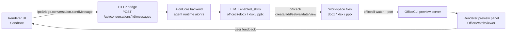

# Guide: Document Creation & Review Flow in AionUi

This guide explains how a user request to **create** an Office document (DOCX/XLSX/PPTX) and how **review** of the generated document flows through AionUi — from the chat UI down to the AionCore backend, the `officecli` runtime, and the live preview panel.

> Reference sample: `clones/doc-tools/` is a standalone TypeScript port of the same boundary (tool schema, sandboxing, skills injection). This guide maps it to the production architecture.

---

## 1. Architecture overview

AionUi's agent loop does **not** run in Electron. The desktop app is a thin client over an embedded **AionCore** backend (Rust) that owns the agent runtime (`aionrs`).



Key rule: agents do **not** call a special Office SDK. They are **prompted with SKILL.md content** (`assistant.enabled_skills`) and execute `officecli` shell commands through their generic command-execution capability.

---

## 2. Document creation flow (step by step)

### Step 1 — User sends a message (Renderer)

- User types in the send box: `packages/desktop/src/renderer/components/chat/SendBox/index.tsx` (`sendMessageHandler`), or the first message of a new conversation via `useInitialMessage.ts`.
- The call goes through the IPC bridge adapter: `ipcBridge.conversation.sendMessage` in `packages/desktop/src/common/adapter/ipcBridge.ts` (~line 369), which is an `httpPost` to:

  ```
  POST /api/conversations/{conversation_id}/messages
  body: { content, files, sessions, loading_id, inject_skills }
  ```

- Agent output streams back over WS (`responseStream` events).

### Step 2 — Backend starts the agent runtime (AionCore)

- `conversation.ensureRuntime` → `POST /api/conversations/{id}/runtime/ensure`.
- Conversations of type `aionrs` run the built-in AionRS agent engine. The runtime loads the conversation's **assistant config**:
  - `assistant.agent_ref = "aionrs"`
  - `assistant.enabled_skills` — e.g. `["officecli-docx"]`
  - the assistant rule file as system prompt

### Step 3 — Skills are injected as prompt context

- The backend loads the builtin skill (e.g. `officecli-docx`) — builtin skills live in AionCore at `crates/aionui-app/assets/builtin-skills/` (Electron only reads them via `process/services/skills/skillFiles.ts` → `ipcBridge.fs.listSkillFiles/readSkillFile`).
- The skill content is the same material as `clones/doc-tools/skills/formats/docx.md`: the workflow **inspect → create/add/set → validate → view-html → repair**.
- This corresponds to `loadDocumentSkills()` in `clones/doc-tools/src/skills.ts`, which wraps skills in `<document-format-skill>` / `<document-use-case-skill>` tags for the sample agent.

### Step 4 — The agent executes officecli commands

The LLM plans and runs allowlisted `officecli` verbs against workspace files:

| Verb | Purpose |
| --- | --- |
| `create` | New document from scratch |
| `open` / `close` | Attach/detach from an existing file |
| `get` / `query` | Inspect content/structure |
| `add` / `set` / `remove` / `move` / `copy` | Edit content |
| `validate` | Structural validation of the result |
| `view` | Render HTML preview for self-review |

In production this runs through AionCore's process spawner (`DefaultProcessSpawner.spawn_officecli`); in the sample it is `runOfficeCli()` in `clones/doc-tools/src/officeCliTool.ts` (spawn without shell, timeout, sandboxed path resolution).

### Step 5 — Assistant presets for document tasks

Office-focused assistant presets wire the right skill automatically:

| Preset | Enabled skill |
| --- | --- |
| `word-creator` | `officecli-docx` |
| `ppt-creator` | `officecli-pptx` |
| `excel-creator` | `officecli-xlsx` |
| `dashboard-creator` | `officecli-data-dashboard` |
| `academic-paper` | `officecli-docx` |
| `morph-ppt` | `officecli-pptx` |

- Legacy Electron presets: `ASSISTANT_PRESETS` in `src/common/config/presets/assistantPresets.ts`; migrated to the backend by `packages/desktop/src/process/utils/migrateAssistants.ts` (legacy `presetAgentType: 'gemini'` → backend default `aionrs`, with a `PRESET_ID_WHITELIST` guard).
- Current built-ins ship with AionCore (`crates/aionui-app/assets/builtin-assistants/assistants.json`).
- Rule files live under `resources/assistant/<id>/<id>.<locale>.md`.
- See `.claude/commands/package-assistant.md` for packaging a new OfficeCLI skill into an assistant preset.

### Step 6 — Result surfaces in the UI

- Generated files land in the conversation workspace.
- The renderer shows them via file markers/artifacts (`Messages/components/fileMarker.ts`, `Messages/artifacts.tsx`) and the workspace explorer.

---

## 3. Document review flow (preview)

### 3.1 File type routing

- `packages/desktop/src/renderer/pages/conversation/Preview/fileUtils.ts`:
  - `FILE_EXTENSION_MAP`: `docx → word`, `pptx → ppt`, `xlsx → excel`.
  - Only OOXML formats are previewable — officecli watch accepts only `docx/xlsx/pptx`. Legacy (`doc/xls/ppt`, `odt/ods/odp`) and macro-enabled (`docm/xlsm/pptm`) formats are routed to `unsupported`.

### 3.2 Opening the preview

1. `usePreviewLauncher` (`packages/desktop/src/renderer/hooks/file/usePreviewLauncher.ts`) resolves the workspace-relative path to absolute, upgrades it to a `ChatFileRef`, reads metadata/content via `/api/fs/*` (gated by `DEFAULT_TEXT_PREVIEW_LIMIT_MB` in `utils/file/previewPayload.ts`), and opens a preview tab.
2. On failure, `classifyPreviewError` (`packages/desktop/src/renderer/utils/previewError.ts`) maps the error to kinds `sandbox | not_found | timeout | too_large | unknown` → i18n keys.

### 3.3 Live watch preview (officecli watch)

- `OfficeWatchViewer` (`Preview/components/viewers/OfficeWatchViewer.tsx`), wrapped by `WordViewer` / `ExcelViewer` / ppt viewer, calls:
  - `ipcBridge.pptPreview / wordPreview / excelPreview.start` → `POST /api/{ppt,word,excel}-preview/start` (`ipcBridge.ts` ~lines 1449–1461).
- Backend: AionCore `office_routes` → `OfficecliWatchManager.start_for_user(...)` → spawns:

  ```
  officecli watch <file> --port <port>
  ```

  which runs an OfficeCLI HTTP preview server that **auto-refreshes** as the file changes.
- The returned URL is loaded in a `WebviewHost` webview:
  - Electron: direct `http://127.0.0.1:<port>`
  - Web: proxied via `/api/office-watch-proxy/<port>` / `/api/ppt-proxy/<port>` (`resolveOfficeWatchUrl`).

### 3.4 Preview error codes

`OfficeWatchErrorCode` values, mapped to i18n keys `preview.office.errors.*` with retry / install-CLI actions:

| Code | Meaning |
| --- | --- |
| `OFFICECLI_NOT_FOUND` | officecli binary not installed |
| `OFFICECLI_INSTALL_FAILED` | auto-install failed |
| `OFFICECLI_PORT_TIMEOUT` | watch server did not open its port in time |
| `OFFICECLI_START_FAILED` | watch process failed to start |
| `PATH_OUTSIDE_SANDBOX` | file outside the allowed workspace |

E2E coverage of the watch lifecycle: `tests/e2e/helpers/bridge/routes.ts` ("officecli watch-server lifecycle").

---

## 4. Human review & repair loop

There is **no dedicated in-app docx/xlsx/pptx repair UI** — the review loop is intentionally conversational:

1. **Agent self-review**: the skill workflow has the agent render `view html`, fix issues, and re-run `validate` inside its own turn before finishing.
2. **User review**: the assistant rule files instruct the agent to say *"Your document is ready. Please open it now to review"* and to warn the user **not** to open the file in a system app while the agent is working (file locking).
3. **Live preview**: the user watches the officecli watch preview (auto-refreshing) and sends follow-up requests; the agent edits the file again with `open → add/set → validate`.
4. **Permission gates**: mid-turn tool actions can require user approval via `ipcBridge.conversation.confirmMessage` / `answerAsk` (`ipcBridge.ts` ~lines 401–408).
5. **Read-only preview**: office files are read-only in the preview panel (`CONTENT_FREE_PREVIEW_TYPES` in `Preview/context/PreviewContext.tsx`) — unlike markdown/code, which are editable via `/api/fs/write` with If-Match.
6. **Export/save**: the file is just a workspace file — `shell.openFile` (`/api/shell/open-file`), `fileSystem.openSystem`, or download utils (`utils/file/download.ts`).

---

## 5. Mapping the `clones/doc-tools` sample to production

| Sample (`clones/doc-tools/src/`) | Production equivalent |
| --- | --- |
| `officeCliTool.ts` — `OFFICE_DOCUMENT_TOOL` schema (12 operations) | Skill-prompted `officecli` shell commands via AionCore's generic command tool (or, alternatively, a builtin MCP server under `packages/desktop/src/process/resources/builtinMcp/`) |
| `officeCliTool.ts` — `resolveDocumentPath` sandboxing | AionCore `PATH_OUTSIDE_SANDBOX` enforcement |
| `officeCliTool.ts` — `runOfficeCli` spawn + timeout | `DefaultProcessSpawner.spawn_officecli` |
| `officeCliTool.ts` — `resolveOfficeCliPath` | officecli auto-install at runtime (see Dockerfile) |
| `harness.ts` — `runDocumentAgent` tool loop | AionCore `aionrs` agent runtime |
| `skills.ts` — `loadDocumentSkills` | `assistant.enabled_skills` loading in the backend |
| *(not in sample)* | `OfficecliWatchManager` + `officecli watch` preview lifecycle |
